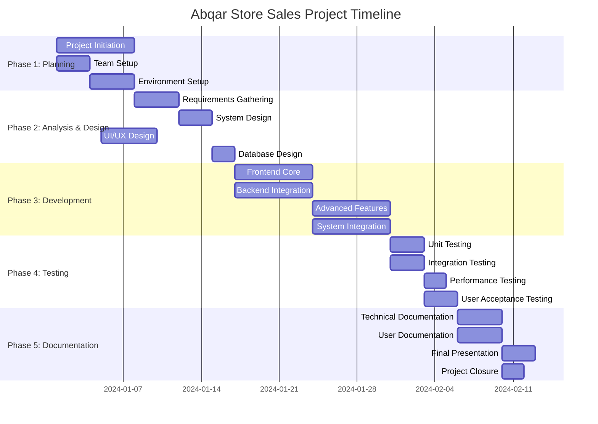

# Project Plan: Abqar Store Sales Documentation

## Project Overview

This document outlines the comprehensive project plan for developing and documenting the Abqar Store Sales management system. The project follows a structured approach combining software development with academic documentation requirements.

## Project Timeline and Phases

### Phase 1: Project Initiation and Planning (Week 1)
**Duration**: 7 days  
**Start Date**: Project Kickoff  
**End Date**: Week 1 End  

#### Deliverables
- Project proposal and scope definition
- Team roles and responsibilities assignment
- Risk assessment and mitigation plan
- KPIs and success metrics establishment
- Development environment setup

#### Key Milestones
- ✅ Project charter approved
- ✅ Team structure finalized
- ✅ Development tools configured
- ✅ Firebase project setup completed

### Phase 2: Requirements Analysis and System Design (Week 2)
**Duration**: 7 days  
**Start Date**: Week 2 Start  
**End Date**: Week 2 End  

#### Deliverables
- Stakeholder analysis and user stories
- Functional and non-functional requirements
- System architecture design
- Database schema and ER diagrams
- UI/UX wireframes and mockups

#### Key Milestones
- 📋 Requirements gathering completed
- 🎨 UI/UX design finalized
- 🏗️ System architecture approved
- 🗄️ Database design completed

### Phase 3: Core Development and Implementation (Week 3-4)
**Duration**: 14 days  
**Start Date**: Week 3 Start  
**End Date**: Week 4 End  

#### Week 3 Focus Areas
- **Frontend Development**
  - Dashboard layout and navigation
  - Sales entry system implementation
  - Customer management interface
  - Multi-language support setup

- **Backend Integration**
  - Firebase configuration and setup
  - Data models and validation
  - Authentication system
  - Real-time data synchronization

#### Week 4 Focus Areas
- **Advanced Features**
  - Analytics dashboard with Chart.js
  - PDF report generation
  - Debt management system
  - Loyalty points implementation

- **System Integration**
  - Component integration testing
  - Performance optimization
  - Cross-browser compatibility
  - Mobile responsiveness

#### Key Milestones
- 🔧 Core functionality implemented
- 📊 Analytics dashboard operational
- 📱 Mobile responsiveness achieved
- 🔒 Security features implemented

### Phase 4: Testing and Quality Assurance (Week 5)
**Duration**: 7 days  
**Start Date**: Week 5 Start  
**End Date**: Week 5 End  

#### Deliverables
- Comprehensive test plan and test cases
- Bug reports and resolution tracking
- Performance testing results
- User acceptance testing documentation

#### Key Milestones
- 🧪 Unit testing completed
- 🔍 Integration testing passed
- 📈 Performance benchmarks met
- ✅ User acceptance criteria satisfied

### Phase 5: Documentation and Final Delivery (Week 6)
**Duration**: 7 days  
**Start Date**: Week 6 Start  
**End Date**: Week 6 End  

#### Deliverables
- Complete technical documentation
- User manual and installation guide
- Final presentation materials
- Project retrospective and lessons learned

#### Key Milestones
- 📚 Documentation completed
- 🎯 Final presentation prepared
- 🚀 System deployed to production
- 📋 Project closure activities completed

## Gantt Chart Visualization

## Resource Allocation and Team Structure

### Team Composition
- **Team Leader**: Ziad Hisham
- **Frontend Developers**: Bishoy Labib, Ahmed Mohamed Salah
- **Backend Developer**: Ahmed Khaled Ahmed
- **UI/UX Designer & Documentation**: Youssef Ebraam Melad

### Resource Distribution by Phase

#### Phase 1: Planning (100% team involvement)
- **Team Leader**: Project planning, risk assessment (40 hours)
- **All Members**: Requirements gathering, tool setup (20 hours each)

#### Phase 2: Analysis & Design (80% team involvement)
- **UI/UX Designer**: Wireframes, mockups, design system (35 hours)
- **Backend Developer**: Database design, architecture (30 hours)
- **Frontend Developers**: Technical analysis, component planning (25 hours each)
- **Team Leader**: Review and coordination (20 hours)

#### Phase 3: Development (100% team involvement)
- **Frontend Developers**: UI implementation, component development (70 hours each)
- **Backend Developer**: Firebase integration, API development (70 hours)
- **UI/UX Designer**: Design implementation support (40 hours)
- **Team Leader**: Code review, integration oversight (50 hours)

#### Phase 4: Testing (60% team involvement)
- **All Members**: Testing activities, bug fixing (30 hours each)
- **Team Leader**: Test coordination, quality assurance (40 hours)

#### Phase 5: Documentation (80% team involvement)
- **UI/UX Designer**: Documentation lead, user manual (50 hours)
- **All Members**: Technical documentation contribution (25 hours each)
- **Team Leader**: Final review, presentation preparation (35 hours)

## Deliverables Schedule

### Week 1 Deliverables
- [ ] Project proposal document
- [ ] Project plan with timeline
- [ ] Team roles and task assignments
- [ ] Risk assessment matrix
- [ ] KPIs and success metrics
- [ ] Development environment setup

### Week 2 Deliverables
- [ ] Stakeholder analysis
- [ ] User stories and use cases
- [ ] Functional requirements specification
- [ ] Non-functional requirements
- [ ] System architecture document
- [ ] Database ER diagrams
- [ ] UI/UX wireframes and mockups

### Week 3-4 Deliverables
- [ ] Core application functionality
- [ ] Dashboard with real-time analytics
- [ ] Customer management system
- [ ] Sales tracking and reporting
- [ ] Authentication and security features
- [ ] Mobile-responsive design
- [ ] Multi-language support

### Week 5 Deliverables
- [ ] Test plan and test cases
- [ ] Bug reports and fixes
- [ ] Performance test results
- [ ] User acceptance testing documentation
- [ ] Quality assurance report

### Week 6 Deliverables
- [ ] Complete technical documentation
- [ ] User manual and installation guide
- [ ] API documentation
- [ ] Final presentation materials
- [ ] Project retrospective report
- [ ] Deployed production system

## Dependencies and Critical Path

### Critical Path Activities
1. **Project Setup → Requirements Analysis**: Cannot start design without clear requirements
2. **System Design → Database Design**: Database schema must be finalized before backend development
3. **Backend Development → Frontend Integration**: Frontend components depend on API availability
4. **Core Development → Advanced Features**: Advanced features build upon core functionality
5. **Development → Testing**: Testing requires completed features
6. **Testing → Documentation**: Final documentation requires tested, stable system

### Key Dependencies
- **Firebase Setup**: Required before any backend development can begin
- **UI/UX Design Approval**: Frontend development depends on approved designs
- **Database Schema**: Backend and frontend development both depend on finalized schema
- **Authentication System**: Many features depend on user authentication
- **Core Features**: Advanced features and testing depend on stable core functionality

## Risk Mitigation Timeline

### Week 1-2 Risks
- **Risk**: Unclear requirements or scope creep
- **Mitigation**: Daily standup meetings, requirement sign-off process

### Week 3-4 Risks
- **Risk**: Technical integration challenges
- **Mitigation**: Proof of concept development, regular integration testing

### Week 5 Risks
- **Risk**: Critical bugs discovered late in testing
- **Mitigation**: Continuous testing throughout development, buffer time allocation

### Week 6 Risks
- **Risk**: Documentation incomplete or presentation not ready
- **Mitigation**: Documentation started early, presentation preparation in parallel

## Quality Gates and Checkpoints

### Weekly Review Points
- **Week 1**: Planning completeness review
- **Week 2**: Design approval checkpoint
- **Week 3**: Development progress review
- **Week 4**: Feature completion checkpoint
- **Week 5**: Testing completion review
- **Week 6**: Final delivery readiness check

### Quality Criteria
- **Code Quality**: All code reviewed and meets standards
- **Documentation**: Complete and follows academic guidelines
- **Testing**: All test cases pass, performance criteria met
- **User Experience**: Intuitive interface, responsive design
- **Academic Standards**: Documentation meets university requirements

## Success Metrics and KPIs

### Development Metrics
- **Code Coverage**: Minimum 80% test coverage
- **Performance**: Page load time under 2 seconds
- **Responsiveness**: Works on all device sizes
- **Browser Compatibility**: Supports all modern browsers

### Project Management Metrics
- **Schedule Adherence**: Deliver on time within 5% variance
- **Budget Compliance**: Stay within allocated resource hours
- **Quality Standards**: Zero critical bugs in production
- **Team Satisfaction**: High team collaboration and satisfaction scores

### Academic Metrics
- **Documentation Completeness**: All required sections completed
- **Academic Standards**: Meets university documentation requirements
- **Presentation Quality**: Professional, comprehensive project presentation
- **Learning Outcomes**: Demonstrates mastery of software engineering principles