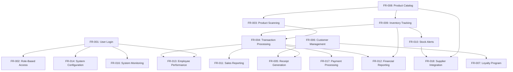

# Functional Requirements

## Overview

This document provides a comprehensive list of all system features and functionalities for the Abqar Store Sales Management System, detailed functional requirement specifications, and establishes requirement priorities and dependencies.

## System Features and Functionalities

### 1. User Authentication and Authorization

#### FR-001: User Login System
**Priority:** High  
**Description:** The system shall provide secure user authentication with role-based access control.

**Detailed Requirements:**
- FR-001.1: System shall authenticate users using email/username and password
- FR-001.2: System shall support multiple user roles (Owner, Manager, Sales Staff, Admin)
- FR-001.3: System shall maintain user sessions with automatic timeout
- FR-001.4: System shall log all authentication attempts
- FR-001.5: System shall enforce password complexity requirements

**Dependencies:** None  
**Related User Stories:** US-013

#### FR-002: Role-Based Access Control
**Priority:** High  
**Description:** The system shall restrict access to features based on user roles and permissions.

**Detailed Requirements:**
- FR-002.1: System shall define permission levels for each user role
- FR-002.2: System shall prevent unauthorized access to restricted features
- FR-002.3: System shall allow role modification by administrators
- FR-002.4: System shall audit permission changes
- FR-002.5: System shall display appropriate interface elements based on user role

**Dependencies:** FR-001  
**Related User Stories:** US-013

### 2. Point of Sale (POS) Operations

#### FR-003: Product Scanning and Selection
**Priority:** High  
**Description:** The system shall support product identification through barcode scanning and manual search.

**Detailed Requirements:**
- FR-003.1: System shall scan barcodes to identify products
- FR-003.2: System shall provide text-based product search functionality
- FR-003.3: System shall display product information (name, price, stock)
- FR-003.4: System shall handle products not found in database
- FR-003.5: System shall support manual product entry

**Dependencies:** FR-007 (Product Catalog)  
**Related User Stories:** US-005, US-009

#### FR-004: Transaction Processing
**Priority:** High  
**Description:** The system shall process customer transactions with multiple payment methods.

**Detailed Requirements:**
- FR-004.1: System shall calculate subtotals, taxes, and discounts automatically
- FR-004.2: System shall support cash, credit card, and digital payment methods
- FR-004.3: System shall process payment transactions securely
- FR-004.4: System shall handle transaction voids and refunds
- FR-004.5: System shall generate unique transaction IDs

**Dependencies:** FR-003, FR-008 (Inventory Management)  
**Related User Stories:** US-005, US-009

#### FR-005: Receipt Generation
**Priority:** High  
**Description:** The system shall generate and print receipts for all transactions.

**Detailed Requirements:**
- FR-005.1: System shall generate detailed receipts with all transaction information
- FR-005.2: System shall print receipts automatically after transaction completion
- FR-005.3: System shall store digital copies of all receipts
- FR-005.4: System shall support receipt reprinting
- FR-005.5: System shall include loyalty program information on receipts

**Dependencies:** FR-004, FR-006 (Customer Management)  
**Related User Stories:** US-005, US-009, US-011

### 3. Customer Management

#### FR-006: Customer Profile Management
**Priority:** Medium  
**Description:** The system shall maintain customer profiles and purchase history.

**Detailed Requirements:**
- FR-006.1: System shall create and update customer profiles
- FR-006.2: System shall store customer contact information
- FR-006.3: System shall track customer purchase history
- FR-006.4: System shall maintain customer preferences and notes
- FR-006.5: System shall support customer search and lookup

**Dependencies:** None  
**Related User Stories:** US-006, US-011

#### FR-007: Loyalty Program Management
**Priority:** Medium  
**Description:** The system shall manage customer loyalty programs and rewards.

**Detailed Requirements:**
- FR-007.1: System shall calculate and award loyalty points
- FR-007.2: System shall track customer loyalty balances
- FR-007.3: System shall apply loyalty discounts and rewards
- FR-007.4: System shall support multiple loyalty program tiers
- FR-007.5: System shall generate loyalty program reports

**Dependencies:** FR-006  
**Related User Stories:** US-010

### 4. Inventory Management

#### FR-008: Product Catalog Management
**Priority:** High  
**Description:** The system shall maintain a comprehensive product catalog with pricing and inventory information.

**Detailed Requirements:**
- FR-008.1: System shall store product information (name, description, price, barcode)
- FR-008.2: System shall support product categories and classifications
- FR-008.3: System shall manage product pricing and price changes
- FR-008.4: System shall track product suppliers and cost information
- FR-008.5: System shall support bulk product operations

**Dependencies:** None  
**Related User Stories:** US-016

#### FR-009: Inventory Tracking
**Priority:** High  
**Description:** The system shall track inventory levels in real-time and provide stock management capabilities.

**Detailed Requirements:**
- FR-009.1: System shall track current stock levels for all products
- FR-009.2: System shall update inventory automatically with each sale
- FR-009.3: System shall support manual inventory adjustments
- FR-009.4: System shall track inventory movements and history
- FR-009.5: System shall calculate inventory valuation

**Dependencies:** FR-008  
**Related User Stories:** US-007, US-015

#### FR-010: Stock Alerts and Notifications
**Priority:** Medium  
**Description:** The system shall provide automated alerts for low stock and reorder points.

**Detailed Requirements:**
- FR-010.1: System shall generate low stock alerts based on minimum thresholds
- FR-010.2: System shall notify relevant users of stock alerts
- FR-010.3: System shall support customizable alert thresholds per product
- FR-010.4: System shall track alert history and responses
- FR-010.5: System shall suggest reorder quantities

**Dependencies:** FR-009  
**Related User Stories:** US-004, US-015

### 5. Reporting and Analytics

#### FR-011: Sales Reporting
**Priority:** High  
**Description:** The system shall generate comprehensive sales reports and analytics.

**Detailed Requirements:**
- FR-011.1: System shall generate daily, weekly, and monthly sales reports
- FR-011.2: System shall provide sales analytics with charts and graphs
- FR-011.3: System shall support custom date range reporting
- FR-011.4: System shall analyze top-selling products and categories
- FR-011.5: System shall compare sales performance across time periods

**Dependencies:** FR-004  
**Related User Stories:** US-001, US-008

#### FR-012: Financial Reporting
**Priority:** High  
**Description:** The system shall generate financial reports for business analysis and tax compliance.

**Detailed Requirements:**
- FR-012.1: System shall generate profit and loss statements
- FR-012.2: System shall provide tax-ready transaction summaries
- FR-012.3: System shall calculate revenue by categories and payment methods
- FR-012.4: System shall analyze cost of goods sold and margins
- FR-012.5: System shall support financial report export in multiple formats

**Dependencies:** FR-004, FR-009  
**Related User Stories:** US-002

#### FR-013: Employee Performance Reporting
**Priority:** Medium  
**Description:** The system shall track and report employee sales performance.

**Detailed Requirements:**
- FR-013.1: System shall track individual employee sales metrics
- FR-013.2: System shall calculate employee performance indicators
- FR-013.3: System shall compare employee performance across time periods
- FR-013.4: System shall track transaction accuracy by employee
- FR-013.5: System shall generate employee performance reports

**Dependencies:** FR-001, FR-004  
**Related User Stories:** US-003

### 6. System Administration

#### FR-014: System Configuration
**Priority:** Medium  
**Description:** The system shall provide configuration options for business rules and system settings.

**Detailed Requirements:**
- FR-014.1: System shall allow configuration of tax rates and calculations
- FR-014.2: System shall support discount and promotion rule configuration
- FR-014.3: System shall allow customization of receipt formats
- FR-014.4: System shall support business hours and operational settings
- FR-014.5: System shall maintain configuration change history

**Dependencies:** FR-001  
**Related User Stories:** US-012

#### FR-015: Data Backup and Recovery
**Priority:** High  
**Description:** The system shall provide automated data backup and recovery capabilities.

**Detailed Requirements:**
- FR-015.1: System shall perform automated daily data backups
- FR-015.2: System shall verify backup integrity and completeness
- FR-015.3: System shall support point-in-time data recovery
- FR-015.4: System shall maintain backup retention policies
- FR-015.5: System shall provide backup status monitoring and alerts

**Dependencies:** None  
**Related User Stories:** US-014

#### FR-016: System Monitoring and Logging
**Priority:** Medium  
**Description:** The system shall monitor system performance and maintain comprehensive logs.

**Detailed Requirements:**
- FR-016.1: System shall monitor system performance metrics
- FR-016.2: System shall log all user activities and system events
- FR-016.3: System shall generate system health reports
- FR-016.4: System shall alert administrators of system issues
- FR-016.5: System shall maintain log retention and archival policies

**Dependencies:** FR-001  
**Related User Stories:** US-012

### 7. Integration and External Services

#### FR-017: Payment Processing Integration
**Priority:** High  
**Description:** The system shall integrate with external payment processing services.

**Detailed Requirements:**
- FR-017.1: System shall integrate with credit card processing services
- FR-017.2: System shall support digital wallet payments
- FR-017.3: System shall handle payment processing errors gracefully
- FR-017.4: System shall maintain payment transaction logs
- FR-017.5: System shall support payment refund processing

**Dependencies:** FR-004  
**Related User Stories:** US-005, US-009

#### FR-018: Supplier Integration
**Priority:** Low  
**Description:** The system shall support integration with supplier systems for ordering and inventory management.

**Detailed Requirements:**
- FR-018.1: System shall generate purchase orders for suppliers
- FR-018.2: System shall track supplier delivery status
- FR-018.3: System shall maintain supplier contact and contract information
- FR-018.4: System shall analyze supplier performance metrics
- FR-018.5: System shall support electronic data interchange (EDI) where applicable

**Dependencies:** FR-008, FR-010  
**Related User Stories:** US-017

## Requirement Priorities and Dependencies

### Priority Classification

#### High Priority (Critical for MVP)
- FR-001: User Login System
- FR-002: Role-Based Access Control
- FR-003: Product Scanning and Selection
- FR-004: Transaction Processing
- FR-005: Receipt Generation
- FR-008: Product Catalog Management
- FR-009: Inventory Tracking
- FR-011: Sales Reporting
- FR-012: Financial Reporting
- FR-015: Data Backup and Recovery
- FR-017: Payment Processing Integration

#### Medium Priority (Important for Full System)
- FR-006: Customer Profile Management
- FR-007: Loyalty Program Management
- FR-010: Stock Alerts and Notifications
- FR-013: Employee Performance Reporting
- FR-014: System Configuration
- FR-016: System Monitoring and Logging

#### Low Priority (Future Enhancements)
- FR-018: Supplier Integration

### Dependency Matrix

### Implementation Phases

#### Phase 1: Core POS Functionality
- FR-001, FR-002: Authentication and Authorization
- FR-008, FR-009: Product Catalog and Inventory
- FR-003, FR-004, FR-005: Transaction Processing
- FR-017: Payment Processing

#### Phase 2: Reporting and Management
- FR-011, FR-012: Sales and Financial Reporting
- FR-015: Data Backup and Recovery
- FR-014: System Configuration

#### Phase 3: Customer and Advanced Features
- FR-006, FR-007: Customer Management and Loyalty
- FR-010: Stock Alerts
- FR-013: Employee Performance
- FR-016: System Monitoring

#### Phase 4: Integration and Optimization
- FR-018: Supplier Integration
- Performance optimization
- Advanced analytics features

## Requirements Validation

### Completeness Criteria
- All user stories are covered by functional requirements
- All stakeholder needs are addressed
- System boundaries are clearly defined
- Integration points are identified

### Consistency Criteria
- No conflicting requirements
- Terminology is consistent throughout
- Dependencies are properly defined
- Priority assignments are logical

### Testability Criteria
- Each requirement is measurable
- Acceptance criteria are defined
- Test scenarios can be derived
- Success metrics are established

This functional requirements document provides the foundation for system design and implementation, ensuring all necessary features are captured and properly prioritized.