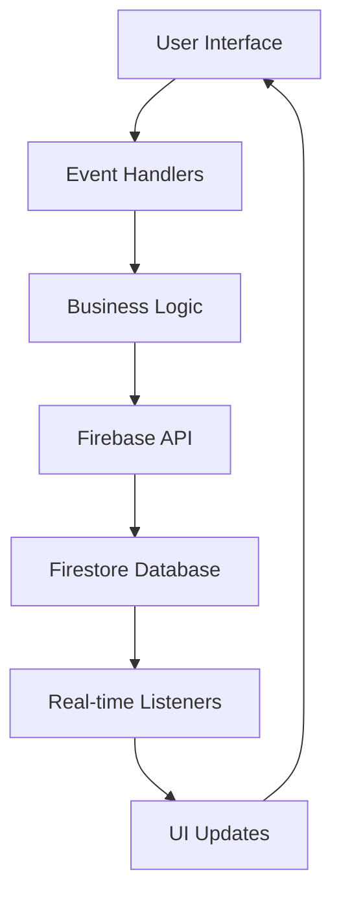

# Source Code Analysis

## Overview

This document provides a comprehensive analysis of the Abqar Store Sales Management System codebase, examining the code organization, architecture, coding standards, and quality assessment.

## Project Structure

The project follows a modular architecture with clear separation of concerns:

```
src/
├── backend/                 # Firebase and backend logic
│   ├── firebase.js          # Firebase configuration and exports
│   └── auditLog.js          # Audit logging functionality
├── pages/                   # UI components and page logic
│   ├── main.js              # Main application logic (2,177 lines)
│   └── script.js            # Additional page functionality (1,735 lines)
├── assets/                  # Static assets
│   ├── images/              # Images and icons
│   └── styles/              # Stylesheets
│       └── globals.css      # Global Tailwind styles
├── utils/                   # Helper functions and utilities
│   └── ui.js                # UI utility functions (1,403 lines)
├── config/                  # Configuration files
│   └── env.js               # Environment configuration
```

## Architecture Analysis

### 1. Frontend Architecture

The application follows a **modular JavaScript architecture** with the following characteristics:

- **Single Page Application (SPA)** structure with tab-based navigation
- **Event-driven architecture** using DOM event listeners
- **Global state management** through JavaScript variables and localStorage
- **Real-time data synchronization** with Firebase Firestore

### 2. Backend Integration

- **Firebase as Backend-as-a-Service (BaaS)**
- **Firestore** for NoSQL document database
- **Firebase Authentication** for user management
- **Real-time listeners** for live data updates

### 3. Data Flow Architecture



## Code Organization Analysis

### 1. Main Application Logic (`src/pages/main.js`)

**Purpose**: Core application functionality and business logic
**Size**: 2,177 lines
**Key Components**:
- Global variables and state management
- Firebase integration and real-time listeners
- Sales management functions
- Customer management system
- Event handlers and UI interactions

**Code Structure**:
```javascript
// Global Variables
let salesData = [];
let customersData = {};
let servicesData = [];

// Core Functions
function initializeApp() { /* App initialization */ }
function loadDataAndSetupRealtimeListener() { /* Firebase setup */ }
function updateAllViews() { /* UI synchronization */ }
```

### 2. UI Utilities (`src/utils/ui.js`)

**Purpose**: User interface helper functions and rendering logic
**Size**: 1,403 lines
**Key Components**:
- Chart initialization and updates
- Form rendering and validation
- Modal management
- Data formatting utilities
- Language translation system

**Code Structure**:
```javascript
// Chart Management
function initializeCharts() { /* Chart.js setup */ }
function updateCharts(salesData) { /* Chart updates */ }

// UI Rendering
function renderSalesLog(data, callbacks) { /* Table rendering */ }
function renderCustomerDatabase(customers) { /* Customer display */ }

// Utility Functions
function formatCurrency(value) { /* Currency formatting */ }
function formatDate(dateString) { /* Date formatting */ }
```

### 3. Firebase Integration (`src/backend/firebase.js`)

**Purpose**: Firebase configuration and API abstraction
**Key Components**:
- Firebase initialization
- Firestore collections setup
- API wrapper functions
- Global exports for application use

**Code Structure**:
```javascript
// Firebase Configuration
const firebaseConfig = {
  apiKey: window.ENV_CONFIG.FIREBASE_API_KEY,
  // ... other config
};

// Global Exports
window.firebaseExports = {
  db, auth,
  salesCollection, customersCollection, servicesCollection,
  // ... API functions
};
```

## Coding Standards Analysis

### 1. Naming Conventions

**Variables**: 
- ✅ **Good**: Descriptive camelCase naming (`salesData`, `customersData`, `dailyGoal`)
- ✅ **Good**: Clear boolean naming (`isNavigatingProgrammatically`, `discountMode`)
- ⚠️ **Improvement**: Some abbreviated names (`custSnapshot`, `docSnap`)

**Functions**:
- ✅ **Good**: Descriptive verb-noun patterns (`updateAllViews`, `handleSaveSale`)
- ✅ **Good**: Event handler naming (`handleTabClick`, `handleFilterSales`)
- ✅ **Good**: UI function prefixes (`render*`, `update*`, `show*`, `hide*`)

**Constants**:
- ✅ **Good**: UPPER_CASE for configuration (`FIREBASE_API_KEY`)
- ✅ **Good**: Descriptive object names (`translations`, `firebaseConfig`)

### 2. Code Structure Standards

**Function Organization**:
```javascript
// ✅ Good: Clear function separation
async function handleSaveSale(e) {
    e.preventDefault();
    // Input validation
    // Data processing
    // Firebase operations
    // UI updates
    // Error handling
}
```

**Error Handling**:
```javascript
// ✅ Good: Consistent try-catch patterns
try {
    await window.firebaseExports.addDoc(collection, data);
    window.UI.showNotification("Success!", "success");
} catch (error) {
    console.error("Error: ", error);
    window.UI.showNotification("Error occurred.", "error");
}
```

### 3. Documentation Standards

**Inline Comments**:
- ✅ **Good**: Section headers with clear descriptions
- ✅ **Good**: Complex logic explanations
- ⚠️ **Improvement**: Inconsistent JSDoc usage

**Code Comments Examples**:
```javascript
// --- Global Variables ---
let salesData = [];
let customersData = {};

// --- Utility Functions ---
function toEgyptIntl(phone) {
    // Convert phone number to Egyptian international format
}

// --- CORE APP LOGIC ---
document.addEventListener("DOMContentLoaded", () => {
    // Application initialization
});
```

## Code Quality Assessment

### 1. Strengths

**Modular Architecture**:
- Clear separation between UI, business logic, and data layers
- Reusable utility functions
- Consistent API patterns

**Real-time Functionality**:
- Efficient Firebase real-time listeners
- Proper state synchronization
- Live UI updates

**User Experience**:
- Comprehensive error handling
- Loading states and user feedback
- Multi-language support

**Data Management**:
- Proper data aggregation and calculations
- Customer loyalty system implementation
- Audit logging functionality

### 2. Areas for Improvement

**Code Organization**:
- ⚠️ Large files (main.js: 2,177 lines) could be split into smaller modules
- ⚠️ Some functions are quite long and could be refactored
- ⚠️ Global state management could be more structured

**Error Handling**:
- ⚠️ Some async operations lack proper error boundaries
- ⚠️ Network error handling could be more robust
- ⚠️ User input validation could be more comprehensive

**Performance**:
- ⚠️ Some DOM queries could be cached
- ⚠️ Event listeners could be optimized
- ⚠️ Large data sets might need pagination optimization

**Testing**:
- ⚠️ Limited test coverage (only ui.test.js found)
- ⚠️ No integration tests for Firebase operations
- ⚠️ No end-to-end testing

### 3. Technical Debt Analysis

**High Priority**:
1. **File Size**: Break down large files into smaller, focused modules
2. **Global State**: Implement a more structured state management pattern
3. **Error Boundaries**: Add comprehensive error handling for all async operations

**Medium Priority**:
1. **Code Documentation**: Add JSDoc comments for all public functions
2. **Type Safety**: Consider TypeScript migration for better type safety
3. **Performance**: Optimize DOM operations and event handling

**Low Priority**:
1. **Code Style**: Implement consistent formatting with Prettier
2. **Linting**: Add ESLint for code quality enforcement
3. **Bundle Optimization**: Implement code splitting for better performance

## Security Analysis

### 1. Security Strengths

**Firebase Security**:
- ✅ Proper Firebase configuration
- ✅ Authentication-based access control
- ✅ Environment variable usage for sensitive data

**Data Validation**:
- ✅ Input validation for forms
- ✅ Data sanitization for user inputs
- ✅ Proper error handling for invalid data

### 2. Security Considerations

**Client-Side Security**:
- ⚠️ Firebase configuration exposed in client code (standard practice but should be noted)
- ⚠️ Business logic validation should be supplemented with server-side rules
- ⚠️ Consider implementing rate limiting for API calls

**Data Privacy**:
- ✅ Customer data properly structured
- ✅ No sensitive data logged to console in production
- ⚠️ Consider implementing data encryption for sensitive customer information

## Performance Analysis

### 1. Performance Strengths

**Efficient Data Loading**:
- ✅ Real-time listeners prevent unnecessary data fetching
- ✅ Pagination implemented for large data sets
- ✅ Optimized chart updates

**UI Performance**:
- ✅ Smooth animations and transitions
- ✅ Responsive design implementation
- ✅ Efficient DOM manipulation

### 2. Performance Optimization Opportunities

**Bundle Size**:
- ⚠️ Large JavaScript files could impact initial load time
- ⚠️ Consider lazy loading for non-critical features
- ⚠️ Implement code splitting for better caching

**Memory Management**:
- ⚠️ Event listeners should be properly cleaned up
- ⚠️ Large data arrays could be optimized
- ⚠️ Chart instances should be properly destroyed when not needed

## Recommendations

### 1. Immediate Improvements

1. **Code Splitting**: Break down large files into focused modules
2. **Error Handling**: Implement comprehensive error boundaries
3. **Testing**: Add unit tests for critical business logic
4. **Documentation**: Add JSDoc comments for all public APIs

### 2. Medium-term Enhancements

1. **State Management**: Implement a structured state management pattern
2. **Type Safety**: Consider TypeScript migration
3. **Performance**: Optimize DOM operations and implement lazy loading
4. **Security**: Add server-side validation rules

### 3. Long-term Considerations

1. **Architecture**: Consider migrating to a modern framework (React/Vue)
2. **Testing**: Implement comprehensive test suite with E2E testing
3. **Monitoring**: Add performance monitoring and error tracking
4. **Scalability**: Prepare for multi-tenant architecture

## Conclusion

The Abqar Store Sales Management System demonstrates solid software engineering practices with a clear modular architecture, comprehensive functionality, and good user experience design. The codebase shows evidence of thoughtful planning and implementation, with particular strengths in real-time data management and user interface design.

While there are opportunities for improvement in areas such as code organization, testing, and performance optimization, the current implementation provides a solid foundation for a production-ready sales management system. The recommendations outlined above would help enhance code maintainability, performance, and scalability for future development.