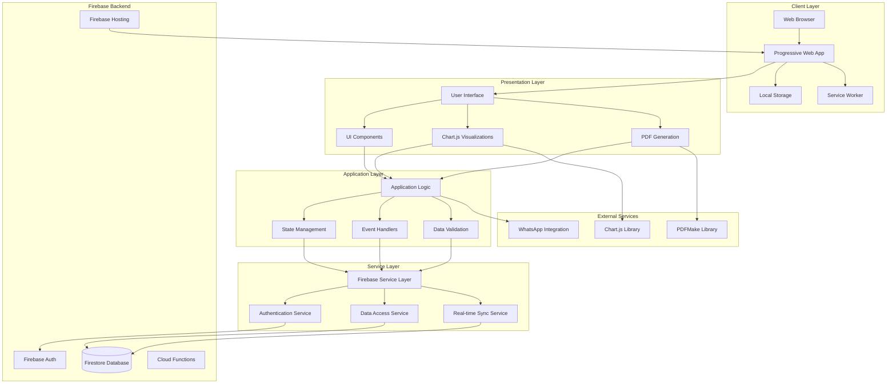
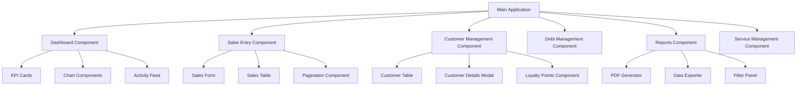
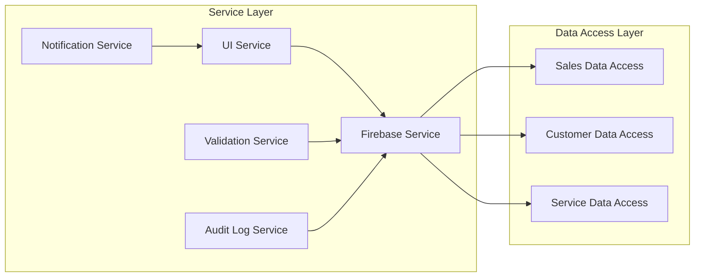
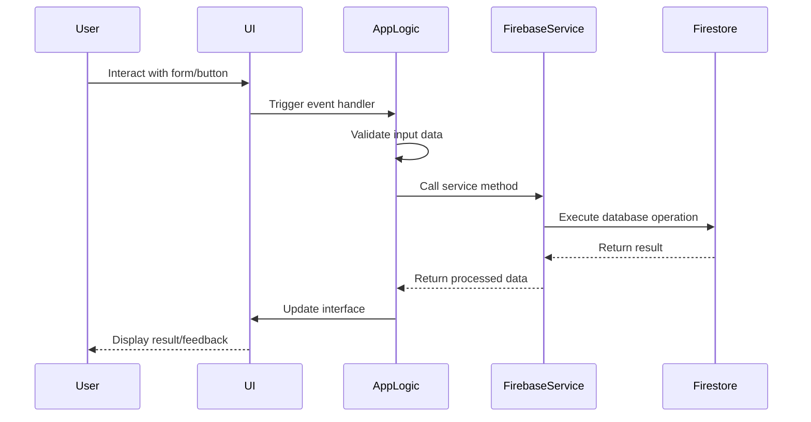
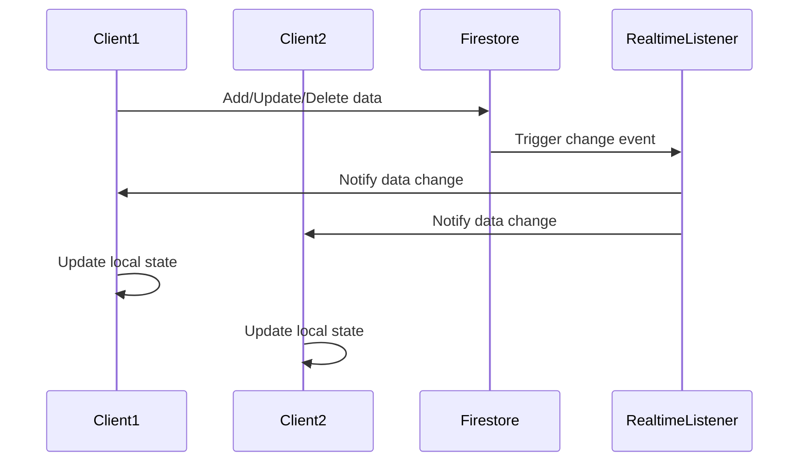
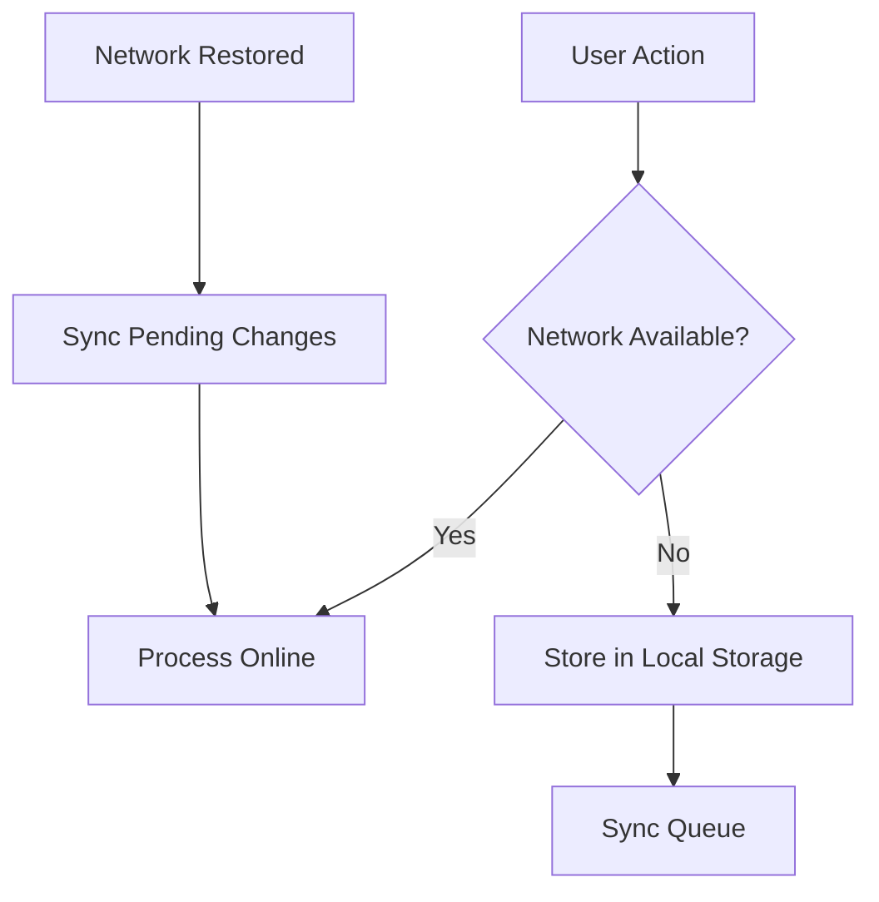
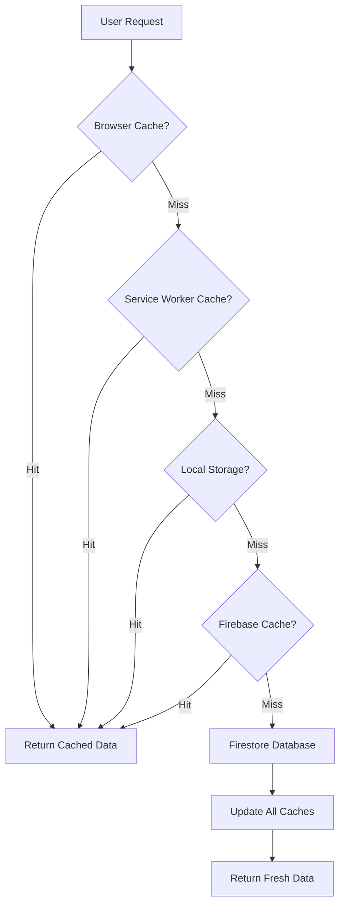
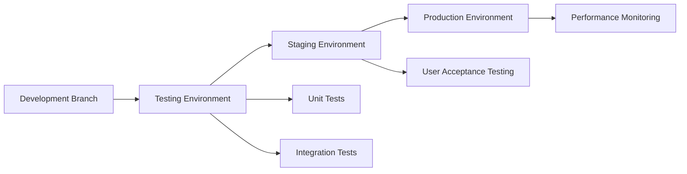

# Software Architecture Documentation

## High-Level System Architecture

### Architecture Overview

The Abqar Store Sales Management System follows a **Client-Server Architecture** with a **Single Page Application (SPA)** frontend and a **Backend-as-a-Service (BaaS)** approach using Firebase. The system is designed as a **Progressive Web Application (PWA)** to provide native app-like experience across different devices.



## Architectural Patterns and Design Decisions

### 1. Model-View-Controller (MVC) Pattern

The application follows a modified MVC pattern adapted for client-side JavaScript:

- **Model**: Firebase Firestore collections (sales, customers, services)
- **View**: HTML templates with dynamic content rendering
- **Controller**: JavaScript modules handling user interactions and business logic

### 2. Component-Based Architecture

The UI is organized into reusable components:



### 3. Service-Oriented Architecture (SOA)

Services are organized into distinct layers:



## System Components and Interfaces

### Frontend Components

#### 1. User Interface Layer

**Technologies**: HTML5, CSS3, TailwindCSS, JavaScript (Vanilla)

**Components**:
- **Navigation Component**: Tab-based navigation system
- **Form Components**: Reusable form elements with validation
- **Table Components**: Data display with sorting and pagination
- **Modal Components**: Overlay dialogs for detailed views
- **Chart Components**: Data visualization using Chart.js
- **Notification System**: Toast notifications for user feedback

**Interfaces**:
```javascript
// UI Service Interface
interface UIService {
    showNotification(message: string, type: 'success' | 'error' | 'info'): void;
    updateDashboard(salesData: Sale[], dailyGoal: number): void;
    renderTable(data: any[], columns: Column[], actions: Action[]): void;
    showModal(modalId: string, data?: any): void;
    hideModal(modalId: string): void;
    setLanguage(language: 'ar' | 'en'): void;
}
```

#### 2. Application Logic Layer

**Components**:
- **State Management**: Global application state handling
- **Event Handlers**: User interaction processing
- **Business Logic**: Sales calculations, customer management
- **Data Validation**: Input validation and sanitization

**Interfaces**:
```javascript
// Application State Interface
interface AppState {
    salesData: Sale[];
    customersData: { [key: string]: Customer };
    servicesData: Service[];
    currentUser: User | null;
    currentLanguage: 'ar' | 'en';
    dailyGoal: number;
}

// Business Logic Interface
interface BusinessLogic {
    calculateProfit(price: number, cost: number): number;
    updateCustomerLoyaltyPoints(customerId: string, points: number): Promise<void>;
    assignCustomerTier(customer: Customer): 'Bronze' | 'Silver' | 'Gold';
    validateSaleData(saleData: Sale): ValidationResult;
}
```

### Backend Services (Firebase)

#### 1. Firebase Firestore Database

**Collections Structure**:
- **sales**: Sales transaction records
- **customers**: Customer information and loyalty data
- **services**: Service catalog and pricing
- **audit_logs**: System activity tracking

**Data Access Patterns**:
```javascript
// Firebase Service Interface
interface FirebaseService {
    // Sales Operations
    addSale(saleData: Sale): Promise<string>;
    updateSale(saleId: string, saleData: Partial<Sale>): Promise<void>;
    deleteSale(saleId: string): Promise<void>;
    getSales(filters?: SaleFilters): Promise<Sale[]>;
    
    // Customer Operations
    addCustomer(customerData: Customer): Promise<string>;
    updateCustomer(customerId: string, customerData: Partial<Customer>): Promise<void>;
    getCustomer(customerId: string): Promise<Customer>;
    getCustomers(filters?: CustomerFilters): Promise<Customer[]>;
    
    // Service Operations
    addService(serviceData: Service): Promise<string>;
    updateService(serviceId: string, serviceData: Partial<Service>): Promise<void>;
    deleteService(serviceId: string): Promise<void>;
    getServices(): Promise<Service[]>;
    
    // Real-time Subscriptions
    onSalesChange(callback: (sales: Sale[]) => void): () => void;
    onCustomersChange(callback: (customers: Customer[]) => void): () => void;
    onServicesChange(callback: (services: Service[]) => void): () => void;
}
```

#### 2. Firebase Authentication

**Authentication Flow**:
- Anonymous authentication for demo/trial usage
- Future support for email/password authentication
- Session management and token refresh

#### 3. Firebase Hosting

**Deployment Configuration**:
- Static file hosting for SPA
- Custom domain support
- SSL/TLS encryption
- CDN distribution

### External Service Integrations

#### 1. Chart.js Integration

**Purpose**: Data visualization and analytics
**Components**:
- Line charts for sales trends
- Pie charts for service distribution
- Bar charts for comparative analysis
- Doughnut charts for profit margins

#### 2. PDFMake Integration

**Purpose**: Report generation and document export
**Features**:
- Sales reports with charts
- Customer lists and details
- Financial summaries
- Custom branding and formatting

#### 3. WhatsApp Integration

**Purpose**: Customer communication and marketing
**Features**:
- Direct WhatsApp links for customer contact
- Bulk messaging for marketing campaigns
- Customer number formatting and validation

## Data Flow Architecture

### 1. User Interaction Flow



### 2. Real-time Data Synchronization



### 3. Offline Data Handling



## Security Architecture

### 1. Authentication and Authorization

**Security Measures**:
- Firebase Authentication for user management
- Anonymous authentication for demo access
- Session token management
- Automatic token refresh

**Authorization Levels**:
- **Store Owner**: Full system access
- **Sales Staff**: Limited to sales and customer operations
- **Manager**: Read-only access to reports and analytics

### 2. Data Security

**Client-Side Security**:
- Input validation and sanitization
- XSS prevention through proper data encoding
- CSRF protection through Firebase security rules

**Server-Side Security**:
- Firebase Security Rules for data access control
- Encrypted data transmission (HTTPS)
- Automatic backup and recovery

### 3. Privacy and Compliance

**Data Protection**:
- Customer data encryption at rest
- Minimal data collection principle
- User consent for data processing
- Right to data deletion

## Performance Architecture

### 1. Frontend Performance

**Optimization Strategies**:
- Lazy loading of components
- Image optimization and compression
- CSS and JavaScript minification
- Browser caching strategies
- Service Worker for offline functionality

**Performance Metrics**:
- Page load time < 3 seconds
- Time to interactive < 2 seconds
- First contentful paint < 1.5 seconds

### 2. Backend Performance

**Firebase Optimization**:
- Efficient query design with proper indexing
- Data pagination for large datasets
- Real-time listener optimization
- Connection pooling and reuse

**Scalability Considerations**:
- Horizontal scaling through Firebase infrastructure
- Auto-scaling based on usage patterns
- Load balancing across multiple regions

### 3. Caching Strategy



## Deployment Architecture

### 1. Development Environment

**Local Development Setup**:
- Vite development server for hot reloading
- Firebase Emulator Suite for local testing
- ESLint and Prettier for code quality
- Vitest for unit testing

### 2. Production Environment

**Firebase Hosting Configuration**:
- Automatic deployment from Git repository
- Custom domain with SSL certificate
- CDN distribution for global performance
- Environment variable management

**Deployment Pipeline**:


## Error Handling and Logging

### 1. Error Handling Strategy

**Client-Side Error Handling**:
- Try-catch blocks for async operations
- Global error handlers for unhandled exceptions
- User-friendly error messages
- Graceful degradation for offline scenarios

**Server-Side Error Handling**:
- Firebase error code mapping
- Retry mechanisms for transient failures
- Circuit breaker pattern for service failures

### 2. Logging and Monitoring

**Audit Logging**:
- User action tracking
- Data modification logs
- System performance metrics
- Error occurrence tracking

**Monitoring Dashboard**:
- Real-time system health
- User activity analytics
- Performance metrics
- Error rate monitoring

## Future Architecture Considerations

### 1. Scalability Enhancements

**Potential Improvements**:
- Microservices architecture for complex features
- API Gateway for service orchestration
- Message queuing for asynchronous processing
- Database sharding for large datasets

### 2. Technology Evolution

**Future Technology Adoption**:
- Progressive Web App enhancements
- WebAssembly for performance-critical operations
- Machine learning for business insights
- Blockchain for transaction integrity

### 3. Integration Capabilities

**External System Integration**:
- ERP system connectivity
- Payment gateway integration
- Inventory management systems
- Accounting software synchronization

This comprehensive software architecture documentation provides a solid foundation for understanding the system's design, implementation approach, and future evolution possibilities. The architecture balances simplicity with scalability, ensuring the system can grow with business needs while maintaining performance and reliability.