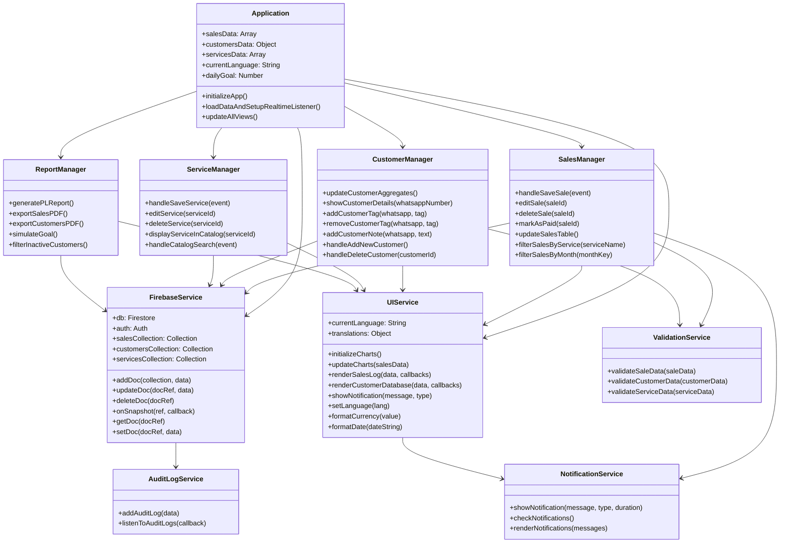
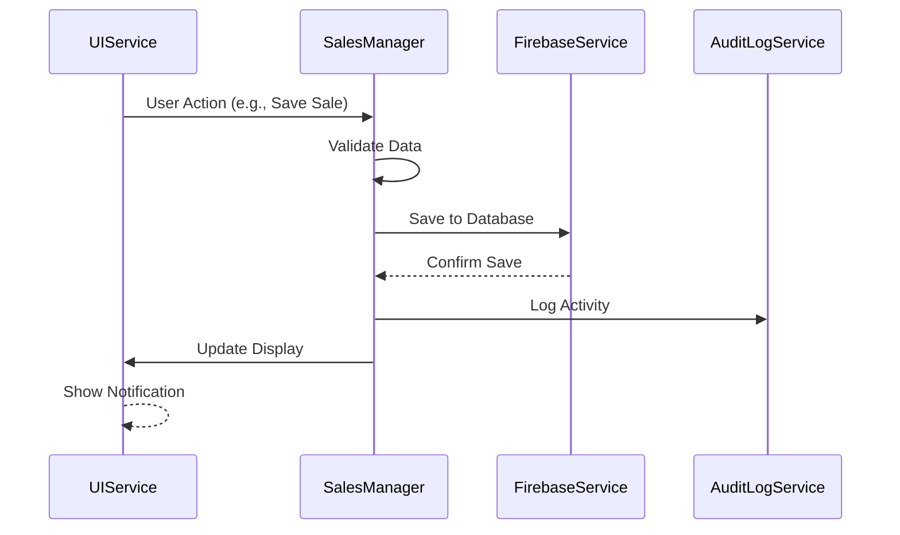
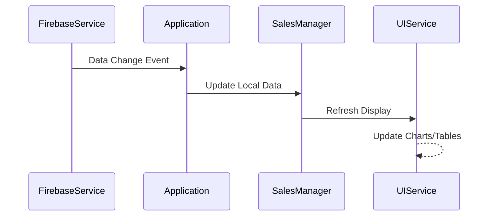
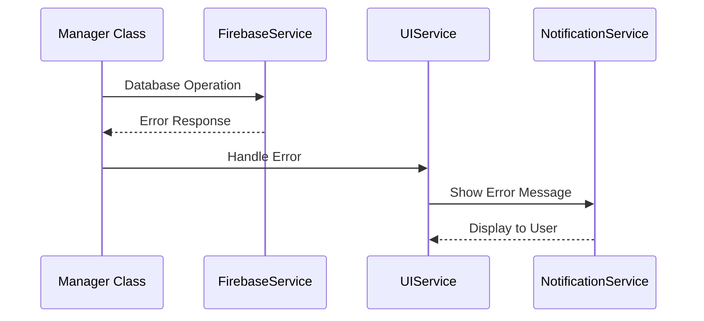

# Class Structure and Relationships Documentation

## System Architecture Overview

The Abqar Store Sales Management System follows a **modular JavaScript architecture** with service-oriented design patterns. Since the system uses vanilla JavaScript rather than class-based object-oriented programming, the "classes" are represented as **modules** and **service objects** that encapsulate related functionality.

## High-Level Class Diagram



## Detailed Class Specifications

### 1. Application Module (Main Controller)

**File**: `src/pages/main.js`
**Purpose**: Central application controller managing global state and coordination

```javascript
class Application {
    // Global State Variables
    salesData: Array<Sale>
    customersData: Object<string, Customer>
    servicesData: Array<Service>
    currentLanguage: string
    dailyGoal: number
    currentSalesPage: number
    currentCustomerPage: number
    filteredSales: Array<Sale> | null
    filteredCustomers: Array<Customer> | null
    
    // Core Methods
    +initializeApp(): void
    +loadDataAndSetupRealtimeListener(): void
    +updateAllViews(): void
    +setupEventListeners(): void
    +handleTabClick(): void
    +checkNotifications(): void
    +addActivity(text: string, extra: Object): void
}
```

**Key Responsibilities**:
- Initialize Firebase connection and authentication
- Set up real-time data listeners
- Coordinate between different service modules
- Manage global application state
- Handle navigation and tab switching

**Relationships**:
- **Aggregates**: SalesManager, CustomerManager, ServiceManager, ReportManager
- **Uses**: FirebaseService, UIService, AuditLogService
- **Manages**: Global data collections (sales, customers, services)

### 2. FirebaseService Module

**File**: `src/backend/firebase.js`
**Purpose**: Database abstraction layer for Firebase operations

```javascript
class FirebaseService {
    // Firebase Configuration
    +firebaseConfig: Object
    +db: Firestore
    +auth: Auth
    +salesCollection: Collection
    +customersCollection: Collection
    +servicesCollection: Collection
    
    // CRUD Operations
    +addDoc(collection: Collection, data: Object): Promise<string>
    +updateDoc(docRef: DocumentReference, data: Object): Promise<void>
    +deleteDoc(docRef: DocumentReference): Promise<void>
    +getDoc(docRef: DocumentReference): Promise<DocumentSnapshot>
    +setDoc(docRef: DocumentReference, data: Object): Promise<void>
    +getDocs(query: Query): Promise<QuerySnapshot>
    
    // Real-time Operations
    +onSnapshot(ref: Reference, callback: Function): Function
    +onAuthStateChanged(auth: Auth, callback: Function): Function
    
    // Query Operations
    +query(collection: Collection, ...constraints: Array): Query
    +where(field: string, operator: string, value: any): WhereConstraint
    +orderBy(field: string, direction: string): OrderByConstraint
    
    // Utility Operations
    +writeBatch(): WriteBatch
    +serverTimestamp(): FieldValue
    +signInAnonymously(auth: Auth): Promise<UserCredential>
}
```

**Key Responsibilities**:
- Provide abstraction layer over Firebase SDK
- Handle database connections and authentication
- Manage real-time data synchronization
- Provide consistent error handling for database operations

**Relationships**:
- **Used by**: All manager classes (SalesManager, CustomerManager, etc.)
- **Integrates with**: Firebase Firestore, Firebase Auth
- **Exports**: Global window.firebaseExports object

### 3. UIService Module

**File**: `src/utils/ui.js`
**Purpose**: User interface management and rendering

```javascript
class UIService {
    // UI State
    +currentLanguage: string
    +translations: Object
    +serviceTypeChart: Chart
    +salesTrendChart: Chart
    
    // Initialization
    +initializeCharts(): void
    +setTranslations(data: Object): void
    +setCurrentLanguage(lang: string): void
    
    // Chart Management
    +updateCharts(salesData: Array<Sale>): void
    +updateDashboardUI(salesData: Array<Sale>, dailyGoal: number): void
    +updateKpiCards(salesData: Array<Sale>, customersData: Object): void
    
    // Table Rendering
    +renderSalesLog(data: Array<Sale>, editCallback: Function, deleteCallback: Function, pagination: Object, onPageChange: Function): void
    +renderCustomerDatabase(customers: Array<Customer>, detailsCallback: Function, pagination: Object, onPageChange: Function): void
    +renderDebtManagement(salesData: Array<Sale>, markPaidCallback: Function): void
    +renderServicesTable(services: Array<Service>, editCallback: Function, deleteCallback: Function): void
    
    // Modal Management
    +showCustomerDetailsUI(customer: Customer, history: Array<Sale>, ...callbacks: Array<Function>): void
    +hideCustomerDetailsUI(): void
    +showDeleteConfirmationUI(confirmCallback: Function, title: string, message: string): void
    +hideDeleteConfirmationUI(): void
    +showRedeemPointsModal(customerData: Customer, onApplyCallback: Function, rate: number): void
    
    // Form Management
    +fillSaleForm(sale: Sale): void
    +resetSaleForm(): void
    +fillServiceForm(service: Service): void
    +resetServiceForm(): void
    
    // Utility Functions
    +showNotification(message: string, type: string, duration: number): void
    +formatCurrency(value: number): string
    +formatDate(dateString: string): string
    +formatEgyptianPhoneNumber(numberString: string): string
    +setLanguage(lang: string): void
    
    // Service Catalog
    +renderCatalogServiceList(services: Array<Service>, selectCallback: Function): void
    +renderCatalogContent(service: Service, discountMode: boolean, discountPercentage: number, checkboxCallback: Function): void
    +updateFloatingActionBar(count: number): void
    +clearCatalogCheckboxes(): void
    
    // Activity and Notifications
    +renderActivityFeed(salesData: Array<Sale>): void
    +updateActivityList(activities: Array<AuditLog>): void
    +renderNotifications(messages: Array<string>): void
    +toggleActivityPanel(show: boolean): void
}
```

**Key Responsibilities**:
- Render all user interface components
- Manage charts and data visualizations
- Handle form interactions and validation display
- Provide consistent UI feedback and notifications
- Manage internationalization and language switching

**Relationships**:
- **Used by**: All manager classes for UI updates
- **Uses**: Chart.js library for data visualization
- **Manages**: DOM manipulation and event handling

### 4. SalesManager Module

**File**: `src/pages/main.js` (Sales-related functions)
**Purpose**: Sales transaction management

```javascript
class SalesManager {
    // Sales Operations
    +handleSaveSale(event: Event): Promise<void>
    +editSale(saleId: string): void
    +deleteSale(saleId: string): Promise<void>
    +markAsPaid(saleId: string): Promise<void>
    
    // Sales Display and Filtering
    +updateSalesTable(): void
    +handleFilterSales(): void
    +filterSalesByService(serviceName: string): void
    +filterSalesByMonth(monthKey: string): void
    +handleSalesRangeChange(event: Event): void
    
    // Sales Validation and Processing
    +validateSaleData(saleData: Sale): boolean
    +calculateProfit(price: number, cost: number): number
    +updateCustomerLoyaltyPoints(customerId: string, saleData: Sale): Promise<void>
    
    // Event Handlers
    +showDeleteConfirmation(saleId: string): void
    +handleClientNameInput(event: Event): void
}
```

**Data Structures**:
```javascript
interface Sale {
    id: string
    date: string
    serviceType: string
    price: number
    serviceCost: number
    profit: number
    clientName: string
    whatsappNumber: string
    paymentStatus: 'paid' | 'unpaid'
    notes: string
    createdAt: Timestamp
    updatedAt: Timestamp
}
```

**Key Responsibilities**:
- Handle all sales transaction operations (CRUD)
- Manage sales filtering and pagination
- Calculate profits and update customer loyalty points
- Validate sales data before database operations

**Relationships**:
- **Uses**: FirebaseService for data persistence
- **Uses**: UIService for form management and display
- **Interacts with**: CustomerManager for loyalty point updates

### 5. CustomerManager Module

**File**: `src/pages/main.js` (Customer-related functions)
**Purpose**: Customer data and relationship management

```javascript
class CustomerManager {
    // Customer Operations
    +updateCustomerAggregates(): void
    +showCustomerDetails(whatsappNumber: string): Promise<void>
    +handleAddNewCustomer(): Promise<void>
    +handleDeleteCustomer(customerId: string): Promise<void>
    +quickCreateOrder(name: string, number: string): void
    
    // Customer Data Management
    +addCustomerTag(whatsapp: string, tag: string): Promise<void>
    +removeCustomerTag(whatsapp: string, tag: string): Promise<void>
    +addCustomerNote(whatsapp: string, text: string): Promise<void>
    
    // Customer Filtering and Search
    +updateCustomerTable(): void
    +filterNewCustomers(): void
    +filterInactiveCustomers(): void
    +handleFilterByTag(): void
    
    // Loyalty Program Management
    +recalculateAllCustomerPoints(): Promise<void>
    +handleCashBackRedemption(whatsappNumber: string): Promise<void>
    +handleAddBonusPoints(customerId: string, points: number, reason: string): Promise<void>
    
    // Import/Export Operations
    +handleImportCustomers(): Promise<void>
    +handleDeleteImportedCustomers(): Promise<void>
    +handleCopyFilteredNumbers(): void
    
    // Reminder Management
    +addCustomerReminder(whatsapp: string, date: string, text: string): void
    +removeCustomerReminder(whatsapp: string, index: number): void
    +checkRemindersOnLoad(): void
}
```

**Data Structures**:
```javascript
interface Customer {
    whatsappNumber: string  // Primary key
    name: string
    tags: Array<string>
    notes: Array<Note>
    loyaltyPoints: number
    tier: 'Bronze' | 'Silver' | 'Gold'
    createdAt: Timestamp
    updatedAt: Timestamp
    // Calculated fields
    totalOrders: number
    totalSpent: number
    lastPurchase: string
    purchaseHistory: Array<Sale>
}

interface Note {
    text: string
    timestamp: number
}
```

**Key Responsibilities**:
- Manage customer data and relationships
- Handle loyalty point calculations and tier assignments
- Provide customer search and filtering capabilities
- Manage customer import/export operations
- Handle customer reminders and notes

**Relationships**:
- **Uses**: FirebaseService for data persistence
- **Uses**: UIService for customer detail displays
- **Interacts with**: SalesManager for purchase history

### 6. ServiceManager Module

**File**: `src/pages/main.js` (Service-related functions)
**Purpose**: Service catalog and pricing management

```javascript
class ServiceManager {
    // Service Operations
    +handleSaveService(event: Event): Promise<void>
    +editService(serviceId: string): void
    +deleteService(serviceId: string, serviceName: string): Promise<void>
    
    // Service Catalog Management
    +displayServiceInCatalog(serviceId: string): void
    +handleCatalogSearch(event: Event): void
    +handleCatalogItemCheckboxChange(item: CatalogItem, isChecked: boolean): void
    
    // Discount Management
    +handleDiscountModeToggle(event: Event): void
    +handleDiscountPercentageChange(event: Event): void
    +calculateDiscountedPrice(originalPrice: number): number
    
    // Service Selection and Communication
    +handleCopySelection(): void
    +handleSendSelection(): void
    +showWhatsAppCustomerModal(): void
    +sendWhatsAppToCustomer(customerNumber: string): void
}
```

**Data Structures**:
```javascript
interface Service {
    id: string
    name: string
    categories: Array<ServiceCategory>
    createdAt: Timestamp
    updatedAt: Timestamp
}

interface ServiceCategory {
    name: string
    items: Array<ServiceItem>
}

interface ServiceItem {
    name: string
    price: number
}

interface CatalogItem {
    id: string
    serviceName: string
    categoryName: string
    itemName: string
    price: number
}
```

**Key Responsibilities**:
- Manage service catalog and pricing
- Handle service creation, editing, and deletion
- Provide service search and filtering
- Manage discount calculations and promotions
- Handle service selection for WhatsApp communication

**Relationships**:
- **Uses**: FirebaseService for data persistence
- **Uses**: UIService for service form management
- **Integrates with**: WhatsApp for customer communication

### 7. ReportManager Module

**File**: `src/pages/main.js` (Report-related functions)
**Purpose**: Business intelligence and reporting

```javascript
class ReportManager {
    // Financial Reports
    +generatePLReport(): void
    +exportSalesPDF(): void
    +exportCustomersPDF(): void
    +exportData(data: Array<Object>, filename: string): void
    
    // Analytics and Insights
    +simulateGoal(): void
    +updateGoalSimulatorResult(goal: number, serviceStats: Object): void
    +updateBasketAnalysisResult(sortedPairs: Array<Array>): void
    
    // Customer Analysis
    +filterInactiveCustomers(): void
    +copyInactiveNumbers(): void
    +exportInactiveNumbers(): void
    +updateInactiveCustomersList(inactiveCustomers: Array<Customer>): void
    
    // Performance Metrics
    +updateDynamicKpi(salesData: Array<Sale>, range: number, type: string): void
    +renderServiceProfitability(salesData: Array<Sale>): void
}
```

**Key Responsibilities**:
- Generate financial and business reports
- Provide data export capabilities (PDF, CSV)
- Calculate business metrics and KPIs
- Analyze customer behavior and trends
- Support goal setting and performance tracking

**Relationships**:
- **Uses**: FirebaseService for data retrieval
- **Uses**: UIService for report display
- **Integrates with**: PDFMake for document generation

### 8. AuditLogService Module

**File**: `src/backend/auditLog.js`
**Purpose**: System activity tracking and logging

```javascript
class AuditLogService {
    // Audit Operations
    +addAuditLog(data: AuditLogData): Promise<void>
    +listenToAuditLogs(callback: Function): Function
}
```

**Data Structures**:
```javascript
interface AuditLogData {
    action: string
    user: string
    entityType?: string
    entityId?: string
    oldData?: Object
    newData?: Object
    timestamp: Timestamp
    metadata?: Object
}
```

**Key Responsibilities**:
- Track all system activities and changes
- Provide audit trail for compliance
- Support real-time activity monitoring

**Relationships**:
- **Used by**: All manager classes for activity logging
- **Uses**: FirebaseService for log persistence

### 9. ValidationService Module

**File**: Distributed across manager modules
**Purpose**: Data validation and sanitization

```javascript
class ValidationService {
    // Validation Methods
    +validateSaleData(saleData: Sale): ValidationResult
    +validateCustomerData(customerData: Customer): ValidationResult
    +validateServiceData(serviceData: Service): ValidationResult
    +validatePhoneNumber(phoneNumber: string): boolean
    +validateEmail(email: string): boolean
    +validateCurrency(amount: number): boolean
    
    // Sanitization Methods
    +sanitizeInput(input: string): string
    +formatPhoneNumber(phoneNumber: string): string
    +formatCurrency(amount: number): string
}
```

**Data Structures**:
```javascript
interface ValidationResult {
    isValid: boolean
    errors: Array<ValidationError>
}

interface ValidationError {
    field: string
    message: string
    code: string
}
```

**Key Responsibilities**:
- Validate all user input data
- Sanitize data before database operations
- Provide consistent error messaging
- Format data according to business rules

### 10. NotificationService Module

**File**: Integrated within UIService
**Purpose**: User feedback and system notifications

```javascript
class NotificationService {
    // Notification Management
    +showNotification(message: string, type: NotificationType, duration: number): void
    +checkNotifications(): void
    +renderNotifications(messages: Array<string>): void
    +hideNotification(): void
    
    // Alert Management
    +showAlert(title: string, message: string, type: AlertType): void
    +showConfirmation(title: string, message: string, onConfirm: Function): void
}
```

**Data Structures**:
```javascript
enum NotificationType {
    SUCCESS = 'success',
    ERROR = 'error',
    WARNING = 'warning',
    INFO = 'info'
}

enum AlertType {
    SUCCESS = 'success',
    ERROR = 'error',
    WARNING = 'warning'
}
```

**Key Responsibilities**:
- Provide user feedback for all operations
- Display system alerts and confirmations
- Manage notification timing and display
- Support internationalization for messages

## Module Interaction Patterns

### 1. Data Flow Pattern



### 2. Real-time Update Pattern



### 3. Error Handling Pattern



## Design Patterns Used

### 1. Module Pattern
- Each service is implemented as a module with private and public methods
- Global exports provide controlled access to functionality
- Encapsulation of related functionality within modules

### 2. Observer Pattern
- Firebase real-time listeners act as observers
- UI components update automatically when data changes
- Event-driven architecture for user interactions

### 3. Service Layer Pattern
- Clear separation between UI, business logic, and data access
- Services provide abstraction over external dependencies
- Consistent interfaces for similar operations

### 4. Factory Pattern
- Dynamic creation of UI components (tables, forms, modals)
- Consistent object creation patterns for data structures
- Template-based generation of HTML elements

### 5. Strategy Pattern
- Different validation strategies for different data types
- Multiple export formats (PDF, CSV) with common interface
- Flexible chart rendering based on data type

## Code Organization and File Structure

```
src/
├── backend/
│   ├── firebase.js          # FirebaseService
│   └── auditLog.js          # AuditLogService
├── pages/
│   ├── main.js              # Application, SalesManager, CustomerManager, ServiceManager, ReportManager
│   └── script.js            # Additional page functionality
├── utils/
│   ├── ui.js                # UIService, NotificationService
│   └── ui.test.js           # UI tests
├── config/
│   └── env.js               # Environment configuration
└── assets/
    ├── images/              # Static images
    └── styles/              # CSS stylesheets
```

## Dependency Management

### External Dependencies
- **Firebase SDK**: Database and authentication services
- **Chart.js**: Data visualization and charting
- **PDFMake**: PDF document generation
- **TailwindCSS**: UI styling framework

### Internal Dependencies
- **Circular Dependency Prevention**: Clear hierarchy with Application as root coordinator
- **Loose Coupling**: Services communicate through well-defined interfaces
- **High Cohesion**: Related functionality grouped within appropriate modules

## Testing Strategy

### Unit Testing
- Individual function testing within each module
- Mock Firebase services for isolated testing
- Validation logic testing with various input scenarios

### Integration Testing
- Cross-module interaction testing
- Database operation testing with Firebase emulator
- UI component rendering and interaction testing

### End-to-End Testing
- Complete user workflow testing
- Real-time synchronization testing
- Error handling and recovery testing

This comprehensive class structure documentation provides a detailed view of the system's modular architecture, showing how different components interact to provide a cohesive sales management solution. The design emphasizes maintainability, scalability, and clear separation of concerns while leveraging modern web technologies and best practices.