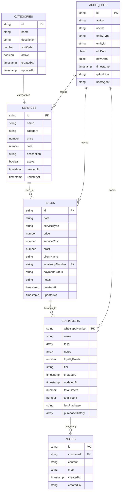

# Database Schema and ER Diagrams

## Database Overview

The Abqar Store Sales Management System uses **Firebase Firestore**, a NoSQL document database, as its primary data storage solution. The database is designed to support real-time synchronization, scalability, and flexible document structures while maintaining data consistency and integrity.

## Entity Relationship Diagram



## Collection Schemas

### 1. Sales Collection

**Collection Name**: `sales`
**Purpose**: Store all sales transaction records

```javascript
{
  "id": "auto-generated-id",
  "date": "2024-01-15",                    // ISO date string (YYYY-MM-DD)
  "serviceType": "Haircut - Men",          // Service name/type
  "price": 50.00,                         // Sale price in EGP
  "serviceCost": 20.00,                   // Cost of providing service
  "profit": 30.00,                        // Calculated profit (price - serviceCost)
  "clientName": "Ahmed Mohamed",           // Customer name
  "whatsappNumber": "201234567890",        // Customer WhatsApp number (Egyptian format)
  "paymentStatus": "paid",                 // "paid" or "unpaid"
  "notes": "Regular customer, prefers morning appointments",
  "createdAt": "2024-01-15T10:30:00Z",    // Timestamp when record was created
  "updatedAt": "2024-01-15T10:30:00Z"     // Timestamp when record was last updated
}
```

**Indexes**:
- `date` (ascending) - for date-based queries
- `whatsappNumber` (ascending) - for customer-based queries
- `paymentStatus` (ascending) - for debt management
- `serviceType` (ascending) - for service analytics
- Composite index: `date` + `paymentStatus` - for filtered reports

**Validation Rules**:
- `date`: Required, valid date format
- `serviceType`: Required, non-empty string
- `price`: Required, positive number
- `serviceCost`: Required, non-negative number
- `profit`: Calculated field, must equal (price - serviceCost)
- `clientName`: Required, non-empty string
- `whatsappNumber`: Optional, valid Egyptian phone format if provided
- `paymentStatus`: Required, must be "paid" or "unpaid"

### 2. Customers Collection

**Collection Name**: `customers`
**Purpose**: Store customer information and loyalty data

```javascript
{
  "whatsappNumber": "201234567890",        // Primary key - Egyptian WhatsApp number
  "name": "Ahmed Mohamed",                 // Customer full name
  "tags": ["VIP", "Regular", "تاجر"],      // Customer categorization tags
  "notes": [                               // Array of note objects
    {
      "id": "note-id-1",
      "content": "Prefers morning appointments",
      "timestamp": "2024-01-15T10:30:00Z",
      "createdBy": "staff-user-id"
    }
  ],
  "loyaltyPoints": 1250,                   // Current loyalty point balance
  "tier": "Silver",                        // Customer tier: "Bronze", "Silver", "Gold"
  "createdAt": "2024-01-01T08:00:00Z",
  "updatedAt": "2024-01-15T10:30:00Z",
  
  // Calculated fields (updated by application logic)
  "totalOrders": 15,                       // Total number of orders
  "totalSpent": 750.00,                    // Total amount spent (EGP)
  "lastPurchase": "2024-01-15",           // Date of last purchase
  "purchaseHistory": [                     // Recent purchase summary
    {
      "date": "2024-01-15",
      "service": "Haircut - Men",
      "amount": 50.00,
      "profit": 30.00
    }
  ]
}
```

**Indexes**:
- `whatsappNumber` (primary key)
- `tier` (ascending) - for tier-based queries
- `totalSpent` (descending) - for top customer analysis
- `lastPurchase` (descending) - for inactive customer identification
- Array index on `tags` - for tag-based filtering

**Validation Rules**:
- `whatsappNumber`: Required, unique, valid Egyptian phone format (20xxxxxxxxxx)
- `name`: Required, non-empty string, max 100 characters
- `tags`: Array of strings, max 10 tags per customer
- `loyaltyPoints`: Non-negative integer
- `tier`: Must be "Bronze", "Silver", or "Gold"
- `totalOrders`: Non-negative integer
- `totalSpent`: Non-negative number

**Tier Assignment Logic**:
- Bronze: totalSpent < 2000 EGP
- Silver: 2000 EGP ≤ totalSpent < 10000 EGP
- Gold: totalSpent ≥ 10000 EGP

### 3. Services Collection

**Collection Name**: `services`
**Purpose**: Store service catalog and pricing information

```javascript
{
  "id": "auto-generated-id",
  "name": "Haircut - Men",                 // Service name
  "category": "Hair Services",             // Service category
  "price": 50.00,                         // Default service price (EGP)
  "cost": 20.00,                          // Cost to provide service
  "description": "Professional men's haircut with styling",
  "active": true,                          // Whether service is currently offered
  "createdAt": "2024-01-01T08:00:00Z",
  "updatedAt": "2024-01-10T14:20:00Z"
}
```

**Indexes**:
- `category` (ascending) - for category-based queries
- `active` (ascending) - for filtering active services
- `name` (ascending) - for service search
- Composite index: `category` + `active` - for active services by category

**Validation Rules**:
- `name`: Required, unique, non-empty string, max 100 characters
- `category`: Required, non-empty string
- `price`: Required, positive number
- `cost`: Required, non-negative number
- `active`: Required, boolean value

### 4. Audit Logs Collection

**Collection Name**: `audit_logs`
**Purpose**: Track all system activities for security and compliance

```javascript
{
  "id": "auto-generated-id",
  "action": "CREATE_SALE",                 // Action type
  "userId": "user-id-or-anonymous",        // User who performed action
  "entityType": "sale",                    // Type of entity affected
  "entityId": "sale-document-id",          // ID of affected entity
  "oldData": null,                         // Previous data (for updates)
  "newData": {                             // New data after action
    "date": "2024-01-15",
    "serviceType": "Haircut - Men",
    "price": 50.00,
    "clientName": "Ahmed Mohamed"
  },
  "timestamp": "2024-01-15T10:30:00Z",
  "ipAddress": "192.168.1.100",           // Client IP address
  "userAgent": "Mozilla/5.0...",          // Browser user agent
  "metadata": {                            // Additional context
    "source": "web_app",
    "version": "1.0.0"
  }
}
```

**Indexes**:
- `timestamp` (descending) - for chronological queries
- `userId` (ascending) - for user activity tracking
- `entityType` (ascending) - for entity-specific audits
- `action` (ascending) - for action-specific queries

**Action Types**:
- `CREATE_SALE`, `UPDATE_SALE`, `DELETE_SALE`
- `CREATE_CUSTOMER`, `UPDATE_CUSTOMER`, `DELETE_CUSTOMER`
- `CREATE_SERVICE`, `UPDATE_SERVICE`, `DELETE_SERVICE`
- `LOGIN`, `LOGOUT`, `SYSTEM_ERROR`

### 5. Categories Collection

**Collection Name**: `categories`
**Purpose**: Organize services into categories

```javascript
{
  "id": "auto-generated-id",
  "name": "Hair Services",                 // Category name
  "description": "All hair-related services including cuts, styling, and treatments",
  "sortOrder": 1,                          // Display order
  "active": true,                          // Whether category is active
  "createdAt": "2024-01-01T08:00:00Z",
  "updatedAt": "2024-01-01T08:00:00Z"
}
```

**Indexes**:
- `sortOrder` (ascending) - for ordered display
- `active` (ascending) - for filtering active categories
- `name` (ascending) - for category search

## Data Relationships and Constraints

### 1. Sales to Customers Relationship

**Type**: Many-to-One (Optional)
**Foreign Key**: `sales.whatsappNumber` → `customers.whatsappNumber`
**Constraints**:
- A sale can exist without a customer record (walk-in customers)
- A customer can have multiple sales records
- When a customer is deleted, related sales retain the customer information

### 2. Sales to Services Relationship

**Type**: Many-to-One (Logical)
**Relationship**: `sales.serviceType` references `services.name`
**Constraints**:
- Sales records maintain service name even if service is deleted
- Service pricing can change without affecting historical sales
- Service analytics are calculated from sales records

### 3. Customers to Notes Relationship

**Type**: One-to-Many (Embedded)
**Implementation**: Notes are embedded as array within customer document
**Constraints**:
- Maximum 50 notes per customer
- Notes are automatically timestamped
- Notes cannot be deleted, only marked as inactive

## Data Normalization and Denormalization

### Normalization Decisions

1. **Customer Data**: Normalized into separate collection to avoid duplication
2. **Service Data**: Normalized to allow centralized pricing management
3. **Audit Logs**: Separate collection for security and performance
4. **Categories**: Normalized to support hierarchical organization

### Denormalization Decisions

1. **Customer Aggregates**: Total orders, total spent, and last purchase are denormalized into customer documents for performance
2. **Service Names in Sales**: Service names are denormalized in sales records to preserve historical data
3. **Customer Notes**: Embedded as arrays within customer documents for atomic updates

## Database Security Rules

### Firebase Security Rules

```javascript
rules_version = '2';
service cloud.firestore {
  match /databases/{database}/documents {
    // Sales collection rules
    match /sales/{saleId} {
      allow read, write: if request.auth != null;
      allow create: if validateSaleData(resource.data);
      allow update: if validateSaleData(resource.data) 
                    && resource.data.createdAt == request.resource.data.createdAt;
    }
    
    // Customers collection rules
    match /customers/{customerId} {
      allow read, write: if request.auth != null;
      allow create: if validateCustomerData(resource.data);
      allow update: if validateCustomerData(resource.data);
    }
    
    // Services collection rules
    match /services/{serviceId} {
      allow read: if request.auth != null;
      allow write: if request.auth != null && hasAdminRole();
    }
    
    // Audit logs - read-only for regular users
    match /audit_logs/{logId} {
      allow read: if request.auth != null;
      allow write: if false; // Only server-side writes
    }
    
    // Helper functions
    function validateSaleData(data) {
      return data.keys().hasAll(['date', 'serviceType', 'price', 'serviceCost', 'clientName', 'paymentStatus'])
             && data.price is number && data.price > 0
             && data.serviceCost is number && data.serviceCost >= 0
             && data.paymentStatus in ['paid', 'unpaid'];
    }
    
    function validateCustomerData(data) {
      return data.keys().hasAll(['whatsappNumber', 'name'])
             && data.whatsappNumber is string
             && data.whatsappNumber.matches('^20[0-9]{9}$')
             && data.loyaltyPoints is number && data.loyaltyPoints >= 0;
    }
    
    function hasAdminRole() {
      return request.auth.token.admin == true;
    }
  }
}
```

## Performance Optimization

### 1. Query Optimization

**Efficient Query Patterns**:
```javascript
// Good: Use indexed fields for filtering
db.collection('sales')
  .where('date', '>=', startDate)
  .where('date', '<=', endDate)
  .orderBy('date', 'desc');

// Good: Limit results for pagination
db.collection('customers')
  .orderBy('totalSpent', 'desc')
  .limit(20);

// Avoid: Queries without proper indexes
db.collection('sales')
  .where('notes', '>=', '')  // Full text search not efficient
```

**Composite Indexes**:
- `sales`: `date` + `paymentStatus`
- `sales`: `whatsappNumber` + `date`
- `customers`: `tier` + `totalSpent`
- `services`: `category` + `active`

### 2. Data Loading Strategies

**Pagination Implementation**:
```javascript
// Cursor-based pagination for better performance
const lastVisible = querySnapshot.docs[querySnapshot.docs.length - 1];
const next = db.collection('sales')
  .orderBy('date', 'desc')
  .startAfter(lastVisible)
  .limit(10);
```

**Real-time Listener Optimization**:
```javascript
// Limit real-time listeners to essential data
const unsubscribe = db.collection('sales')
  .where('date', '==', today)
  .onSnapshot(snapshot => {
    // Only listen to today's sales for dashboard
  });
```

### 3. Caching Strategy

**Client-Side Caching**:
- Browser localStorage for user preferences
- Service Worker cache for offline functionality
- In-memory cache for frequently accessed data

**Firebase Caching**:
- Automatic caching of query results
- Offline persistence for mobile devices
- Cache invalidation on data changes

## Data Migration and Versioning

### Schema Evolution Strategy

1. **Additive Changes**: New fields added with default values
2. **Field Modifications**: Gradual migration with backward compatibility
3. **Breaking Changes**: Version-based migration with data transformation

### Migration Scripts

```javascript
// Example migration for adding customer tiers
async function migrateTo_v2_0() {
  const customers = await db.collection('customers').get();
  const batch = db.batch();
  
  customers.forEach(doc => {
    const data = doc.data();
    const tier = calculateTier(data.totalSpent || 0);
    batch.update(doc.ref, { tier, version: '2.0' });
  });
  
  await batch.commit();
}

function calculateTier(totalSpent) {
  if (totalSpent >= 10000) return 'Gold';
  if (totalSpent >= 2000) return 'Silver';
  return 'Bronze';
}
```

## Backup and Recovery

### Automated Backup Strategy

1. **Daily Backups**: Automated export of all collections
2. **Incremental Backups**: Track changes since last backup
3. **Cross-Region Replication**: Data replicated across multiple regions
4. **Point-in-Time Recovery**: Ability to restore to specific timestamp

### Data Export Formats

```javascript
// Export structure for backup
{
  "backup_metadata": {
    "timestamp": "2024-01-15T10:30:00Z",
    "version": "1.0.0",
    "collections": ["sales", "customers", "services", "audit_logs"]
  },
  "sales": [...],
  "customers": [...],
  "services": [...],
  "audit_logs": [...]
}
```

## Monitoring and Analytics

### Database Metrics

1. **Performance Metrics**:
   - Query execution time
   - Document read/write counts
   - Index usage statistics
   - Connection pool utilization

2. **Business Metrics**:
   - Daily transaction volume
   - Customer growth rate
   - Service popularity trends
   - Revenue analytics

3. **System Health**:
   - Error rates and types
   - Data consistency checks
   - Backup success rates
   - Security rule violations

This comprehensive database schema documentation provides a solid foundation for understanding the data structure, relationships, and optimization strategies used in the Abqar Store Sales Management System. The schema is designed to support current requirements while allowing for future scalability and feature enhancements.