# Data Flow and System Behavior Diagrams

## Context-Level Data Flow Diagram (Level 0)

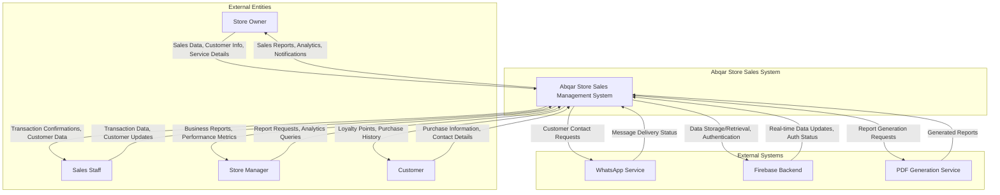

## Level 1 Data Flow Diagram - System Decomposition

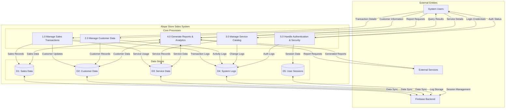

## Level 2 Data Flow Diagram - Sales Transaction Management

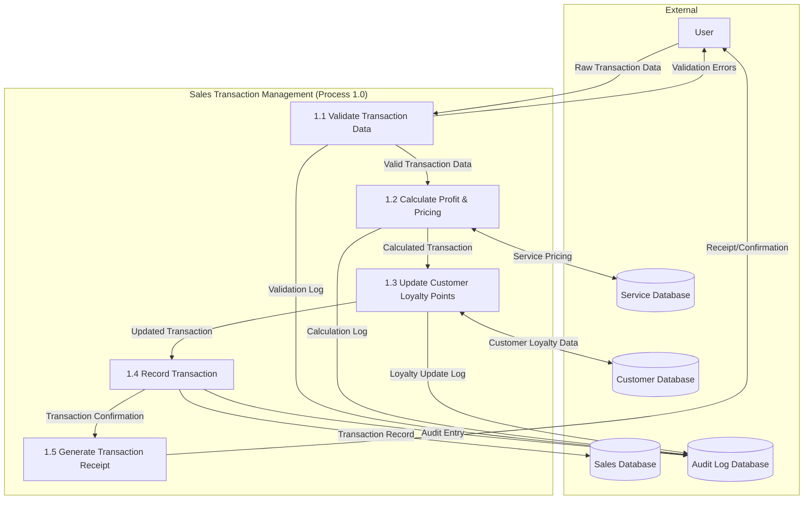

## Sequence Diagrams for Key System Interactions

### 1. Sales Transaction Processing Sequence

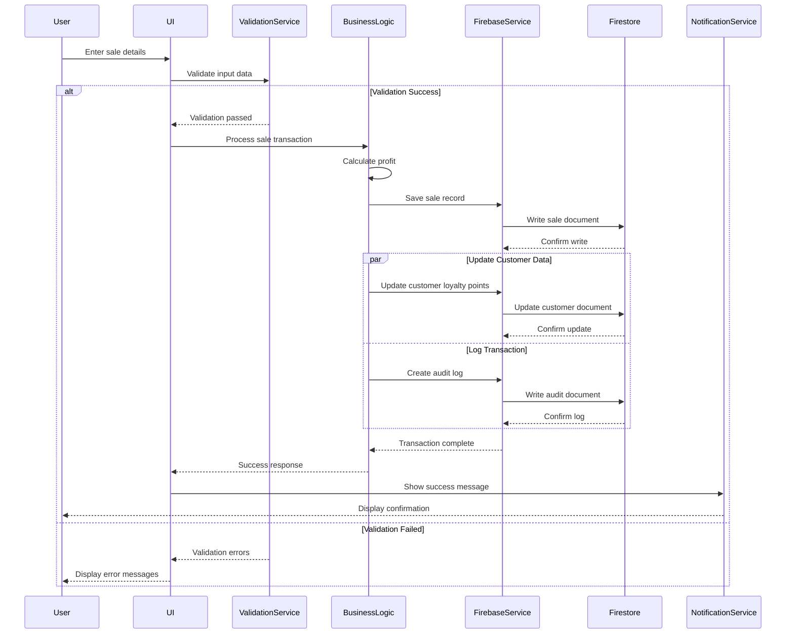

### 2. Customer Data Management Sequence

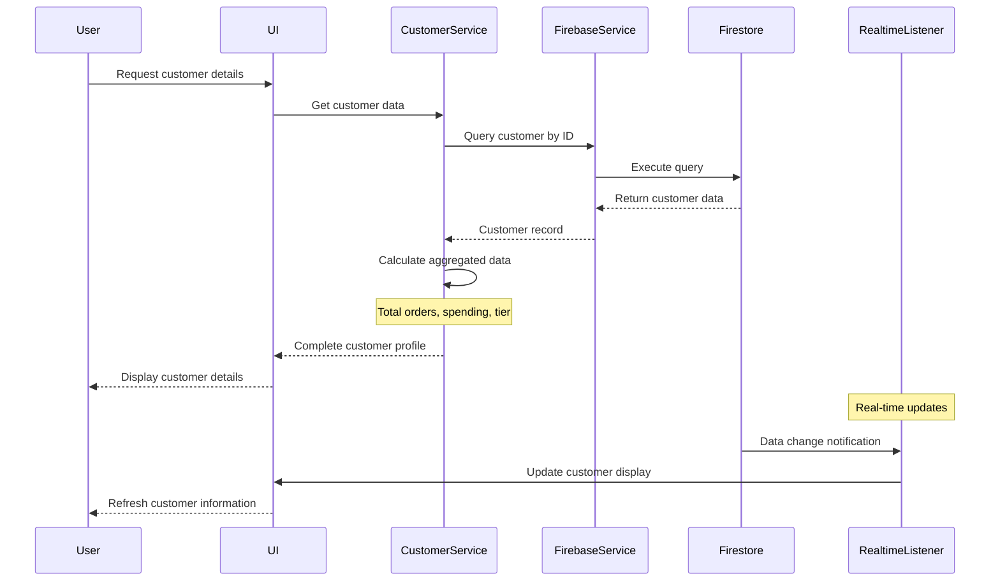

### 3. Report Generation Sequence

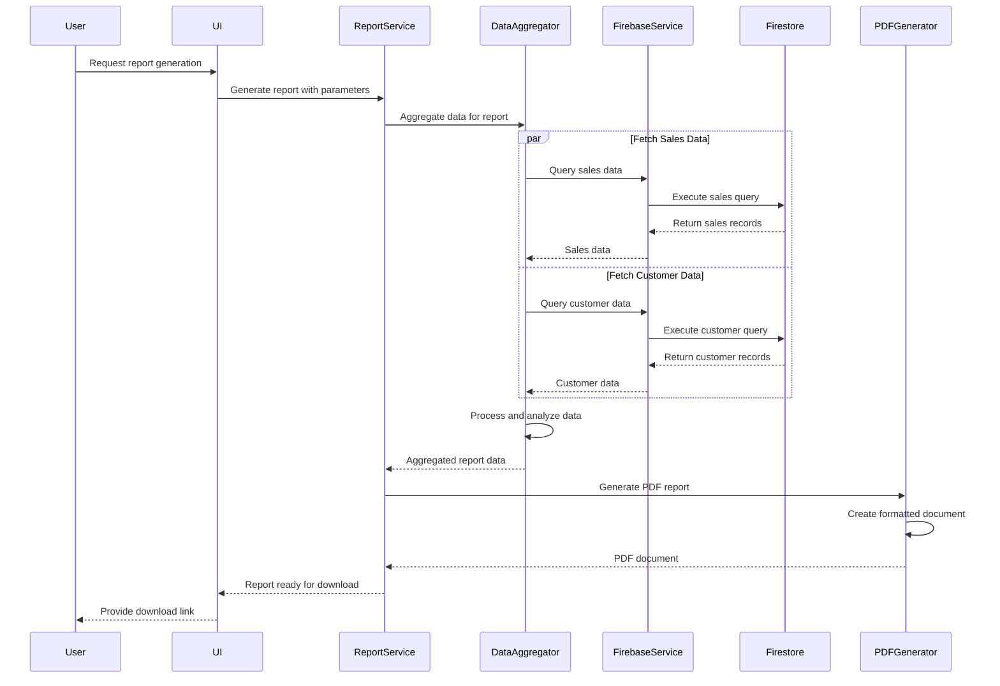

## Activity Diagrams for User Workflows

### 1. Sales Entry Workflow

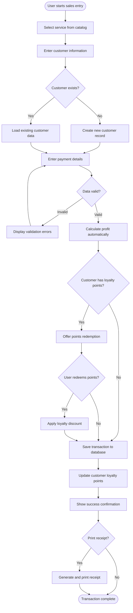

### 2. Customer Management Workflow

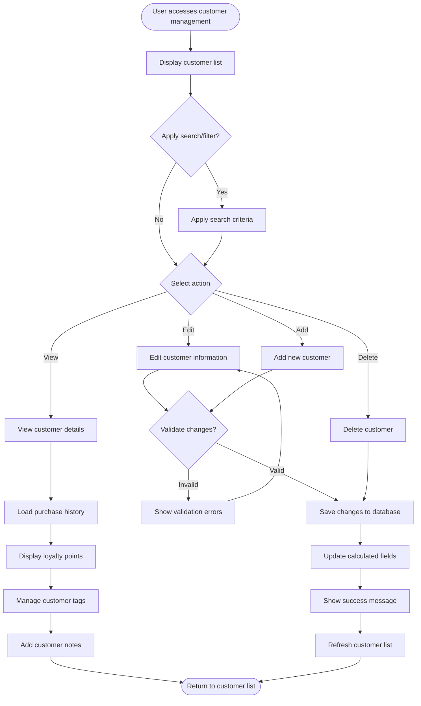

## State Diagrams for Object Transitions

### 1. Sales Transaction State Diagram

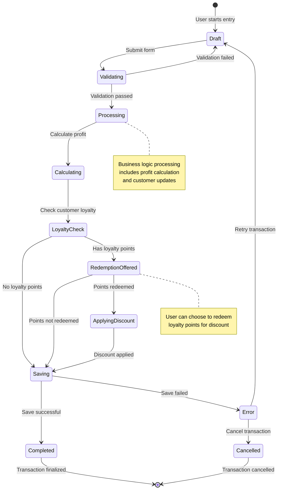

### 2. Customer Lifecycle State Diagram

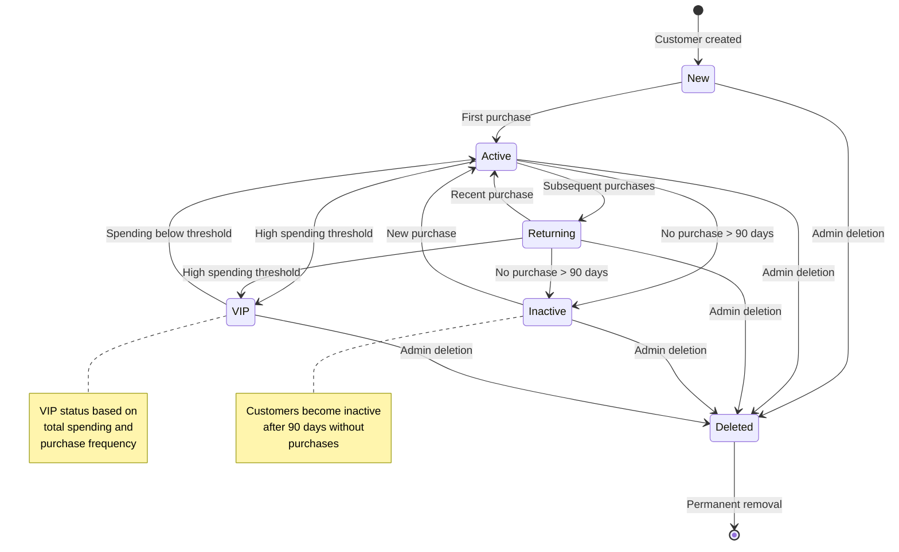

### 3. Service Catalog State Diagram

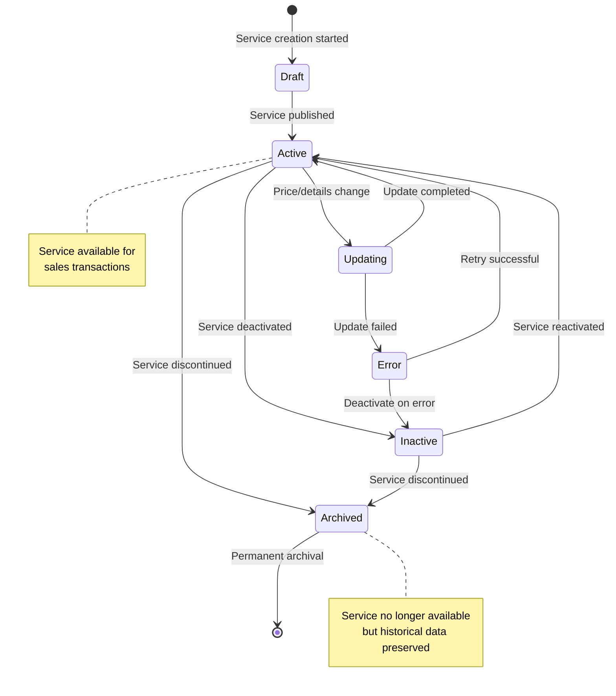

## Data Flow Patterns

### 1. Real-time Data Synchronization Pattern

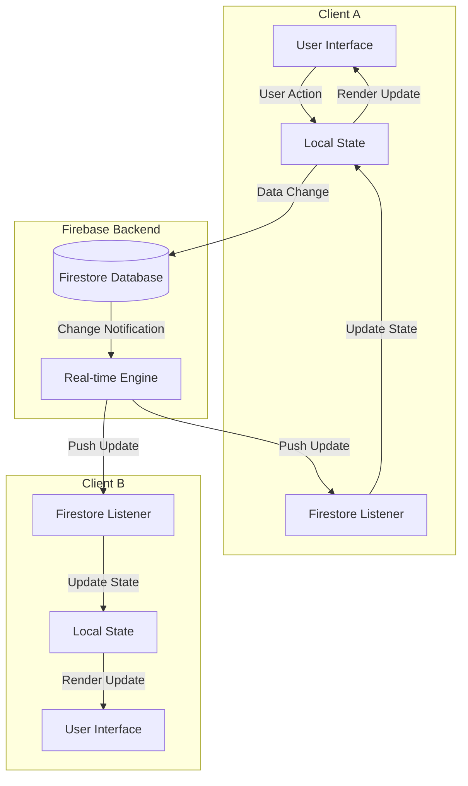

### 2. Offline Data Handling Pattern

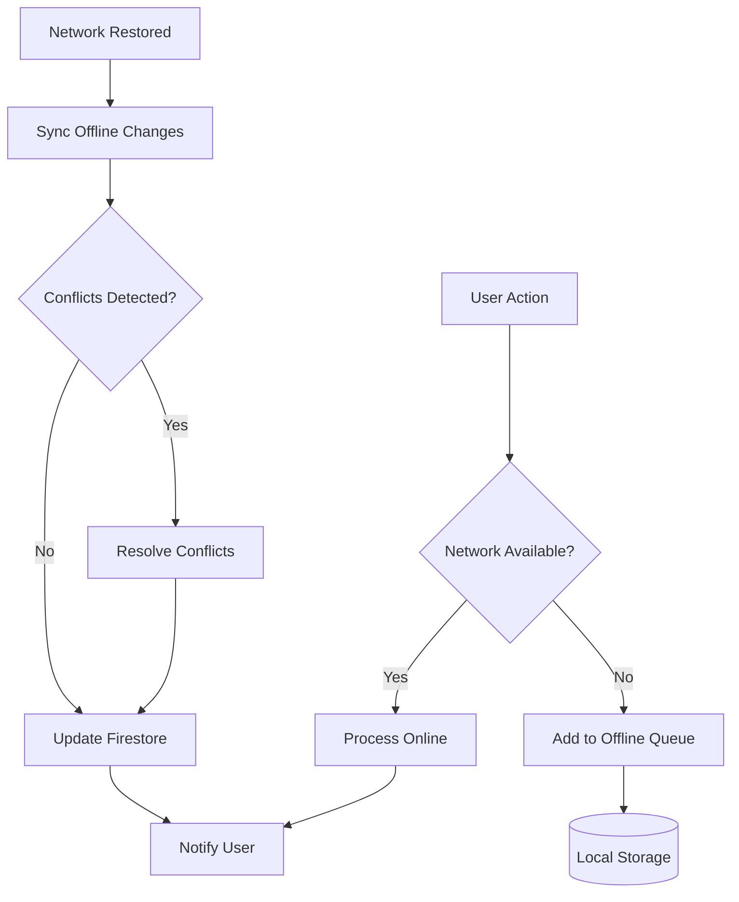

### 3. Data Validation and Error Handling Pattern

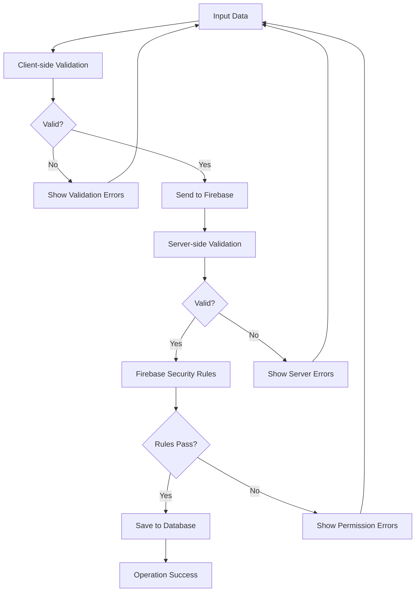

## System Integration Data Flows

### 1. WhatsApp Integration Flow

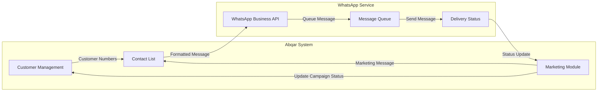

### 2. PDF Report Generation Flow

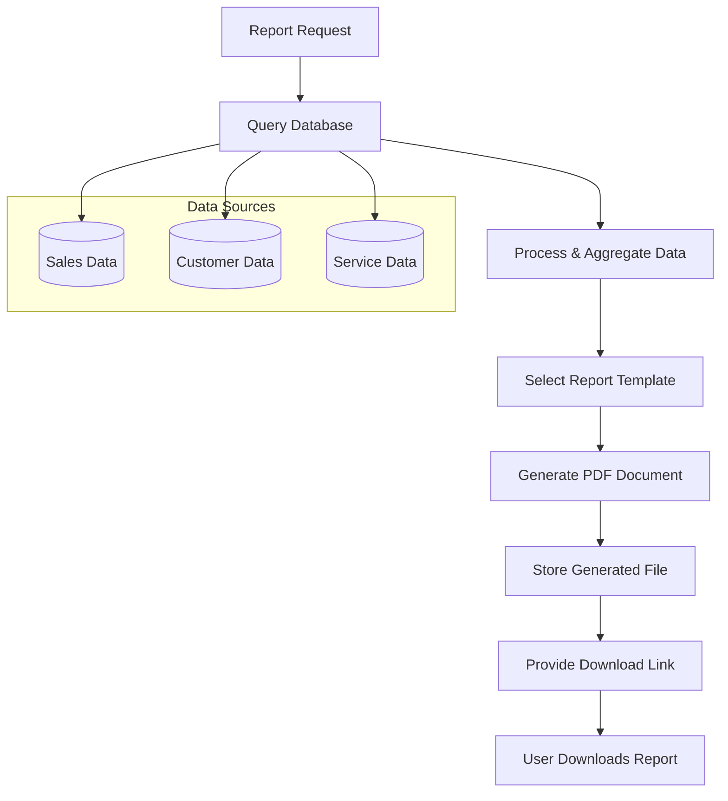

This comprehensive data flow and system behavior documentation provides detailed insights into how data moves through the Abqar Store Sales Management System, how different components interact, and how the system responds to various user actions and state changes. These diagrams serve as essential references for understanding system architecture, debugging issues, and planning future enhancements.