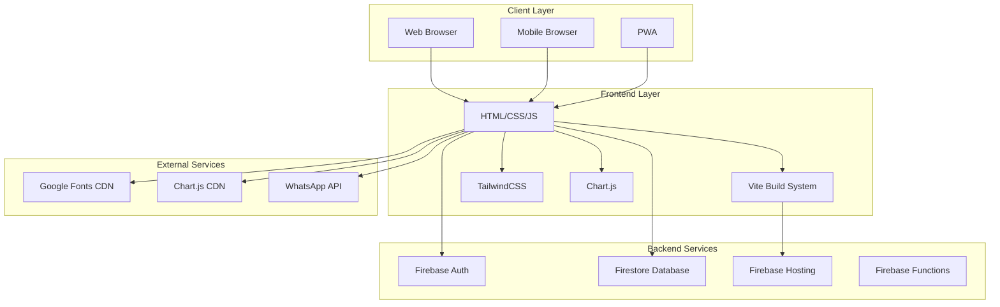
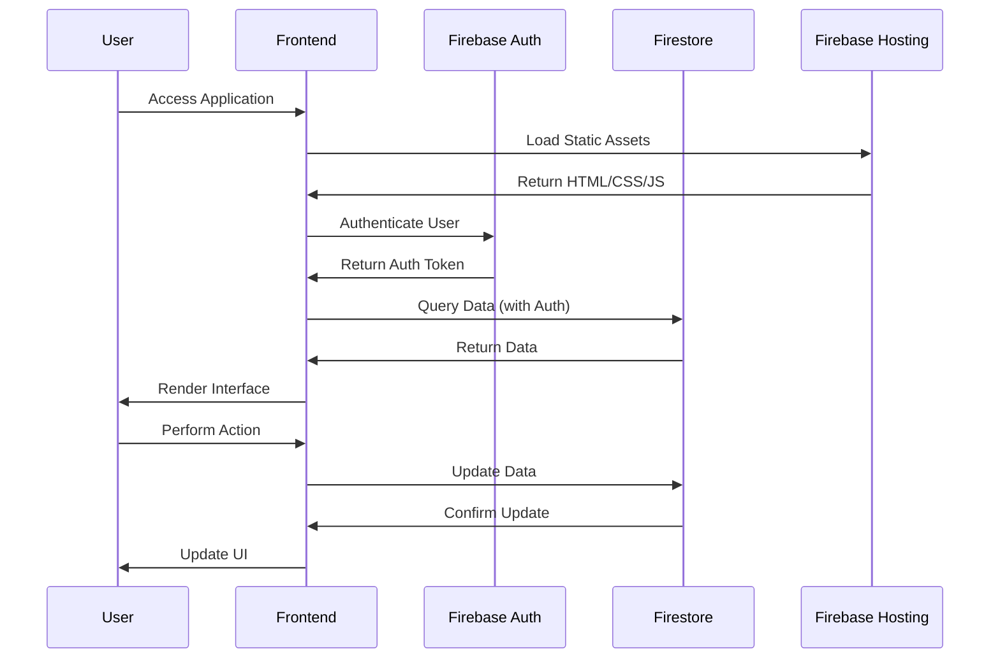
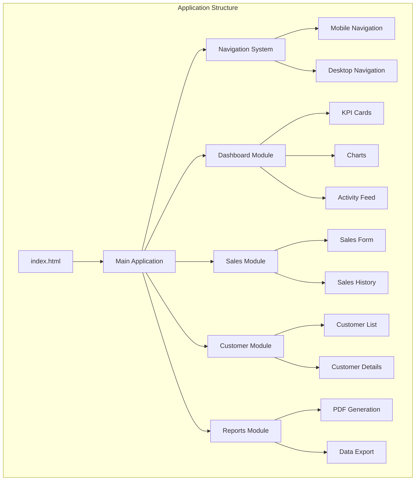
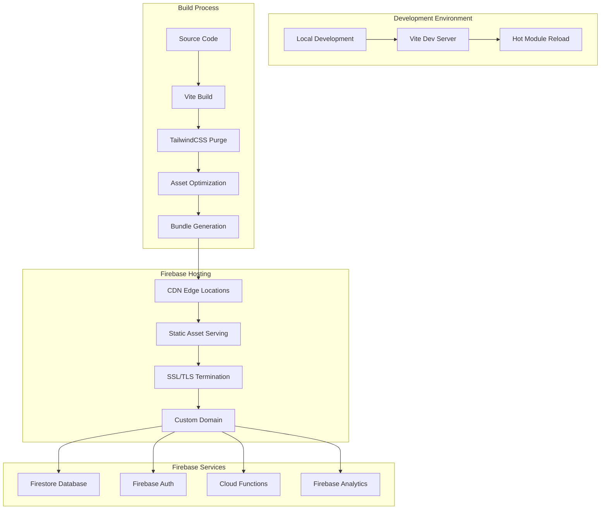

# Technology Stack and Deployment Architecture

## Overview

This document provides comprehensive documentation of the technology stack, system dependencies, and deployment architecture for the Abqar Store Sales Management System. The system is built using modern web technologies with a focus on performance, scalability, and maintainability.

## Technology Stack

### Frontend Technologies

#### Core Framework
- **Vanilla JavaScript (ES6+)**: Pure JavaScript implementation without framework dependencies
- **HTML5**: Semantic markup with modern web standards
- **CSS3**: Advanced styling with custom properties and modern layout techniques

#### Build Tools and Development
```json
{
  "build_system": "Vite 6.3.5",
  "css_framework": "TailwindCSS 3.4.18",
  "css_processor": "PostCSS 8.5.6",
  "css_autoprefixer": "Autoprefixer 10.4.21",
  "testing_framework": "Vitest 3.2.4",
  "test_environment": "jsdom 26.1.0"
}
```

#### UI/UX Libraries
- **Chart.js**: Data visualization and analytics charts
- **Heroicons**: Consistent SVG icon library
- **Google Fonts**: Typography (Cairo for Arabic, Montserrat for English)

### Backend Technologies

#### Database and Authentication
- **Firebase 12.1.0**: Complete backend-as-a-service solution
  - **Firestore**: NoSQL document database
  - **Firebase Auth**: User authentication and authorization
  - **Firebase Hosting**: Static site hosting and CDN

#### Data Management
```javascript
// Firebase Configuration Structure
{
  "firestore": {
    "collections": [
      "sales",
      "customers", 
      "services",
      "audit_logs",
      "user_settings"
    ],
    "security_rules": "Firestore Security Rules",
    "indexes": "Composite indexes for complex queries"
  },
  "authentication": {
    "providers": ["Email/Password", "Google"],
    "security": "Firebase Auth with custom claims"
  }
}
```

### Development Tools

#### Package Management
```json
{
  "package_manager": "npm",
  "node_version": ">=16.0.0",
  "dependencies": {
    "firebase": "^12.1.0"
  },
  "dev_dependencies": {
    "vite": "^6.3.5",
    "tailwindcss": "^3.4.18",
    "vitest": "^3.2.4",
    "jsdom": "^26.1.0",
    "postcss": "^8.5.6",
    "autoprefixer": "^10.4.21"
  }
}
```

#### Code Quality and Testing
- **Vitest**: Unit testing framework with jsdom environment
- **ESLint**: Code linting and style enforcement
- **Prettier**: Code formatting
- **Git**: Version control with conventional commits

## System Architecture

### Application Architecture



### Data Flow Architecture



### Component Architecture



## File Structure and Organization

### Project Directory Structure
```
abqar-store-system/
├── docs/                          # Documentation
│   ├── 01-project-planning/
│   ├── 02-literature-review/
│   ├── 03-requirements/
│   ├── 04-system-design/
│   ├── 05-implementation/
│   ├── 06-testing/
│   ├── 07-final-reports/
│   └── standards/
├── src/                           # Source code
│   ├── assets/                    # Static assets
│   │   ├── images/               # Images and icons
│   │   └── styles/               # Global CSS files
│   ├── backend/                   # Backend logic
│   │   ├── firebase.js           # Firebase configuration
│   │   └── auditLog.js           # Audit logging
│   ├── config/                    # Configuration files
│   │   └── env.js                # Environment variables
│   ├── pages/                     # Page-specific logic
│   │   ├── main.js               # Main application logic
│   │   └── script.js             # Additional scripts
│   └── utils/                     # Utility functions
│       ├── ui.js                 # UI helper functions
│       └── ui.test.js            # Unit tests
├── dist/                          # Build output
├── node_modules/                  # Dependencies
├── .env                          # Environment variables
├── .gitignore                    # Git ignore rules
├── index.html                    # Main HTML file
├── package.json                  # Project configuration
├── package-lock.json             # Dependency lock file
├── postcss.config.js             # PostCSS configuration
├── tailwind.config.js            # TailwindCSS configuration
├── vite.config.js                # Vite build configuration
└── README.md                     # Project documentation
```

### Code Organization Patterns

#### Module Structure
```javascript
// Example module structure (src/pages/main.js)
class SalesManager {
    constructor() {
        this.firebase = new FirebaseService();
        this.ui = new UIManager();
        this.init();
    }
    
    init() {
        this.bindEvents();
        this.loadInitialData();
    }
    
    bindEvents() {
        // Event listeners
    }
    
    async loadInitialData() {
        // Data loading logic
    }
}
```

#### Configuration Management
```javascript
// src/config/env.js
export const config = {
    firebase: {
        apiKey: process.env.VITE_FIREBASE_API_KEY,
        authDomain: process.env.VITE_FIREBASE_AUTH_DOMAIN,
        projectId: process.env.VITE_FIREBASE_PROJECT_ID,
        // ... other config
    },
    app: {
        name: 'Abqar Store System',
        version: '1.0.0',
        environment: process.env.NODE_ENV
    }
};
```

## Deployment Architecture

### Deployment Diagram



### Build and Deployment Process

#### Development Workflow
```bash
# 1. Local Development
npm run dev                    # Start Vite dev server
npm run test                   # Run unit tests
npm run test:watch            # Watch mode testing

# 2. Build Process
npm run build                  # Production build
npm run build:analyze         # Build with bundle analysis
npm run preview               # Preview production build

# 3. Deployment
firebase deploy               # Deploy to Firebase Hosting
firebase deploy --only hosting # Deploy only static assets
```

#### Build Configuration (vite.config.js)
```javascript
import { defineConfig } from 'vite';

export default defineConfig({
  build: {
    outDir: 'dist',
    assetsDir: 'assets',
    sourcemap: false,
    minify: 'terser',
    rollupOptions: {
      output: {
        manualChunks: {
          vendor: ['firebase'],
          charts: ['chart.js']
        }
      }
    }
  },
  server: {
    port: 3000,
    open: true
  },
  preview: {
    port: 4173
  }
});
```

### Environment Configuration

#### Environment Variables
```bash
# .env file structure
VITE_FIREBASE_API_KEY=your_api_key
VITE_FIREBASE_AUTH_DOMAIN=your_project.firebaseapp.com
VITE_FIREBASE_PROJECT_ID=your_project_id
VITE_FIREBASE_STORAGE_BUCKET=your_project.appspot.com
VITE_FIREBASE_MESSAGING_SENDER_ID=your_sender_id
VITE_FIREBASE_APP_ID=your_app_id
VITE_FIREBASE_MEASUREMENT_ID=your_measurement_id

# Application settings
VITE_APP_NAME=Abqar Store System
VITE_APP_VERSION=1.0.0
VITE_APP_ENVIRONMENT=production
```

#### Firebase Configuration
```json
{
  "hosting": {
    "public": "dist",
    "ignore": [
      "firebase.json",
      "**/.*",
      "**/node_modules/**"
    ],
    "rewrites": [
      {
        "source": "**",
        "destination": "/index.html"
      }
    ],
    "headers": [
      {
        "source": "**/*.@(js|css)",
        "headers": [
          {
            "key": "Cache-Control",
            "value": "max-age=31536000"
          }
        ]
      }
    ]
  },
  "firestore": {
    "rules": "firestore.rules",
    "indexes": "firestore.indexes.json"
  }
}
```

## System Dependencies

### Runtime Dependencies

#### Core Dependencies
```json
{
  "firebase": "^12.1.0",
  "chart.js": "Latest via CDN"
}
```

#### Development Dependencies
```json
{
  "vite": "^6.3.5",
  "tailwindcss": "^3.4.18",
  "postcss": "^8.5.6",
  "autoprefixer": "^10.4.21",
  "vitest": "^3.2.4",
  "jsdom": "^26.1.0"
}
```

### External Service Dependencies

#### CDN Resources
```html
<!-- Google Fonts -->
<link href="https://fonts.googleapis.com/css2?family=Cairo:wght@400;600;700&family=Montserrat:wght@400;500;600;700&display=swap" rel="stylesheet">

<!-- Chart.js -->
<script src="https://cdn.jsdelivr.net/npm/chart.js"></script>

<!-- Firebase SDK -->
<script src="https://www.gstatic.com/firebasejs/10.7.1/firebase-app-compat.js"></script>
<script src="https://www.gstatic.com/firebasejs/10.7.1/firebase-firestore-compat.js"></script>
<script src="https://www.gstatic.com/firebasejs/10.7.1/firebase-auth-compat.js"></script>
```

#### Third-Party Integrations
- **WhatsApp Business API**: For customer communication
- **Google Fonts**: Typography resources
- **Firebase Services**: Complete backend infrastructure

## Performance Optimization

### Build Optimization

#### Asset Optimization
```javascript
// Vite build optimizations
{
  build: {
    minify: 'terser',
    cssMinify: true,
    rollupOptions: {
      output: {
        manualChunks: {
          vendor: ['firebase'],
          ui: ['chart.js']
        }
      }
    }
  }
}
```

#### TailwindCSS Purging
```javascript
// tailwind.config.js
module.exports = {
  content: [
    "./index.html",
    "./src/**/*.{js,ts,jsx,tsx,html}",
    "./*.{js,ts,jsx,tsx,html}"
  ],
  // Purge unused CSS in production
  purge: {
    enabled: process.env.NODE_ENV === 'production',
    content: ['./src/**/*.{js,html}', './index.html']
  }
}
```

### Runtime Performance

#### Lazy Loading
```javascript
// Dynamic imports for code splitting
const loadChartModule = async () => {
  const { Chart } = await import('chart.js');
  return Chart;
};

// Image lazy loading
const images = document.querySelectorAll('img[data-src]');
const imageObserver = new IntersectionObserver((entries) => {
  entries.forEach(entry => {
    if (entry.isIntersecting) {
      const img = entry.target;
      img.src = img.dataset.src;
      imageObserver.unobserve(img);
    }
  });
});
```

#### Caching Strategy
```javascript
// Service Worker for caching (if implemented)
const CACHE_NAME = 'abqar-store-v1';
const urlsToCache = [
  '/',
  '/src/assets/styles/globals.css',
  '/src/pages/main.js'
];

self.addEventListener('install', (event) => {
  event.waitUntil(
    caches.open(CACHE_NAME)
      .then((cache) => cache.addAll(urlsToCache))
  );
});
```

## Security Considerations

### Firebase Security Rules
```javascript
// Firestore Security Rules
rules_version = '2';
service cloud.firestore {
  match /databases/{database}/documents {
    // Users can only access their own data
    match /sales/{document} {
      allow read, write: if request.auth != null 
        && request.auth.uid == resource.data.userId;
    }
    
    match /customers/{document} {
      allow read, write: if request.auth != null 
        && request.auth.uid == resource.data.userId;
    }
  }
}
```

### Environment Security
```javascript
// Secure environment variable handling
const config = {
  firebase: {
    apiKey: import.meta.env.VITE_FIREBASE_API_KEY,
    authDomain: import.meta.env.VITE_FIREBASE_AUTH_DOMAIN,
    // Never expose sensitive keys in client-side code
  }
};

// Validate required environment variables
const requiredEnvVars = [
  'VITE_FIREBASE_API_KEY',
  'VITE_FIREBASE_PROJECT_ID'
];

requiredEnvVars.forEach(envVar => {
  if (!import.meta.env[envVar]) {
    throw new Error(`Missing required environment variable: ${envVar}`);
  }
});
```

## Monitoring and Analytics

### Performance Monitoring
```javascript
// Web Vitals monitoring
import { getCLS, getFID, getFCP, getLCP, getTTFB } from 'web-vitals';

getCLS(console.log);
getFID(console.log);
getFCP(console.log);
getLCP(console.log);
getTTFB(console.log);
```

### Error Tracking
```javascript
// Global error handling
window.addEventListener('error', (event) => {
  console.error('Global error:', event.error);
  // Send to monitoring service
});

window.addEventListener('unhandledrejection', (event) => {
  console.error('Unhandled promise rejection:', event.reason);
  // Send to monitoring service
});
```

## Scalability Considerations

### Database Scaling
- **Firestore**: Automatic scaling with regional replication
- **Indexing**: Composite indexes for complex queries
- **Data Partitioning**: User-based data isolation

### Frontend Scaling
- **CDN**: Firebase Hosting with global CDN
- **Code Splitting**: Dynamic imports for large features
- **Asset Optimization**: Compressed images and minified code

### Monitoring and Maintenance
- **Firebase Analytics**: User behavior tracking
- **Performance Monitoring**: Core Web Vitals tracking
- **Error Reporting**: Automated error collection and alerting

This comprehensive technology stack and deployment documentation provides a complete overview of the system architecture, ensuring maintainability, scalability, and optimal performance for the Abqar Store Sales Management System.