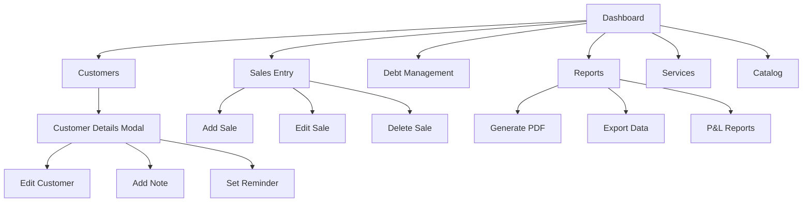

# Wireframes and Mockups

## Overview

This document presents the wireframes and mockups for the Abqar Store Sales Management System, showcasing the user interface design for all major screens and user interactions. The design follows modern web application patterns with responsive layouts supporting both desktop and mobile devices.

## Design Principles

- **Responsive Design**: Mobile-first approach with adaptive layouts
- **Accessibility**: WCAG 2.1 compliant design with proper contrast ratios
- **User-Centric**: Intuitive navigation and clear information hierarchy
- **Modern Aesthetics**: Clean, professional interface with gradient accents
- **Dark Mode Support**: Complete dark/light theme implementation

## Main Application Layout

### Header Navigation (Desktop)

```
┌─────────────────────────────────────────────────────────────────────────────┐
│ [Logo]  [Dashboard] [Sales] [Customers] [Debt] [Reports] [Services] [Catalog] │
│                                                    [🔔] [EN/AR] [🌙] │
└─────────────────────────────────────────────────────────────────────────────┘
```

**Key Features:**
- Sticky header with company logo (Abqar)
- Horizontal navigation tabs with active state indicators
- Right-aligned controls: notifications, language toggle, dark mode toggle
- Gradient backgrounds with hover effects

### Mobile Navigation

```
┌─────────────────────────────────────────────────────────────────┐
│ [☰]              [3abqar Logo]                    [⚙️] │
└─────────────────────────────────────────────────────────────────┘
│                                                                 │
│ [Slide-out Menu Panel]                                          │
│ ┌─ Dashboard                                                    │
│ ├─ Sales & Log                                                 │
│ ├─ Customers                                                   │
│ ├─ Debt Management                                             │
│ ├─ Reports & Tools                                             │
│ ├─ Services                                                    │
│ ├─ Catalog                                                     │
│ └─ Audit Log                                                   │
```

**Key Features:**
- Hamburger menu for mobile navigation
- Collapsible sidebar with full-screen overlay
- Settings popover with language and theme controls

## Screen Wireframes

### 1. Dashboard Screen

```
┌─────────────────────────────────────────────────────────────────────────────┐
│                              DASHBOARD                                      │
├─────────────────────────────────────────────────────────────────────────────┤
│ ┌─────────────┐ ┌─────────────┐ ┌─────────────┐ ┌─────────────┐ ┌─────────┐ │
│ │   Revenue   │ │Profit Margin│ │New Customers│ │Profit by Date│ │ Orders  │ │
│ │   [💰]      │ │    [📈]     │ │    [👥]     │ │    [📅]     │ │  [📋]   │ │
│ │  $0.00 EGP  │ │     0%      │ │      0      │ │  $0.00 EGP  │ │    0    │ │
│ │ [24h][7d][30d]│ │ ████░░░░░░  │ │             │ │[24h][7d][30d]│ │         │ │
│ └─────────────┘ └─────────────┘ └─────────────┘ └─────────────┘ └─────────┘ │
├─────────────────────────────────────────────────────────────────────────────┤
│ ┌─────────────┐ ┌─────────────┐ ┌─────────────┐                             │
│ │ Total Debt  │ │ Top Client  │ │Most Profit  │                             │
│ │    [💳]     │ │    [👤]     │ │Client [⚡]  │                             │
│ │  $0.00 EGP  │ │     N/A     │ │     N/A     │                             │
│ └─────────────┘ └─────────────┘ └─────────────┘                             │
├─────────────────────────────────────────────────────────────────────────────┤
│ ┌─────────────────────────────┐ ┌─────────────────────────────┐             │
│ │    Sales by Service Type    │ │    Monthly Sales Trend      │             │
│ │         [Pie Chart]         │ │       [Line Chart]          │             │
│ └─────────────────────────────┘ └─────────────────────────────┘             │
├─────────────────────────────────────────────────────────────────────────────┤
│ ┌─────────────────────────────────────────────┐ ┌─────────────────────────┐ │
│ │           Service Profitability             │ │    Recent Activity      │ │
│ │ ┌─────────┬─────────┬─────────┬─────────┐   │ │ • Sale added: $50       │ │
│ │ │Service  │ Orders  │ Revenue │ Profit  │   │ │ • Customer registered   │ │
│ │ │Service A│   15    │  $500   │  $150   │   │ │ • Payment received      │ │
│ │ └─────────┴─────────┴─────────┴─────────┘   │ └─────────────────────────┘ │
│ └─────────────────────────────────────────────┘                             │
└─────────────────────────────────────────────────────────────────────────────┘
```

**Key Features:**
- Grid layout with KPI cards featuring gradient backgrounds
- Interactive time range selectors (24h, 7d, 30d)
- Progress bars for goal tracking
- Chart.js integration for data visualization
- Real-time activity feed

### 2. Sales Entry Screen

```
┌─────────────────────────────────────────────────────────────────────────────┐
│                            SALES ENTRY                                     │
├─────────────────────────────────────────────────────────────────────────────┤
│ ┌─────────────────────────┐ ┌─────────────────────────────────────────────┐ │
│ │    New Sale Entry       │ │            Sales History                    │ │
│ │ ┌─────────┬─────────┐   │ │ ┌─────────────────────────────────────────┐ │ │
│ │ │  Date   │Service  │   │ │ │ [Start Date] [End Date] [Filter]        │ │ │
│ │ │[Input]  │[Select] │   │ │ └─────────────────────────────────────────┘ │ │
│ │ └─────────┴─────────┘   │ │ ┌─────────────────────────────────────────┐ │ │
│ │ ┌─────────┬─────────┐   │ │ │Date │Service│Client │Price│Profit│Status│ │ │
│ │ │ Price   │  Cost   │   │ │ │2024 │Web    │John   │$100 │ $30  │ Paid │ │ │
│ │ │[Input]  │[Input]  │   │ │ │2024 │Design │Jane   │$200 │ $80  │Unpaid│ │ │
│ │ └─────────┴─────────┘   │ │ └─────────────────────────────────────────┘ │ │
│ │ ┌─────────────────────┐ │ │                                             │ │
│ │ │   Client Name       │ │ │                                             │ │
│ │ │   [Autocomplete]    │ │ │                                             │ │
│ │ └─────────────────────┘ │ │                                             │ │
│ │ ┌─────────────────────┐ │ │                                             │ │
│ │ │ WhatsApp (Optional) │ │ │                                             │ │
│ │ │      [Input]        │ │ │                                             │ │
│ │ └─────────────────────┘ │ │                                             │ │
│ │ ┌─────────────────────┐ │ │                                             │ │
│ │ │  Payment Status     │ │ │                                             │ │
│ │ │ [Paid ▼] [Unpaid]   │ │ │                                             │ │
│ │ └─────────────────────┘ │ │                                             │ │
│ │ ┌─────────────────────┐ │ │                                             │ │
│ │ │   Notes (Optional)  │ │ │                                             │ │
│ │ │    [Text Area]      │ │ │                                             │ │
│ │ └─────────────────────┘ │ │                                             │ │
│ │      [Save Sale]        │ │                                             │ │
│ └─────────────────────────┘ └─────────────────────────────────────────────┘ │
└─────────────────────────────────────────────────────────────────────────────┘
```

**Key Features:**
- Split layout: form on left, history table on right
- Auto-complete for client names with suggestion dropdown
- Real-time form validation
- Filterable sales history with date range picker
- Responsive design adapts to mobile with stacked layout

### 3. Customer Management Screen

```
┌─────────────────────────────────────────────────────────────────────────────┐
│                         CUSTOMER DATABASE                                  │
├─────────────────────────────────────────────────────────────────────────────┤
│ [Search...] [Add Customer]                                                  │
├─────────────────────────────────────────────────────────────────────────────┤
│ ┌─────────────────────────────────────────────────────────────────────────┐ │
│ │Customer │WhatsApp │Last Purchase│Total Orders│Total Spent│Actions      │ │
│ │John Doe │+201234  │2024-01-15   │     5      │   $500    │[View][Edit] │ │
│ │Jane Sm. │+201235  │2024-01-10   │     3      │   $300    │[View][Edit] │ │
│ └─────────────────────────────────────────────────────────────────────────┘ │
│                            [Pagination Controls]                            │
└─────────────────────────────────────────────────────────────────────────────┘
```

**Key Features:**
- Search functionality with real-time filtering
- Sortable table columns
- Pagination for large datasets
- Quick action buttons for viewing/editing customer details

### 4. Customer Details Modal

```
┌─────────────────────────────────────────────────────────────────────────────┐
│                        Customer Details                        [×]          │
├─────────────────────────────────────────────────────────────────────────────┤
│ Name: John Doe              │ WhatsApp: +201234567890                       │
│ Total Orders: 5             │ Total Spent: $500.00                          │
│ Total Profit: $150.00       │ Avg Profit/Order: $30.00                      │
│ Loyalty Points: 250 [📱] [📋] [Cash Back] [Add Bonus]                      │
├─────────────────────────────────────────────────────────────────────────────┤
│ Tags: [VIP] [Regular] [+]                                                   │
│ [New tag...] [Add]                                                          │
├─────────────────────────────────────────────────────────────────────────────┤
│ Purchase History                                                            │
│ ┌─────────────────────────────────────────────────────────────────────────┐ │
│ │Date      │Service    │Price                                             │ │
│ │2024-01-15│Web Design │$100                                              │ │
│ │2024-01-10│Logo Design│$50                                               │ │
│ └─────────────────────────────────────────────────────────────────────────┘ │
├─────────────────────────────────────────────────────────────────────────────┤
│ Notes Timeline                                                              │
│ [Add a new note...] [Add]                                                   │
│ • 2024-01-15: Customer requested rush delivery                              │
│ • 2024-01-10: Very satisfied with service                                   │
├─────────────────────────────────────────────────────────────────────────────┤
│ Reminders                                                                   │
│ [Date] [Reminder text...] [Add]                                             │
│ • 2024-02-01: Follow up on project status                                   │
└─────────────────────────────────────────────────────────────────────────────┘
```

**Key Features:**
- Comprehensive customer information display
- Loyalty points management with WhatsApp integration
- Tag system for customer categorization
- Purchase history with scrollable table
- Notes timeline for customer relationship management
- Reminder system for follow-ups

## Mobile Wireframes

### Mobile Dashboard

```
┌─────────────────────────┐
│ [☰]  3abqar      [⚙️]  │
├─────────────────────────┤
│ ┌─────────────────────┐ │
│ │      Revenue        │ │
│ │       [💰]          │ │
│ │    $0.00 EGP        │ │
│ │  [24h] [7d] [30d]   │ │
│ └─────────────────────┘ │
│ ┌─────────────────────┐ │
│ │   Profit Margin     │ │
│ │       [📈]          │ │
│ │        0%           │ │
│ │   ████░░░░░░        │ │
│ └─────────────────────┘ │
│ ┌─────────────────────┐ │
│ │  New Customers      │ │
│ │       [👥]          │ │
│ │        0            │ │
│ └─────────────────────┘ │
│        [More...]        │
└─────────────────────────┘
```

### Mobile Sales Entry

```
┌─────────────────────────┐
│    New Sale Entry       │
├─────────────────────────┤
│ Date: [2024-01-15]      │
│ Service: [Select ▼]     │
│ Price: [$0.00]          │
│ Cost: [$0.00]           │
│ Client: [John Doe]      │
│ WhatsApp: [+201234...]  │
│ Status: [Paid ▼]        │
│ Notes: [Optional...]    │
│                         │
│      [Save Sale]        │
├─────────────────────────┤
│    Sales History        │
│ [Filter] [Date Range]   │
│ ┌─────────────────────┐ │
│ │ 2024-01-15         │ │
│ │ Web Design         │ │
│ │ John Doe - $100    │ │
│ │ Profit: $30 [Paid] │ │
│ └─────────────────────┘ │
└─────────────────────────┘
```

## User Interface Flow

### Navigation Flow



### User Interaction Patterns

1. **Card-based Layout**: Information organized in cards with hover effects
2. **Modal Dialogs**: Detailed views and forms in overlay modals
3. **Inline Editing**: Quick edits without page navigation
4. **Progressive Disclosure**: Show more details on demand
5. **Contextual Actions**: Actions appear based on user context

## Responsive Breakpoints

- **Mobile**: 320px - 768px (Single column, stacked layout)
- **Tablet**: 768px - 1024px (Two column, condensed navigation)
- **Desktop**: 1024px+ (Full layout with sidebar navigation)

## Accessibility Features

- **Keyboard Navigation**: Full keyboard support for all interactions
- **Screen Reader Support**: Proper ARIA labels and semantic HTML
- **High Contrast**: Dark mode with sufficient contrast ratios
- **Focus Indicators**: Clear visual focus states
- **Text Scaling**: Responsive text that scales with user preferences

## Visual Design Elements

- **Color Palette**: Blue/indigo primary, green success, red error, yellow warning
- **Typography**: Cairo (Arabic), Montserrat (English) font families
- **Shadows**: Soft, medium, and strong shadow variations
- **Gradients**: Subtle gradients for depth and visual interest
- **Icons**: Heroicons for consistent iconography
- **Animations**: Smooth transitions and hover effects

This wireframe and mockup documentation provides a comprehensive view of the user interface design, ensuring consistency across all screens and user interactions while maintaining accessibility and responsive design principles.