# Use Case Diagrams and Descriptions

## System Overview Use Case Diagram

```mermaid
graph TB
    subgraph "Abqar Store Sales Management System"
        subgraph "Sales Management"
            UC1[Record New Sale]
            UC2[Edit Sale Record]
            UC3[Delete Sale Record]
            UC4[View Sales History]
            UC5[Filter Sales Data]
        end
        
        subgraph "Customer Management"
            UC6[Add New Customer]
            UC7[View Customer Details]
            UC8[Update Customer Information]
            UC9[Manage Customer Tags]
            UC10[Track Customer Loyalty Points]
        end
        
        subgraph "Financial Management"
            UC11[Track Unpaid Orders]
            UC12[Mark Orders as Paid]
            UC13[Generate Financial Reports]
            UC14[View Profit Analytics]
            UC15[Set Daily Goals]
        end
        
        subgraph "Service Management"
            UC16[Add New Service]
            UC17[Edit Service Details]
            UC18[Delete Service]
            UC19[Manage Service Categories]
            UC20[View Service Catalog]
        end
        
        subgraph "Reporting & Analytics"
            UC21[Generate PDF Reports]
            UC22[Export Customer Data]
            UC23[View Dashboard Analytics]
            UC24[Track Performance Metrics]
        end
    end
    
    StoreOwner[Store Owner]
    SalesStaff[Sales Staff]
    Manager[Store Manager]
    
    StoreOwner --> UC1
    StoreOwner --> UC2
    StoreOwner --> UC3
    StoreOwner --> UC4
    StoreOwner --> UC5
    StoreOwner --> UC6
    StoreOwner --> UC7
    StoreOwner --> UC8
    StoreOwner --> UC9
    StoreOwner --> UC10
    StoreOwner --> UC11
    StoreOwner --> UC12
    StoreOwner --> UC13
    StoreOwner --> UC14
    StoreOwner --> UC15
    StoreOwner --> UC16
    StoreOwner --> UC17
    StoreOwner --> UC18
    StoreOwner --> UC19
    StoreOwner --> UC20
    StoreOwner --> UC21
    StoreOwner --> UC22
    StoreOwner --> UC23
    StoreOwner --> UC24
    
    SalesStaff --> UC1
    SalesStaff --> UC2
    SalesStaff --> UC4
    SalesStaff --> UC5
    SalesStaff --> UC6
    SalesStaff --> UC7
    SalesStaff --> UC8
    SalesStaff --> UC10
    SalesStaff --> UC12
    SalesStaff --> UC20
    
    Manager --> UC4
    Manager --> UC5
    Manager --> UC13
    Manager --> UC14
    Manager --> UC21
    Manager --> UC22
    Manager --> UC23
    Manager --> UC24
```

## Actor Definitions

### Primary Actors

1. **Store Owner**
   - **Description**: The business owner who has full access to all system features
   - **Responsibilities**: Strategic decision making, financial oversight, system configuration
   - **Goals**: Maximize profitability, understand business performance, manage operations efficiently

2. **Sales Staff**
   - **Description**: Employees who handle day-to-day sales transactions and customer interactions
   - **Responsibilities**: Process sales, manage customer data, handle payments
   - **Goals**: Complete transactions quickly and accurately, provide good customer service

3. **Store Manager**
   - **Description**: Middle management responsible for operational oversight and reporting
   - **Responsibilities**: Monitor performance, generate reports, analyze trends
   - **Goals**: Ensure operational efficiency, track performance metrics, support decision making

### Secondary Actors

4. **Firebase System**
   - **Description**: Cloud backend service providing data storage and synchronization
   - **Responsibilities**: Data persistence, real-time synchronization, user authentication
   - **Interactions**: Automatic data backup, cross-device synchronization

## Detailed Use Case Descriptions

### UC1: Record New Sale

**Primary Actor**: Store Owner, Sales Staff
**Goal**: Record a new sales transaction in the system
**Preconditions**: User is authenticated and has access to sales entry form
**Success Guarantee**: Sale is recorded with accurate profit calculation and customer data is updated

**Main Success Scenario**:
1. User navigates to sales entry form
2. System displays current date and empty form fields
3. User selects service type from dropdown menu
4. System auto-populates price and service cost based on selected service
5. User enters customer name and optional WhatsApp number
6. User selects payment status (paid/unpaid)
7. User adds optional notes
8. System calculates profit automatically (price - service cost)
9. User clicks "Save Sale" button
10. System validates all required fields
11. System saves sale to Firebase database
12. System updates customer loyalty points if WhatsApp number provided
13. System displays success notification
14. System resets form for next entry

**Extensions**:
- 4a. Service not in dropdown: User can enter custom service details
- 6a. Customer has loyalty points: System offers redemption option
- 10a. Validation fails: System highlights missing fields and shows error message
- 11a. Database error: System shows error notification and retains form data

**Special Requirements**:
- Response time < 2 seconds for form submission
- Automatic profit calculation must be accurate to 2 decimal places
- Support for Arabic and English input

---

### UC2: Edit Sale Record

**Primary Actor**: Store Owner, Sales Staff
**Goal**: Modify an existing sales transaction
**Preconditions**: Sale record exists and user has edit permissions
**Success Guarantee**: Sale record is updated with new information and customer data is recalculated

**Main Success Scenario**:
1. User views sales history table
2. User clicks "Edit" button on specific sale record
3. System populates form with existing sale data
4. User modifies desired fields
5. System recalculates profit if price or cost changed
6. User clicks "Update Sale" button
7. System validates modified data
8. System updates sale record in database
9. System adjusts customer loyalty points based on price difference
10. System displays success notification
11. System refreshes sales table with updated data

**Extensions**:
- 3a. Sale record not found: System displays error message
- 7a. Validation fails: System shows validation errors
- 8a. Database error: System shows error and retains changes
- 9a. Customer changed: System updates points for both old and new customers

---

### UC3: Delete Sale Record

**Primary Actor**: Store Owner
**Goal**: Remove a sales transaction from the system
**Preconditions**: Sale record exists and user has delete permissions
**Success Guarantee**: Sale record is permanently removed and customer data is updated

**Main Success Scenario**:
1. User views sales history table
2. User clicks "Delete" button on specific sale record
3. System displays confirmation dialog with sale details
4. User confirms deletion
5. System removes sale record from database
6. System adjusts customer loyalty points by subtracting earned points
7. System displays success notification
8. System refreshes sales table

**Extensions**:
- 4a. User cancels: System closes dialog without changes
- 5a. Database error: System shows error message and retains record
- 6a. Customer not found: System logs warning but continues deletion

---

### UC4: View Sales History

**Primary Actor**: Store Owner, Sales Staff, Manager
**Goal**: View and analyze historical sales data
**Preconditions**: User is authenticated
**Success Guarantee**: Sales data is displayed with accurate information and filtering options

**Main Success Scenario**:
1. User navigates to sales history section
2. System loads sales data from database
3. System displays sales in table format with pagination
4. System shows columns: Date, Service, Customer, Price, Profit, Status, Actions
5. User can sort by any column
6. User can filter by date range, service type, or payment status
7. System updates display based on filters
8. User can export filtered data to PDF

**Extensions**:
- 2a. No sales data: System displays "No sales records found" message
- 2b. Database error: System shows error message and retry option
- 6a. Invalid filter criteria: System shows validation message

---

### UC5: Filter Sales Data

**Primary Actor**: Store Owner, Sales Staff, Manager
**Goal**: Filter sales data based on specific criteria
**Preconditions**: Sales data exists in the system
**Success Guarantee**: Filtered results are displayed accurately

**Main Success Scenario**:
1. User accesses sales history or dashboard
2. User clicks on filter options
3. System displays filter panel with options:
   - Date range picker
   - Service type dropdown
   - Payment status selector
   - Customer name search
4. User selects desired filter criteria
5. System applies filters to sales data
6. System updates display with filtered results
7. System shows count of filtered records
8. User can clear filters to return to full dataset

**Extensions**:
- 5a. No results match criteria: System displays "No matching records" message
- 5b. Filter processing error: System shows error and resets filters

---

### UC6: Add New Customer

**Primary Actor**: Store Owner, Sales Staff
**Goal**: Add a new customer to the database
**Preconditions**: User has customer management access
**Success Guarantee**: Customer is added with initial loyalty points and proper tier assignment

**Main Success Scenario**:
1. User navigates to customer management section
2. User clicks "Add Customer" button
3. System displays customer entry form
4. User enters customer name and WhatsApp number
5. User optionally adds tags and notes
6. User clicks "Save Customer" button
7. System validates customer data
8. System checks for duplicate WhatsApp numbers
9. System saves customer with 250 initial loyalty points
10. System assigns Bronze tier status
11. System displays success notification
12. System refreshes customer list

**Extensions**:
- 7a. Validation fails: System highlights errors and prevents submission
- 8a. Duplicate number exists: System shows warning and offers to update existing customer
- 9a. Database error: System shows error message and retains form data

---

### UC7: View Customer Details

**Primary Actor**: Store Owner, Sales Staff
**Goal**: View comprehensive customer information and purchase history
**Preconditions**: Customer record exists
**Success Guarantee**: Complete customer profile is displayed with accurate data

**Main Success Scenario**:
1. User views customer list
2. User clicks on customer name or "Details" button
3. System opens customer details modal/page
4. System displays customer information:
   - Name and contact details
   - Loyalty points and tier status
   - Total orders and amount spent
   - Purchase history with dates and services
   - Customer tags and notes timeline
5. User can view detailed purchase history
6. User can edit customer information inline
7. User can add new tags or notes
8. User can redeem loyalty points

**Extensions**:
- 3a. Customer not found: System displays error message
- 4a. No purchase history: System shows "No purchases yet" message

---

### UC8: Update Customer Information

**Primary Actor**: Store Owner, Sales Staff
**Goal**: Modify existing customer data
**Preconditions**: Customer record exists and user has edit permissions
**Success Guarantee**: Customer information is updated accurately

**Main Success Scenario**:
1. User opens customer details
2. User clicks "Edit" button or edits inline
3. System enables editing mode for customer fields
4. User modifies name, WhatsApp number, or other details
5. User clicks "Save Changes" button
6. System validates updated information
7. System updates customer record in database
8. System displays success notification
9. System refreshes customer display

**Extensions**:
- 6a. Validation fails: System shows validation errors
- 7a. Database error: System shows error and retains changes
- 4a. WhatsApp number changed: System updates all related sales records

---

### UC9: Manage Customer Tags

**Primary Actor**: Store Owner, Sales Staff
**Goal**: Add, edit, or remove customer tags for categorization
**Preconditions**: Customer record exists
**Success Guarantee**: Customer tags are updated and available for filtering

**Main Success Scenario**:
1. User opens customer details
2. User views current tags section
3. User clicks "Add Tag" button
4. System displays tag input field
5. User enters new tag name
6. User clicks "Add" button
7. System adds tag to customer record
8. System updates tag list for filtering
9. System displays updated tags

**Extensions**:
- 5a. Tag already exists: System shows warning but allows duplicate
- 7a. Database error: System shows error message
- Alternative: User can remove existing tags by clicking "X" button

---

### UC10: Track Customer Loyalty Points

**Primary Actor**: Store Owner, Sales Staff
**Goal**: Monitor and manage customer loyalty point balances
**Preconditions**: Customer has made purchases or has initial points
**Success Guarantee**: Loyalty points are accurately tracked and displayed

**Main Success Scenario**:
1. User views customer details
2. System displays current loyalty point balance
3. System shows point earning history with dates and amounts
4. System displays customer tier (Bronze/Silver/Gold) based on spending
5. User can view point redemption history
6. User can manually adjust points if needed (Store Owner only)
7. System calculates tier upgrades automatically based on total spending

**Extensions**:
- 6a. Manual adjustment: System logs the change with reason
- 7a. Tier upgrade: System shows notification and updates customer status

---

### UC11: Track Unpaid Orders

**Primary Actor**: Store Owner, Sales Staff, Manager
**Goal**: Monitor and manage orders with unpaid status
**Preconditions**: Sales records with unpaid status exist
**Success Guarantee**: Unpaid orders are clearly identified and manageable

**Main Success Scenario**:
1. User navigates to debt management section
2. System loads all sales records with "unpaid" status
3. System displays unpaid orders table with:
   - Customer name and contact
   - Service details
   - Amount due
   - Days overdue
   - Action buttons
4. System calculates total debt amount
5. User can sort by amount or date
6. User can filter by customer or date range
7. System highlights overdue orders in different color

**Extensions**:
- 2a. No unpaid orders: System displays "No unpaid orders" message
- 7a. Overdue calculation: System uses current date minus sale date

---

### UC12: Mark Orders as Paid

**Primary Actor**: Store Owner, Sales Staff
**Goal**: Update payment status of orders from unpaid to paid
**Preconditions**: Unpaid order exists
**Success Guarantee**: Payment status is updated and debt calculations are adjusted

**Main Success Scenario**:
1. User views unpaid orders list
2. User clicks "Mark as Paid" button for specific order
3. System displays confirmation dialog with order details
4. User confirms payment received
5. System updates payment status to "paid"
6. System removes order from unpaid list
7. System updates total debt calculation
8. System displays success notification
9. System logs payment in audit trail

**Extensions**:
- 4a. User cancels: System closes dialog without changes
- 5a. Database error: System shows error and retains unpaid status

---

### UC13: Generate Financial Reports

**Primary Actor**: Store Owner, Manager
**Goal**: Create comprehensive financial reports for business analysis
**Preconditions**: Sales data exists in the system
**Success Guarantee**: Accurate financial reports are generated and available for download

**Main Success Scenario**:
1. User navigates to reports section
2. User selects report type (Monthly, Quarterly, Custom)
3. User specifies date range if custom report
4. User clicks "Generate Report" button
5. System calculates financial metrics:
   - Total income
   - Total expenses (service costs)
   - Net profit/loss
   - Profit margins
   - Top performing services
6. System generates PDF report with charts and tables
7. System displays report preview
8. User can download or print report

**Extensions**:
- 5a. No data for period: System shows "No data available" message
- 6a. PDF generation error: System shows error and offers alternative formats

---

### UC14: View Profit Analytics

**Primary Actor**: Store Owner, Manager
**Goal**: Analyze profit trends and performance metrics
**Preconditions**: Sales data exists with profit calculations
**Success Guarantee**: Profit analytics are displayed with interactive charts

**Main Success Scenario**:
1. User accesses dashboard or analytics section
2. System loads profit data from database
3. System displays profit analytics including:
   - Daily profit trends (line chart)
   - Profit by service type (pie chart)
   - Monthly comparison (bar chart)
   - Profit margin analysis
4. User can interact with charts to view details
5. User can filter by date range or service type
6. System updates charts based on filters
7. User can export chart data

**Extensions**:
- 2a. Insufficient data: System shows message about minimum data requirements
- 4a. Chart interaction error: System shows tooltip with error message

---

### UC15: Set Daily Goals

**Primary Actor**: Store Owner
**Goal**: Set and track daily sales/profit targets
**Preconditions**: User has administrative access
**Success Guarantee**: Daily goal is set and progress tracking is enabled

**Main Success Scenario**:
1. User accesses dashboard settings
2. User clicks on daily goal display
3. System shows goal setting dialog
4. User enters new daily goal amount
5. User clicks "Update Goal" button
6. System validates goal amount (positive number)
7. System saves goal to local storage
8. System updates dashboard with new goal
9. System recalculates goal progress percentage
10. System displays success notification

**Extensions**:
- 6a. Invalid goal: System shows validation error
- 7a. Storage error: System shows error but continues with session goal

---

### UC16: Add New Service

**Primary Actor**: Store Owner
**Goal**: Add a new service to the service catalog
**Preconditions**: User has service management access
**Success Guarantee**: Service is added and available for sales transactions

**Main Success Scenario**:
1. User navigates to service management section
2. User clicks "Add Service" button
3. System displays service entry form
4. User enters service details:
   - Service name
   - Category
   - Price
   - Service cost
   - Description
5. User clicks "Save Service" button
6. System validates service data
7. System saves service to database
8. System updates service dropdown in sales form
9. System displays success notification
10. System refreshes service list

**Extensions**:
- 6a. Validation fails: System highlights errors
- 7a. Database error: System shows error and retains form data
- 4a. New category: User can create new category inline

---

### UC17: Edit Service Details

**Primary Actor**: Store Owner
**Goal**: Modify existing service information
**Preconditions**: Service exists and user has edit permissions
**Success Guarantee**: Service details are updated and reflected in all related areas

**Main Success Scenario**:
1. User views service list
2. User clicks "Edit" button for specific service
3. System populates form with current service data
4. User modifies desired fields
5. User clicks "Update Service" button
6. System validates updated data
7. System updates service record
8. System updates service dropdown options
9. System displays success notification
10. System refreshes service display

**Extensions**:
- 6a. Validation fails: System shows validation errors
- 7a. Database error: System shows error and retains changes

---

### UC18: Delete Service

**Primary Actor**: Store Owner
**Goal**: Remove a service from the catalog
**Preconditions**: Service exists and user has delete permissions
**Success Guarantee**: Service is removed but historical sales data is preserved

**Main Success Scenario**:
1. User views service list
2. User clicks "Delete" button for specific service
3. System displays confirmation dialog with warning about historical data
4. User confirms deletion
5. System removes service from active catalog
6. System preserves service name in historical sales records
7. System removes service from dropdown options
8. System displays success notification
9. System refreshes service list

**Extensions**:
- 4a. User cancels: System closes dialog without changes
- 5a. Database error: System shows error and retains service

---

### UC19: Manage Service Categories

**Primary Actor**: Store Owner
**Goal**: Organize services into categories for better management
**Preconditions**: User has service management access
**Success Guarantee**: Service categories are properly organized and functional

**Main Success Scenario**:
1. User accesses service management
2. User views category management section
3. User can add new categories by entering category name
4. User can edit existing category names
5. User can delete unused categories
6. System validates category operations
7. System updates service organization
8. System reflects changes in service forms

**Extensions**:
- 5a. Category in use: System prevents deletion and shows warning
- 6a. Validation error: System shows appropriate error message

---

### UC20: View Service Catalog

**Primary Actor**: Store Owner, Sales Staff
**Goal**: Browse and select services from organized catalog
**Preconditions**: Services exist in the system
**Success Guarantee**: Service catalog is displayed with search and filter capabilities

**Main Success Scenario**:
1. User accesses service catalog section
2. System displays services organized by categories
3. User can search services by name
4. User can filter by category
5. User can view service details including price and description
6. User can select services for sales transactions
7. System provides quick selection options

**Extensions**:
- 2a. No services: System displays "No services available" message
- 3a. No search results: System shows "No matching services" message

---

### UC21: Generate PDF Reports

**Primary Actor**: Store Owner, Manager
**Goal**: Create downloadable PDF reports for various business data
**Preconditions**: Relevant data exists in the system
**Success Guarantee**: PDF reports are generated with accurate data and professional formatting

**Main Success Scenario**:
1. User selects report type (Sales, Customers, Financial)
2. User specifies report parameters (date range, filters)
3. User clicks "Generate PDF" button
4. System compiles relevant data
5. System formats data into PDF layout
6. System generates PDF file
7. System provides download link
8. User downloads PDF report

**Extensions**:
- 4a. No data available: System shows "No data for selected criteria" message
- 6a. PDF generation error: System shows error and suggests alternative formats

---

### UC22: Export Customer Data

**Primary Actor**: Store Owner, Manager
**Goal**: Export customer information for external use or backup
**Preconditions**: Customer data exists in the system
**Success Guarantee**: Customer data is exported in usable format

**Main Success Scenario**:
1. User accesses customer management
2. User clicks "Export" button
3. System displays export options (PDF, CSV)
4. User selects export format and data fields
5. User clicks "Export" button
6. System compiles customer data
7. System generates export file
8. System provides download link
9. User downloads exported data

**Extensions**:
- 6a. No customers to export: System shows appropriate message
- 7a. Export error: System shows error and retry option

---

### UC23: View Dashboard Analytics

**Primary Actor**: Store Owner, Sales Staff, Manager
**Goal**: Monitor key business metrics and performance indicators
**Preconditions**: User is authenticated and has dashboard access
**Success Guarantee**: Dashboard displays current and accurate business metrics

**Main Success Scenario**:
1. User logs into system or navigates to dashboard
2. System loads current business data
3. System displays key metrics:
   - Today's sales and profit
   - Daily goal progress
   - Top selling services
   - Customer statistics
   - Recent activities
4. System shows interactive charts and graphs
5. User can click on metrics for detailed views
6. System updates data in real-time
7. User can refresh dashboard manually

**Extensions**:
- 2a. Data loading error: System shows error message and retry option
- 6a. Real-time update fails: System shows last update timestamp

---

### UC24: Track Performance Metrics

**Primary Actor**: Store Owner, Manager
**Goal**: Monitor and analyze business performance over time
**Preconditions**: Historical data exists for comparison
**Success Guarantee**: Performance metrics are accurately calculated and displayed

**Main Success Scenario**:
1. User accesses performance tracking section
2. System calculates performance metrics:
   - Sales growth trends
   - Customer acquisition rates
   - Average order values
   - Profit margin trends
   - Service performance rankings
3. System displays metrics with visual indicators
4. User can compare different time periods
5. User can drill down into specific metrics
6. System provides insights and recommendations
7. User can export performance data

**Extensions**:
- 2a. Insufficient historical data: System shows message about minimum data requirements
- 6a. No significant trends: System indicates stable performance

## Use Case Relationships

### Include Relationships
- All use cases include "Authenticate User" (implicit)
- Sales-related use cases include "Validate Data"
- Customer-related use cases include "Update Customer Aggregates"
- Report generation use cases include "Format Data for Export"

### Extend Relationships
- "Record New Sale" extends to "Update Customer Loyalty Points"
- "Edit Sale Record" extends to "Recalculate Customer Points"
- "Add New Customer" extends to "Assign Customer Tier"
- "Generate Reports" extends to "Send Report via Email" (future enhancement)

### Generalization Relationships
- "Generate PDF Reports" generalizes "Generate Sales Report", "Generate Customer Report", "Generate Financial Report"
- "Manage Customer Data" generalizes "Add Customer", "Edit Customer", "Delete Customer"
- "Manage Service Data" generalizes "Add Service", "Edit Service", "Delete Service"

This comprehensive use case documentation provides a detailed foundation for understanding system functionality and user interactions within the Abqar Store Sales Management System.