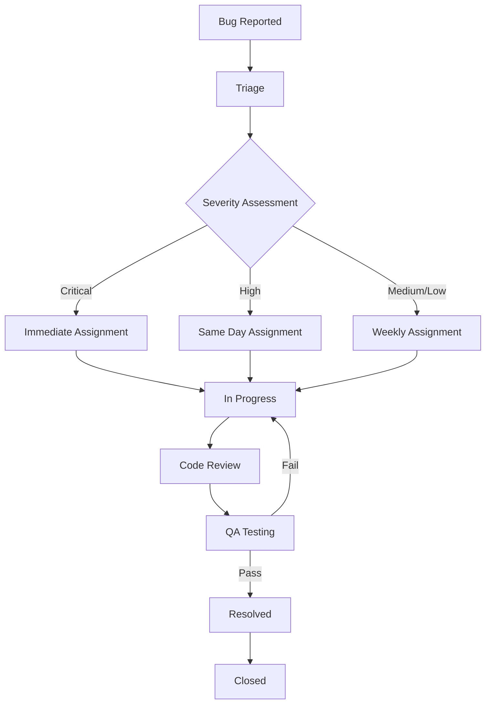

# Bug Reports and Quality Assurance

## Overview

This document outlines the bug tracking and resolution processes for the Abqar Store Sales Management System. It includes bug report templates, severity classifications, quality assurance procedures, and resolution workflows.

## Bug Classification System

### Severity Levels

#### Critical (P1)
- **Definition**: System crashes, data loss, security vulnerabilities
- **Response Time**: Immediate (within 2 hours)
- **Examples**:
  - Application fails to load
  - Data corruption in Firebase
  - Authentication bypass
  - Payment processing failures

#### High (P2)
- **Definition**: Major functionality broken, significant user impact
- **Response Time**: Same day (within 8 hours)
- **Examples**:
  - Sales cannot be saved
  - Customer data not displaying
  - Charts not rendering
  - Export functions failing

#### Medium (P3)
- **Definition**: Minor functionality issues, workarounds available
- **Response Time**: Within 3 business days
- **Examples**:
  - UI formatting issues
  - Minor calculation errors
  - Slow performance
  - Translation missing

#### Low (P4)
- **Definition**: Cosmetic issues, enhancement requests
- **Response Time**: Next release cycle
- **Examples**:
  - Color scheme inconsistencies
  - Minor text alignment
  - Feature enhancement requests
  - Documentation updates

### Bug Categories

1. **Functional**: Core functionality not working as expected
2. **UI/UX**: User interface and experience issues
3. **Performance**: Speed and responsiveness problems
4. **Security**: Authentication and data protection issues
5. **Compatibility**: Browser or device compatibility problems
6. **Data**: Data integrity and validation issues

## Bug Report Template

### Standard Bug Report Format

```markdown
# Bug Report #[ID]

## Summary
Brief description of the issue

## Environment
- **Browser**: Chrome 120.0.6099.109
- **OS**: Windows 11
- **Screen Resolution**: 1920x1080
- **User Role**: Administrator
- **Date/Time**: 2024-01-15 14:30 UTC

## Severity
[Critical/High/Medium/Low]

## Category
[Functional/UI/Performance/Security/Compatibility/Data]

## Steps to Reproduce
1. Navigate to Sales Entry page
2. Fill in all required fields
3. Click "Save Sale" button
4. Observe error message

## Expected Behavior
Sale should be saved successfully and appear in sales log

## Actual Behavior
Error message appears: "Failed to save sale"

## Screenshots/Videos
[Attach relevant media]

## Additional Information
- Console errors: [Include any console output]
- Network requests: [Include failed requests if applicable]
- User actions: [Any specific user context]

## Workaround
[If any workaround exists]

## Impact Assessment
- **Users Affected**: All users
- **Business Impact**: High - prevents sales recording
- **Frequency**: Every attempt

## Related Issues
[Link to related bugs or features]
```

## Current Known Issues

### Active Bug Reports

#### BUG-001: Currency Formatting Inconsistency
**Severity**: Medium  
**Category**: UI/UX  
**Status**: Open  
**Reported**: 2024-01-10  

**Description**: Currency formatting shows different decimal places in different components

**Steps to Reproduce**:
1. Create sale with price 150.5
2. View in sales table
3. View in dashboard KPI
4. Compare formatting

**Expected**: Consistent 2 decimal places (150.50)  
**Actual**: Sales table shows 150.5, dashboard shows 150.50  

**Impact**: Low user confusion, no functional impact  
**Assigned**: Development Team  
**Target Fix**: Next minor release  

#### BUG-002: Real-time Updates Delay
**Severity**: Medium  
**Category**: Performance  
**Status**: In Progress  
**Reported**: 2024-01-12  

**Description**: Dashboard updates with 5-10 second delay after new sale creation

**Steps to Reproduce**:
1. Open dashboard in one tab
2. Create sale in another tab
3. Observe update delay in dashboard

**Expected**: Updates within 2-3 seconds  
**Actual**: Updates after 5-10 seconds  

**Root Cause**: Firebase listener optimization needed  
**Impact**: Moderate - affects real-time experience  
**Assigned**: Backend Team  
**Target Fix**: Current sprint  

#### BUG-003: Mobile Navigation Overlap
**Severity**: Low  
**Category**: UI/UX  
**Status**: Open  
**Reported**: 2024-01-14  

**Description**: Mobile menu overlaps with content on small screens

**Steps to Reproduce**:
1. Open application on mobile device (< 375px width)
2. Open navigation menu
3. Observe content overlap

**Expected**: Menu should overlay without affecting content  
**Actual**: Menu pushes content and causes layout issues  

**Impact**: Minor - affects mobile usability  
**Assigned**: Frontend Team  
**Target Fix**: Next release  

### Resolved Bug Reports

#### BUG-004: Loyalty Points Calculation Error (RESOLVED)
**Severity**: High  
**Category**: Functional  
**Status**: Resolved  
**Reported**: 2024-01-08  
**Resolved**: 2024-01-09  

**Description**: Loyalty points not calculating correctly for Silver tier customers

**Root Cause**: Multiplier not applied in calculation function  
**Fix**: Updated calculateLoyaltyPoints function to apply tier multiplier  
**Verification**: Tested with all tier levels  
**Resolution Time**: 1 day  

## Quality Assurance Procedures

### QA Testing Checklist

#### Pre-Release Testing

**Functional Testing**:
- [ ] All CRUD operations work correctly
- [ ] Data validation prevents invalid input
- [ ] Error handling displays appropriate messages
- [ ] Authentication and authorization function properly
- [ ] Real-time updates work as expected

**UI/UX Testing**:
- [ ] Responsive design works on all screen sizes
- [ ] Dark mode toggle functions correctly
- [ ] Language switching works properly
- [ ] Navigation is intuitive and accessible
- [ ] Forms are user-friendly and validated

**Performance Testing**:
- [ ] Page load times are under 3 seconds
- [ ] Large datasets load efficiently
- [ ] Charts render smoothly
- [ ] Memory usage stays within limits
- [ ] No memory leaks detected

**Cross-Browser Testing**:
- [ ] Chrome (latest 2 versions)
- [ ] Firefox (latest 2 versions)
- [ ] Safari (latest 2 versions)
- [ ] Edge (latest 2 versions)

**Data Integrity Testing**:
- [ ] Sales data saves correctly
- [ ] Customer data updates properly
- [ ] Calculations are mathematically correct
- [ ] Export functions produce accurate data
- [ ] Backup and restore work correctly

### Testing Environments

#### Development Environment
- **Purpose**: Initial development and unit testing
- **Data**: Mock data and test fixtures
- **Access**: Development team only
- **Reset**: Daily automated cleanup

#### Staging Environment
- **Purpose**: Integration testing and QA validation
- **Data**: Production-like test data
- **Access**: QA team and stakeholders
- **Reset**: Weekly or before major releases

#### Production Environment
- **Purpose**: Live system for end users
- **Data**: Real business data
- **Access**: End users and support team
- **Monitoring**: 24/7 error tracking and performance monitoring

### Bug Triage Process

#### Weekly Bug Triage Meeting

**Participants**:
- Product Manager
- Development Lead
- QA Lead
- UX Designer (if UI issues)

**Agenda**:
1. Review new bugs reported
2. Assign severity and priority
3. Assign to appropriate team member
4. Set target resolution dates
5. Review progress on existing bugs

#### Bug Lifecycle



### Automated Quality Checks

#### Pre-commit Hooks

```bash
#!/bin/sh
# .git/hooks/pre-commit

# Run linting
npm run lint
if [ $? -ne 0 ]; then
  echo "Linting failed. Please fix errors before committing."
  exit 1
fi

# Run tests
npm test
if [ $? -ne 0 ]; then
  echo "Tests failed. Please fix failing tests before committing."
  exit 1
fi

# Check test coverage
npm run test:coverage
if [ $? -ne 0 ]; then
  echo "Coverage below threshold. Please add tests."
  exit 1
fi
```

#### Continuous Integration Checks

```yaml
# .github/workflows/quality-check.yml
name: Quality Check

on: [push, pull_request]

jobs:
  quality:
    runs-on: ubuntu-latest
    steps:
      - uses: actions/checkout@v3
      
      - name: Setup Node.js
        uses: actions/setup-node@v3
        with:
          node-version: '18'
          
      - name: Install dependencies
        run: npm ci
        
      - name: Run linting
        run: npm run lint
        
      - name: Run tests
        run: npm test
        
      - name: Check coverage
        run: npm run test:coverage
        
      - name: Build application
        run: npm run build
        
      - name: Run security audit
        run: npm audit --audit-level moderate
```

### Performance Monitoring

#### Key Performance Indicators

**Response Time Metrics**:
- Page load time: < 3 seconds
- API response time: < 500ms
- Chart rendering: < 1 second
- Search results: < 200ms

**Resource Usage Metrics**:
- Memory usage: < 100MB
- CPU usage: < 50% during normal operations
- Network requests: Minimized and optimized
- Bundle size: < 2MB total

**User Experience Metrics**:
- Time to interactive: < 5 seconds
- First contentful paint: < 2 seconds
- Cumulative layout shift: < 0.1
- Largest contentful paint: < 2.5 seconds

#### Monitoring Tools

**Error Tracking**:
```javascript
// Error tracking setup
window.addEventListener('error', (event) => {
  console.error('Global error:', event.error);
  // Send to error tracking service
  trackError({
    message: event.error.message,
    stack: event.error.stack,
    url: window.location.href,
    userAgent: navigator.userAgent,
    timestamp: new Date().toISOString()
  });
});
```

**Performance Monitoring**:
```javascript
// Performance monitoring
const observer = new PerformanceObserver((list) => {
  for (const entry of list.getEntries()) {
    if (entry.entryType === 'navigation') {
      console.log('Page load time:', entry.loadEventEnd - entry.loadEventStart);
    }
  }
});
observer.observe({ entryTypes: ['navigation'] });
```

### User Acceptance Testing

#### UAT Process

**Phase 1: Functional Validation**
- Business stakeholders test core workflows
- Verify all requirements are met
- Validate business rules and calculations
- Test data accuracy and integrity

**Phase 2: Usability Testing**
- End users test interface and workflows
- Identify usability issues and improvements
- Validate accessibility requirements
- Test with real-world scenarios

**Phase 3: Performance Validation**
- Test with production-like data volumes
- Validate performance under normal load
- Test concurrent user scenarios
- Verify system stability

#### UAT Acceptance Criteria

**Functional Criteria**:
- [ ] All critical user stories are implemented
- [ ] Business calculations are accurate
- [ ] Data integrity is maintained
- [ ] Error handling is appropriate
- [ ] Security requirements are met

**Non-Functional Criteria**:
- [ ] Performance meets specified benchmarks
- [ ] System is stable under normal load
- [ ] UI is responsive and intuitive
- [ ] Accessibility standards are met
- [ ] Cross-browser compatibility is verified

### Bug Prevention Strategies

#### Code Review Guidelines

**Review Checklist**:
- [ ] Code follows established patterns
- [ ] Error handling is comprehensive
- [ ] Input validation is implemented
- [ ] Performance implications considered
- [ ] Security best practices followed
- [ ] Tests are included and passing
- [ ] Documentation is updated

#### Development Best Practices

**Defensive Programming**:
```javascript
// Input validation
function formatCurrency(value) {
  // Validate input
  if (value === null || value === undefined) {
    return '0.00 ' + getCurrentCurrency();
  }
  
  // Convert to number safely
  const numValue = Number(value);
  if (isNaN(numValue)) {
    console.warn('Invalid currency value:', value);
    return '0.00 ' + getCurrentCurrency();
  }
  
  // Format with proper error handling
  try {
    return numValue.toFixed(2) + ' ' + getCurrentCurrency();
  } catch (error) {
    console.error('Currency formatting error:', error);
    return '0.00 ' + getCurrentCurrency();
  }
}
```

**Error Boundaries**:
```javascript
// Global error handling
class ErrorBoundary {
  constructor() {
    this.handleError = this.handleError.bind(this);
    window.addEventListener('error', this.handleError);
    window.addEventListener('unhandledrejection', this.handleError);
  }
  
  handleError(event) {
    console.error('Application error:', event);
    this.showUserFriendlyError();
    this.reportError(event);
  }
  
  showUserFriendlyError() {
    showNotification('An error occurred. Please try again.', 'error');
  }
  
  reportError(event) {
    // Send error report to monitoring service
  }
}
```

## Quality Metrics Dashboard

### Bug Metrics

**Current Status**:
- Open Bugs: 3
- Critical: 0
- High: 0
- Medium: 2
- Low: 1

**Resolution Metrics**:
- Average Resolution Time: 2.5 days
- First Response Time: 4 hours
- Reopened Bugs: 5%
- Customer Satisfaction: 4.2/5

**Trend Analysis**:
- Bug Discovery Rate: 2 bugs/week
- Bug Resolution Rate: 3 bugs/week
- Backlog Trend: Decreasing
- Quality Trend: Improving

### Test Coverage Metrics

**Current Coverage**:
- Line Coverage: 65%
- Function Coverage: 70%
- Branch Coverage: 60%
- Statement Coverage: 68%

**Target Coverage**:
- Line Coverage: 80%
- Function Coverage: 85%
- Branch Coverage: 75%
- Statement Coverage: 80%

This comprehensive bug tracking and quality assurance documentation ensures systematic identification, tracking, and resolution of issues while maintaining high quality standards throughout the development lifecycle.