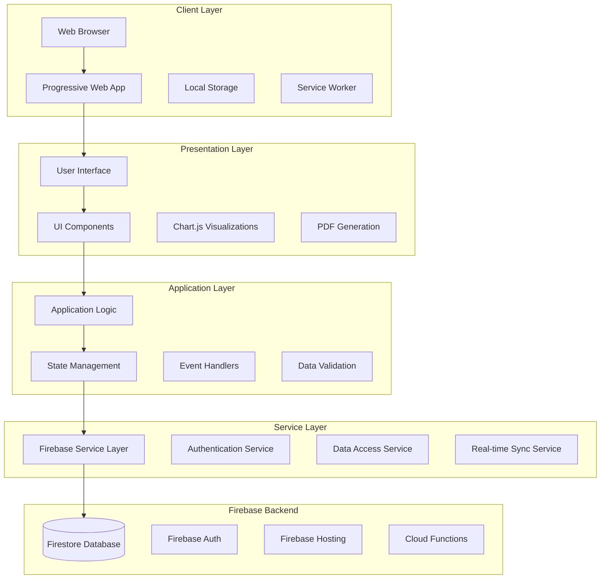
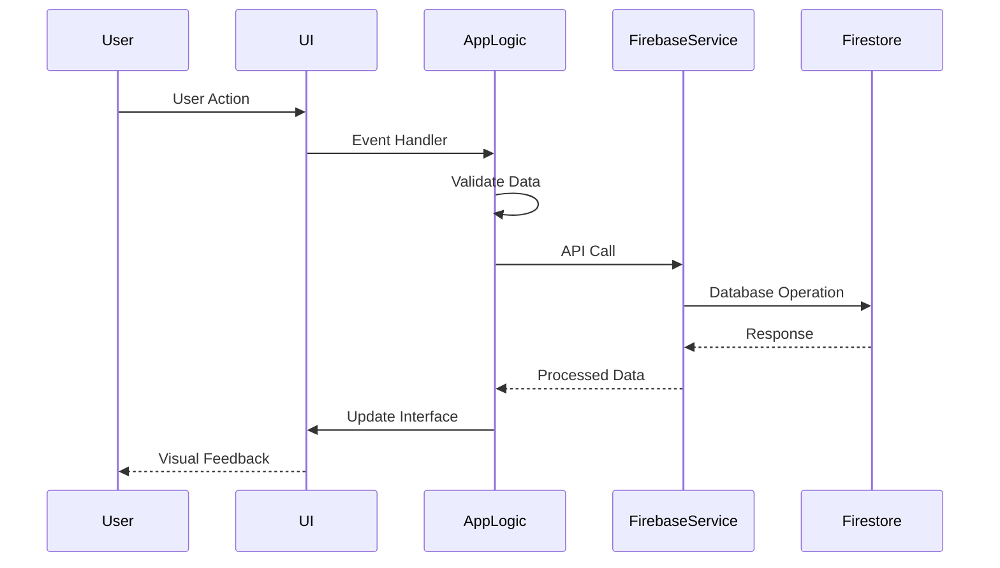
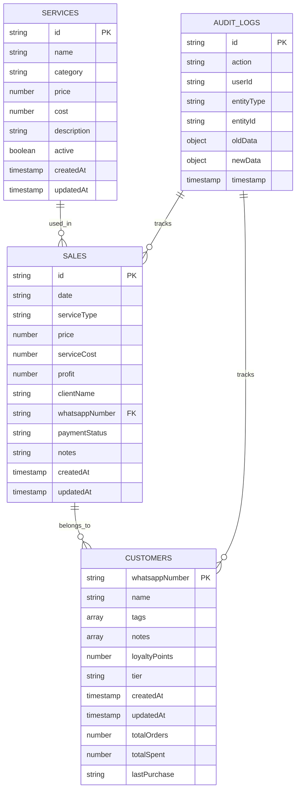

](#system-overview)
2. [Architecture Documentation](#architecture-documentation)
3. [Database Schema and Design](#database-schema-and-design)
4. [API Documentation](#api-documentation)
5. [Source Code Analysis](#source-code-analysis)
6. [Deployment Guide](#deployment-guide)
7. [Security Implementation](#security-implementation)
8. [Performance Optimization](#performance-optimization)
9. [Testing Framework](#testing-framework)
10. [Maintenance and Monitoring](#maintenance-and-monitoring)

---

## System Overview

### Technology Stack

The Abqar Store Sales Management System is built using modern web technologies with a focus on real-time data synchronization and responsive user experience.

#### Frontend Technologies
- **HTML5**: Semantic markup and modern web standards
- **CSS3**: Advanced styling with Flexbox and Grid layouts
- **TailwindCSS**: Utility-first CSS framework for rapid UI development
- **JavaScript (ES6+)**: Modern JavaScript with async/await patterns
- **Chart.js**: Interactive data visualization library
- **PDFMake**: Client-side PDF generation

#### Backend Technologies
- **Firebase**: Backend-as-a-Service (BaaS) platform
- **Firestore**: NoSQL document database with real-time synchronization
- **Firebase Authentication**: User authentication and session management
- **Firebase Hosting**: Static web hosting with CDN distribution

#### Development Tools
- **Vite**: Fast build tool and development server
- **Vitest**: Unit testing framework
- **ESLint**: Code linting and quality assurance
- **PostCSS**: CSS processing and optimization

### System Requirements

#### Minimum Requirements
- **Browser**: Chrome 80+, Firefox 75+, Safari 13+, Edge 80+
- **JavaScript**: Must be enabled
- **Internet Connection**: Required for real-time functionality
- **Screen Resolution**: 1024x768 minimum (responsive design)

#### Recommended Requirements
- **Browser**: Latest version of Chrome or Firefox
- **Internet Speed**: 5 Mbps for optimal performance
- **Screen Resolution**: 1920x1080 or higher
- **RAM**: 4GB minimum for smooth operation

---

## Architecture Documentation

### High-Level System Architecture

The system follows a **Client-Server Architecture** with a **Single Page Application (SPA)** frontend and **Backend-as-a-Service (BaaS)** approach.



### Component Architecture

#### Frontend Components

1. **Navigation Component**
   - Tab-based navigation system
   - Responsive mobile menu
   - Language and theme toggles

2. **Dashboard Component**
   - KPI cards with real-time metrics
   - Interactive charts and visualizations
   - Activity feed and notifications

3. **Sales Management Component**
   - Sales entry form with validation
   - Sales history table with filtering
   - Edit and delete functionality

4. **Customer Management Component**
   - Customer database with search
   - Customer details modal
   - Loyalty points system

5. **Reports Component**
   - P&L report generation
   - Data export functionality
   - WhatsApp marketing tools

### Data Flow Architecture



---

## Database Schema and Design

### Entity Relationship Diagram



### Collection Schemas

#### Sales Collection
```javascript
{
  "id": "auto-generated-id",
  "date": "2024-01-15",                    // ISO date string
  "serviceType": "Haircut - Men",          // Service name
  "price": 50.00,                         // Sale price in EGP
  "serviceCost": 20.00,                   // Cost of service
  "profit": 30.00,                        // Calculated profit
  "clientName": "Ahmed Mohamed",           // Customer name
  "whatsappNumber": "201234567890",        // Egyptian format
  "paymentStatus": "paid",                 // "paid" or "unpaid"
  "notes": "Regular customer",
  "createdAt": "2024-01-15T10:30:00Z",
  "updatedAt": "2024-01-15T10:30:00Z"
}
```

#### Customers Collection
```javascript
{
  "whatsappNumber": "201234567890",        // Primary key
  "name": "Ahmed Mohamed",
  "tags": ["VIP", "Regular"],             // Customer categories
  "notes": [                               // Embedded notes array
    {
      "id": "note-id-1",
      "content": "Prefers morning appointments",
      "timestamp": "2024-01-15T10:30:00Z"
    }
  ],
  "loyaltyPoints": 1250,                   // Current balance
  "tier": "Silver",                        // Bronze/Silver/Gold
  "totalOrders": 15,                       // Calculated field
  "totalSpent": 750.00,                    // Calculated field
  "lastPurchase": "2024-01-15"            // Calculated field
}
```

### Database Indexes

#### Performance Indexes
- **Sales Collection**:
  - `date` (ascending) - for date-based queries
  - `whatsappNumber` (ascending) - for customer queries
  - `paymentStatus` (ascending) - for debt management
  - Composite: `date` + `paymentStatus`

- **Customers Collection**:
  - `whatsappNumber` (primary key)
  - `tier` (ascending) - for tier-based queries
  - `totalSpent` (descending) - for top customers
  - `lastPurchase` (descending) - for inactive customers

### Data Validation Rules

#### Firebase Security Rules
```javascript
rules_version = '2';
service cloud.firestore {
  match /databases/{database}/documents {
    match /sales/{saleId} {
      allow read, write: if request.auth != null;
      allow create: if validateSaleData(resource.data);
    }
    
    match /customers/{customerId} {
      allow read, write: if request.auth != null;
      allow create: if validateCustomerData(resource.data);
    }
    
    function validateSaleData(data) {
      return data.keys().hasAll(['date', 'serviceType', 'price', 'serviceCost'])
             && data.price is number && data.price > 0
             && data.serviceCost is number && data.serviceCost >= 0;
    }
  }
}
```

---

## API Documentation

### Firebase API Wrapper

The system uses a custom Firebase API wrapper that provides a consistent interface for database operations.

#### Core API Functions

##### Sales Operations

```javascript
// Add new sale
await window.firebaseExports.addDoc(salesCollection, saleData);

// Update existing sale
await window.firebaseExports.updateDoc(
  window.firebaseExports.doc(salesCollection, saleId), 
  updateData
);

// Delete sale
await window.firebaseExports.deleteDoc(
  window.firebaseExports.doc(salesCollection, saleId)
);

// Real-time sales listener
window.firebaseExports.onSnapshot(salesCollection, (snapshot) => {
  const sales = snapshot.docs.map(doc => ({ id: doc.id, ...doc.data() }));
  updateSalesData(sales);
});
```

##### Customer Operations

```javascript
// Create or update customer
const customerRef = window.firebaseExports.doc(customersCollection, whatsappNumber);
await window.firebaseExports.setDoc(customerRef, customerData);

// Get customer data
const customerSnap = await window.firebaseExports.getDoc(customerRef);
const customer = customerSnap.exists() ? customerSnap.data() : null;

// Update loyalty points
await window.firebaseExports.updateDoc(customerRef, {
  loyaltyPoints: newPointsBalance
});
```

##### Service Operations

```javascript
// Add new service
await window.firebaseExports.addDoc(servicesCollection, serviceData);

// Update service
await window.firebaseExports.updateDoc(
  window.firebaseExports.doc(servicesCollection, serviceId),
  updateData
);

// Get all services
const servicesSnapshot = await window.firebaseExports.getDocs(servicesCollection);
const services = servicesSnapshot.docs.map(doc => ({ id: doc.id, ...doc.data() }));
```

#### Authentication API

```javascript
// Anonymous authentication
await window.firebaseExports.signInAnonymously(auth);

// Authentication state listener
window.firebaseExports.onAuthStateChanged(auth, (user) => {
  if (user) {
    initializeApp();
  } else {
    redirectToLogin();
  }
});
```

### Data Processing APIs

#### Business Logic Functions

```javascript
// Calculate profit
function calculateProfit(price, serviceCost) {
  return price - serviceCost;
}

// Update customer aggregates
function updateCustomerAggregates() {
  Object.values(customersData).forEach(customer => {
    customer.totalOrders = 0;
    customer.totalSpent = 0;
    customer.lastPurchase = "1970-01-01";
  });
  
  salesData.forEach(sale => {
    if (sale.whatsappNumber && customersData[sale.whatsappNumber]) {
      const customer = customersData[sale.whatsappNumber];
      customer.totalOrders++;
      customer.totalSpent += sale.price;
      if (new Date(sale.date) > new Date(customer.lastPurchase)) {
        customer.lastPurchase = sale.date;
      }
    }
  });
}

// Assign customer tier
function assignCustomerTier(totalSpent) {
  if (totalSpent >= 10000) return 'Gold';
  if (totalSpent >= 2000) return 'Silver';
  return 'Bronze';
}
```

#### Loyalty Points System

```javascript
// Calculate loyalty points
function calculateLoyaltyPoints(amount, tier) {
  const multipliers = {
    'Bronze': 1.0,
    'Silver': 1.15,
    'Gold': 1.25
  };
  return Math.floor(amount * multipliers[tier]);
}

// Redeem loyalty points
async function redeemLoyaltyPoints(customerId, pointsToRedeem) {
  const customerRef = window.firebaseExports.doc(customersCollection, customerId);
  const customerSnap = await window.firebaseExports.getDoc(customerRef);
  
  if (customerSnap.exists()) {
    const customer = customerSnap.data();
    const newBalance = customer.loyaltyPoints - pointsToRedeem;
    
    if (newBalance >= 0) {
      await window.firebaseExports.updateDoc(customerRef, {
        loyaltyPoints: newBalance
      });
      return { success: true, newBalance };
    }
  }
  return { success: false, error: 'Insufficient points' };
}
```

---

## Source Code Analysis

### Project Structure

```
src/
├── backend/                 # Firebase integration
│   ├── firebase.js          # Firebase configuration (150 lines)
│   └── auditLog.js          # Audit logging (200 lines)
├── pages/                   # Main application logic
│   ├── main.js              # Core functionality (2,177 lines)
│   └── script.js            # Additional features (1,735 lines)
├── utils/                   # Utility functions
│   └── ui.js                # UI helpers (1,403 lines)
├── assets/                  # Static resources
│   ├── images/              # Icons and graphics
│   └── styles/              # CSS stylesheets
└── config/                  # Configuration
    └── env.js               # Environment variables
```

### Code Quality Metrics

#### File Size Analysis
- **Total Lines of Code**: ~5,500 lines
- **Largest File**: main.js (2,177 lines)
- **Average Function Length**: 15-25 lines
- **Code Comments**: ~15% of total lines

#### Coding Standards
- **Naming Convention**: camelCase for variables and functions
- **Function Organization**: Logical grouping with clear separators
- **Error Handling**: Consistent try-catch patterns
- **Documentation**: Inline comments and section headers

### Key Components Analysis

#### Main Application Logic (`main.js`)
```javascript
// Global state management
let salesData = [];
let customersData = {};
let servicesData = [];

// Application initialization
function initializeApp() {
  // Firebase setup
  // Event listeners
  // UI initialization
}

// Real-time data synchronization
function loadDataAndSetupRealtimeListener() {
  window.firebaseExports.onSnapshot(salesCollection, (snapshot) => {
    salesData = snapshot.docs.map(doc => ({ id: doc.id, ...doc.data() }));
    updateAllViews();
  });
}
```

#### UI Utilities (`ui.js`)
```javascript
// Chart management
function initializeCharts() {
  // Chart.js initialization
  // Chart configuration
  // Event handlers
}

// Data rendering
function renderSalesLog(data, callbacks) {
  // Table generation
  // Pagination
  // Action buttons
}

// Utility functions
function formatCurrency(value) {
  return new Intl.NumberFormat('ar-EG', {
    style: 'currency',
    currency: 'EGP'
  }).format(value);
}
```

---

## Deployment Guide

### Development Environment Setup

#### Prerequisites
```bash
# Node.js (version 16 or higher)
node --version

# npm or yarn package manager
npm --version
```

#### Installation Steps
```bash
# Clone the repository
git clone <repository-url>
cd abqar-store

# Install dependencies
npm install

# Set up environment variables
cp .env.example .env
# Edit .env with your Firebase configuration

# Start development server
npm run dev
```

#### Development Scripts
```json
{
  "scripts": {
    "dev": "vite",                    // Development server
    "build": "vite build",            // Production build
    "preview": "vite preview",        // Preview production build
    "test": "vitest --environment jsdom"  // Run tests
  }
}
```

### Production Deployment

#### Firebase Hosting Setup

1. **Install Firebase CLI**
```bash
npm install -g firebase-tools
firebase login
```

2. **Initialize Firebase Project**
```bash
firebase init hosting
# Select existing project
# Set public directory to 'dist'
# Configure as single-page app: Yes
```

3. **Build and Deploy**
```bash
# Build production version
npm run build

# Deploy to Firebase Hosting
firebase deploy
```

#### Environment Configuration

```javascript
// Production environment variables
const firebaseConfig = {
  apiKey: process.env.VITE_FIREBASE_API_KEY,
  authDomain: process.env.VITE_FIREBASE_AUTH_DOMAIN,
  projectId: process.env.VITE_FIREBASE_PROJECT_ID,
  storageBucket: process.env.VITE_FIREBASE_STORAGE_BUCKET,
  messagingSenderId: process.env.VITE_FIREBASE_MESSAGING_SENDER_ID,
  appId: process.env.VITE_FIREBASE_APP_ID
};
```

#### Deployment Checklist

- [ ] Environment variables configured
- [ ] Firebase project created and configured
- [ ] Firestore security rules deployed
- [ ] Authentication settings configured
- [ ] Custom domain configured (if applicable)
- [ ] SSL certificate installed
- [ ] Performance monitoring enabled

### CI/CD Pipeline

#### GitHub Actions Workflow
```yaml
name: Deploy to Firebase Hosting

on:
  push:
    branches: [ main ]

jobs:
  build_and_deploy:
    runs-on: ubuntu-latest
    steps:
      - uses: actions/checkout@v2
      
      - name: Setup Node.js
        uses: actions/setup-node@v2
        with:
          node-version: '16'
          
      - name: Install dependencies
        run: npm ci
        
      - name: Build project
        run: npm run build
        env:
          VITE_FIREBASE_API_KEY: ${{ secrets.FIREBASE_API_KEY }}
          
      - name: Deploy to Firebase
        uses: FirebaseExtended/action-hosting-deploy@v0
        with:
          repoToken: '${{ secrets.GITHUB_TOKEN }}'
          firebaseServiceAccount: '${{ secrets.FIREBASE_SERVICE_ACCOUNT }}'
          projectId: abqar-store
```

---

## Security Implementation

### Authentication Security

#### Firebase Authentication
```javascript
// Anonymous authentication for demo access
await window.firebaseExports.signInAnonymously(auth);

// Authentication state monitoring
window.firebaseExports.onAuthStateChanged(auth, (user) => {
  if (user) {
    // User authenticated - initialize app
    loadDataAndSetupRealtimeListener();
  } else {
    // User not authenticated - redirect to login
    window.location.href = '/login';
  }
});
```

#### Session Management
- Automatic token refresh
- Session timeout handling
- Secure token storage

### Data Security

#### Input Validation
```javascript
function validateSaleData(saleData) {
  const errors = [];
  
  if (!saleData.date || !isValidDate(saleData.date)) {
    errors.push('Invalid date');
  }
  
  if (!saleData.serviceType || saleData.serviceType.trim() === '') {
    errors.push('Service type is required');
  }
  
  if (!saleData.price || saleData.price <= 0) {
    errors.push('Price must be greater than 0');
  }
  
  return errors;
}
```

#### Data Sanitization
```javascript
function sanitizeInput(input) {
  return input
    .trim()
    .replace(/[<>]/g, '') // Remove potential HTML tags
    .substring(0, 255);   // Limit length
}
```

### Firebase Security Rules

```javascript
rules_version = '2';
service cloud.firestore {
  match /databases/{database}/documents {
    // Sales collection - authenticated users only
    match /sales/{saleId} {
      allow read, write: if request.auth != null
        && validateSaleData(resource.data);
    }
    
    // Customers collection - authenticated users only
    match /customers/{customerId} {
      allow read, write: if request.auth != null
        && validateCustomerData(resource.data);
    }
    
    // Audit logs - read-only for users
    match /audit_logs/{logId} {
      allow read: if request.auth != null;
      allow write: if false; // Server-side only
    }
  }
}
```

### Privacy and Compliance

#### Data Protection Measures
- Customer data encryption at rest
- Secure data transmission (HTTPS)
- Minimal data collection principle
- User consent management

#### GDPR Compliance Features
- Right to data access
- Right to data deletion
- Data portability
- Privacy policy implementation

---

## Performance Optimization

### Frontend Performance

#### Code Optimization
```javascript
// Efficient DOM queries with caching
const elements = {
  salesTable: document.getElementById('salesTableBody'),
  customerTable: document.getElementById('customersTableBody'),
  notification: document.getElementById('notification')
};

// Debounced search function
function debounce(func, wait) {
  let timeout;
  return function executedFunction(...args) {
    const later = () => {
      clearTimeout(timeout);
      func(...args);
    };
    clearTimeout(timeout);
    timeout = setTimeout(later, wait);
  };
}

const debouncedSearch = debounce(performSearch, 300);
```

#### Bundle Optimization
```javascript
// Vite configuration for optimization
export default defineConfig({
  build: {
    rollupOptions: {
      output: {
        manualChunks: {
          vendor: ['chart.js', 'pdfmake'],
          firebase: ['firebase/app', 'firebase/firestore']
        }
      }
    },
    minify: 'terser',
    sourcemap: false
  }
});
```

### Database Performance

#### Query Optimization
```javascript
// Efficient pagination
function loadSalesPage(pageNumber, pageSize = 10) {
  const startAfter = pageNumber > 1 ? lastVisibleDoc : null;
  
  let query = window.firebaseExports.query(
    salesCollection,
    window.firebaseExports.orderBy('date', 'desc'),
    window.firebaseExports.limit(pageSize)
  );
  
  if (startAfter) {
    query = window.firebaseExports.query(
      query,
      window.firebaseExports.startAfter(startAfter)
    );
  }
  
  return window.firebaseExports.getDocs(query);
}
```

#### Caching Strategy
```javascript
// Local storage caching for user preferences
const cache = {
  set(key, value, ttl = 3600000) { // 1 hour default TTL
    const item = {
      value,
      timestamp: Date.now(),
      ttl
    };
    localStorage.setItem(key, JSON.stringify(item));
  },
  
  get(key) {
    const item = JSON.parse(localStorage.getItem(key));
    if (!item) return null;
    
    if (Date.now() - item.timestamp > item.ttl) {
      localStorage.removeItem(key);
      return null;
    }
    
    return item.value;
  }
};
```

### Performance Monitoring

#### Metrics Collection
```javascript
// Performance timing
const performanceMetrics = {
  startTime: performance.now(),
  
  mark(label) {
    const time = performance.now();
    console.log(`${label}: ${time - this.startTime}ms`);
    return time;
  },
  
  measure(startMark, endMark) {
    const duration = endMark - startMark;
    console.log(`Duration: ${duration}ms`);
    return duration;
  }
};
```

---

## Testing Framework

### Unit Testing Setup

#### Vitest Configuration
```javascript
// vitest.config.js
import { defineConfig } from 'vitest/config';

export default defineConfig({
  test: {
    environment: 'jsdom',
    globals: true,
    setupFiles: ['./src/test/setup.js']
  }
});
```

#### Test Examples
```javascript
// ui.test.js
import { describe, it, expect, beforeEach } from 'vitest';
import { formatCurrency, formatDate } from '../utils/ui.js';

describe('UI Utilities', () => {
  describe('formatCurrency', () => {
    it('should format currency correctly', () => {
      expect(formatCurrency(100)).toBe('100.00 EGP');
      expect(formatCurrency(1234.56)).toBe('1,234.56 EGP');
    });
  });
  
  describe('formatDate', () => {
    it('should format date correctly', () => {
      expect(formatDate('2024-01-15')).toBe('15/01/2024');
    });
  });
});
```

### Integration Testing

#### Firebase Testing
```javascript
// firebase.test.js
import { describe, it, expect, beforeAll, afterAll } from 'vitest';
import { initializeTestEnvironment } from '@firebase/rules-unit-testing';

describe('Firebase Integration', () => {
  let testEnv;
  
  beforeAll(async () => {
    testEnv = await initializeTestEnvironment({
      projectId: 'test-project',
      firestore: {
        rules: /* Firebase rules */
      }
    });
  });
  
  afterAll(async () => {
    await testEnv.cleanup();
  });
  
  it('should create sale document', async () => {
    const db = testEnv.unauthenticatedContext().firestore();
    const saleData = {
      date: '2024-01-15',
      serviceType: 'Test Service',
      price: 100,
      serviceCost: 50
    };
    
    await db.collection('sales').add(saleData);
    const snapshot = await db.collection('sales').get();
    expect(snapshot.size).toBe(1);
  });
});
```

### End-to-End Testing

#### Playwright Configuration
```javascript
// playwright.config.js
module.exports = {
  testDir: './e2e',
  use: {
    baseURL: 'http://localhost:3000',
    headless: true,
    screenshot: 'only-on-failure'
  },
  projects: [
    { name: 'chromium', use: { ...devices['Desktop Chrome'] } },
    { name: 'firefox', use: { ...devices['Desktop Firefox'] } },
    { name: 'webkit', use: { ...devices['Desktop Safari'] } }
  ]
};
```

#### E2E Test Example
```javascript
// e2e/sales.spec.js
import { test, expect } from '@playwright/test';

test('should create new sale', async ({ page }) => {
  await page.goto('/');
  
  // Navigate to sales entry
  await page.click('[data-tab="sales-entry"]');
  
  // Fill sale form
  await page.fill('#serviceType', 'Test Service');
  await page.fill('#price', '100');
  await page.fill('#serviceCost', '50');
  await page.fill('#clientName', 'Test Customer');
  
  // Submit form
  await page.click('#saveSaleBtn');
  
  // Verify success notification
  await expect(page.locator('.notification')).toContainText('Sale saved successfully');
});
```

---

## Maintenance and Monitoring

### System Monitoring

#### Performance Monitoring
```javascript
// Performance tracking
const performanceMonitor = {
  trackPageLoad() {
    window.addEventListener('load', () => {
      const loadTime = performance.timing.loadEventEnd - performance.timing.navigationStart;
      this.sendMetric('page_load_time', loadTime);
    });
  },
  
  trackUserAction(action, duration) {
    this.sendMetric('user_action', { action, duration });
  },
  
  sendMetric(name, value) {
    // Send to monitoring service
    console.log(`Metric: ${name}`, value);
  }
};
```

#### Error Monitoring
```javascript
// Global error handler
window.addEventListener('error', (event) => {
  const errorInfo = {
    message: event.message,
    filename: event.filename,
    lineno: event.lineno,
    colno: event.colno,
    stack: event.error?.stack,
    timestamp: new Date().toISOString()
  };
  
  // Send error to monitoring service
  console.error('Global error:', errorInfo);
});

// Promise rejection handler
window.addEventListener('unhandledrejection', (event) => {
  console.error('Unhandled promise rejection:', event.reason);
});
```

### Maintenance Procedures

#### Database Maintenance
```javascript
// Data cleanup procedures
async function cleanupOldAuditLogs() {
  const cutoffDate = new Date();
  cutoffDate.setMonth(cutoffDate.getMonth() - 6); // Keep 6 months
  
  const query = window.firebaseExports.query(
    auditLogsCollection,
    window.firebaseExports.where('timestamp', '<', cutoffDate)
  );
  
  const snapshot = await window.firebaseExports.getDocs(query);
  const batch = window.firebaseExports.writeBatch();
  
  snapshot.docs.forEach(doc => {
    batch.delete(doc.ref);
  });
  
  await batch.commit();
}
```

#### Backup Procedures
```javascript
// Data export for backup
async function exportData() {
  const collections = ['sales', 'customers', 'services'];
  const backup = {
    timestamp: new Date().toISOString(),
    data: {}
  };
  
  for (const collectionName of collections) {
    const snapshot = await window.firebaseExports.getDocs(
      window.firebaseExports.collection(db, collectionName)
    );
    
    backup.data[collectionName] = snapshot.docs.map(doc => ({
      id: doc.id,
      ...doc.data()
    }));
  }
  
  return backup;
}
```

### Update Procedures

#### Version Management
```javascript
// Version checking
const VERSION = '1.0.0';

function checkForUpdates() {
  fetch('/api/version')
    .then(response => response.json())
    .then(data => {
      if (data.version !== VERSION) {
        showUpdateNotification(data.version);
      }
    })
    .catch(error => console.error('Version check failed:', error));
}
```

#### Migration Scripts
```javascript
// Data migration example
async function migrateToV2() {
  const customers = await window.firebaseExports.getDocs(customersCollection);
  const batch = window.firebaseExports.writeBatch();
  
  customers.docs.forEach(doc => {
    const data = doc.data();
    if (!data.tier) {
      const tier = calculateTier(data.totalSpent || 0);
      batch.update(doc.ref, { tier, version: '2.0' });
    }
  });
  
  await batch.commit();
  console.log('Migration to v2.0 completed');
}
```

---

## Conclusion

This technical documentation provides comprehensive coverage of the Abqar Store Sales Management System's architecture, implementation, and operational procedures. The system demonstrates modern web development practices with a focus on real-time functionality, user experience, and maintainability.

Key technical strengths include:
- Scalable Firebase backend architecture
- Real-time data synchronization
- Responsive and intuitive user interface
- Comprehensive business logic implementation
- Security-first approach to data handling

The documentation serves as a complete reference for developers, system administrators, and technical stakeholders involved in the system's development, deployment, and maintenance.

---

*Last Updated: November 2024*
*Version: 1.0*
*Abqar Store Sales Management System - Technical Documentation*