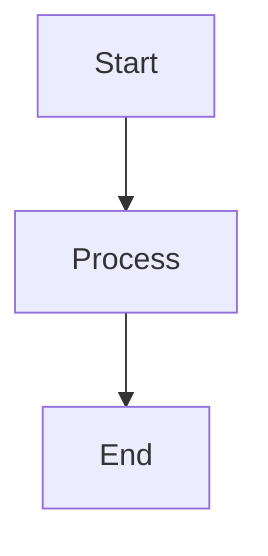

# Documentation Standards and Style Guide

## Overview

This document establishes the standards and guidelines for creating academic-compliant documentation for the Abqar Store Sales System project. All documentation must follow these standards to ensure consistency, quality, and academic compliance.

## Academic Compliance Requirements

### University Standards

- All documentation must meet university-level academic writing standards
- Proper citation and referencing where applicable
- Professional formatting and presentation
- Clear structure with logical flow
- Comprehensive coverage of all required topics

### Evaluation Criteria

Documentation will be evaluated based on:
- **Completeness**: All required sections and content present
- **Accuracy**: Technical accuracy and correctness
- **Clarity**: Clear, understandable writing and presentation
- **Professional Quality**: Academic-level formatting and structure
- **Requirements Traceability**: Clear mapping to project requirements

## Document Structure Standards

### File Naming Conventions

- Use lowercase with hyphens for file names: `project-proposal.md`
- Use descriptive names that clearly indicate content
- Include version numbers for major revisions: `v1.0`, `v2.0`
- Use consistent naming across related documents

### Directory Structure

- Follow the established hierarchical structure
- Use numbered prefixes for main sections: `01-project-planning/`
- Include README.md files in each directory
- Maintain consistent subdirectory organization

### Document Headers

All documents must include:
```markdown
# [Document Title]

## Overview
[Brief description of document purpose and scope]

## Table of Contents
[Numbered list of main sections]
```

### Document Footers

All documents must include:
```markdown
---

**Document Information:**
- **Created:** [Date]
- **Last Updated:** [Date]
- **Version:** [Version number]
- **Author:** [Author name]
- **Reviewed by:** [Reviewer name]
```

## Writing Standards

### Language and Tone

- Use professional, academic language
- Write in third person where appropriate
- Use active voice when possible
- Avoid colloquialisms and informal language
- Maintain consistent terminology throughout

### Formatting Guidelines

#### Headers
- Use consistent header hierarchy (H1, H2, H3, etc.)
- Capitalize headers using title case
- Use descriptive, specific header names

#### Lists
- Use numbered lists for sequential items
- Use bullet points for non-sequential items
- Maintain consistent indentation
- Use parallel structure in list items

#### Tables
- Include headers for all columns
- Use consistent formatting
- Provide table captions when necessary
- Ensure tables are readable and well-organized

#### Code Blocks
- Use appropriate syntax highlighting
- Include comments for complex code
- Maintain consistent indentation
- Use descriptive variable and function names

## Diagram Standards

### Mermaid Diagrams

All diagrams must use Mermaid syntax for consistency:



#### Diagram Types Required

- **ER Diagrams**: Database relationships and schema
- **Use Case Diagrams**: System actors and interactions
- **Sequence Diagrams**: Component interactions over time
- **Activity Diagrams**: User workflows and processes
- **State Diagrams**: Object state transitions
- **Class Diagrams**: System structure and relationships
- **Data Flow Diagrams**: Data movement and processing

#### Diagram Standards

- Use consistent styling and colors
- Include clear labels and descriptions
- Provide legend when necessary
- Ensure diagrams are readable at standard sizes
- Include diagram descriptions and explanations

## Requirements Documentation Standards

### EARS Pattern Compliance

All requirements must follow EARS (Easy Approach to Requirements Syntax) patterns:

- **Ubiquitous**: THE [system] SHALL [response]
- **Event-driven**: WHEN [trigger], THE [system] SHALL [response]
- **State-driven**: WHILE [condition], THE [system] SHALL [response]
- **Unwanted event**: IF [condition], THEN THE [system] SHALL [response]
- **Optional feature**: WHERE [option], THE [system] SHALL [response]
- **Complex**: [WHERE] [WHILE] [WHEN/IF] THE [system] SHALL [response]

### INCOSE Quality Rules

Requirements must comply with INCOSE semantic quality rules:
- Use active voice (who does what)
- Avoid vague terms ("quickly", "adequate")
- No escape clauses ("where possible")
- No negative statements ("SHALL not...")
- One thought per requirement
- Explicit and measurable conditions
- Consistent, defined terminology
- No pronouns ("it", "them")
- No absolutes ("never", "always", "100%")
- Solution-free (focus on what, not how)
- Realistic tolerances for timing and performance

### Requirements Traceability

- Each requirement must have a unique identifier
- Requirements must be traceable to user stories
- Implementation must be traceable to requirements
- Test cases must be traceable to requirements

## Quality Assurance

### Review Process

1. **Self-Review**: Author reviews for completeness and accuracy
2. **Peer Review**: Technical review by team member
3. **Academic Review**: Review against academic standards
4. **Final Approval**: Approval by project lead

### Validation Checklist

- [ ] Document follows template structure
- [ ] All required sections are present
- [ ] Writing meets academic standards
- [ ] Diagrams are clear and properly formatted
- [ ] Requirements follow EARS and INCOSE standards
- [ ] Cross-references are valid and complete
- [ ] Document information is complete and accurate

### Version Control

- Use semantic versioning (v1.0, v1.1, v2.0)
- Document all changes in version history
- Maintain change log for major revisions
- Archive previous versions when updating

## Templates and Resources

### Available Templates

- [Document Template](../templates/document-template.md)
- [Diagram Template](../templates/diagram-template.md)
- [Requirements Template](../templates/requirements-template.md)

### Style Resources

- Use consistent formatting across all documents
- Follow markdown best practices
- Maintain professional appearance
- Ensure accessibility compliance

## Compliance Verification

### Academic Standards Checklist

- [ ] Professional writing quality
- [ ] Proper document structure
- [ ] Complete coverage of required topics
- [ ] Clear and logical organization
- [ ] Appropriate level of technical detail
- [ ] Consistent terminology and formatting
- [ ] Proper use of diagrams and visual aids
- [ ] Requirements traceability maintained

### Final Submission Requirements

- All documents must pass quality review
- Complete documentation package
- Consistent formatting and style
- All cross-references validated
- Academic compliance verified
- Professional presentation quality

---

**Document Information:**
- **Created:** [Current Date]
- **Last Updated:** [Current Date]
- **Version:** v1.0
- **Author:** Project Team
- **Status:** Active Standard