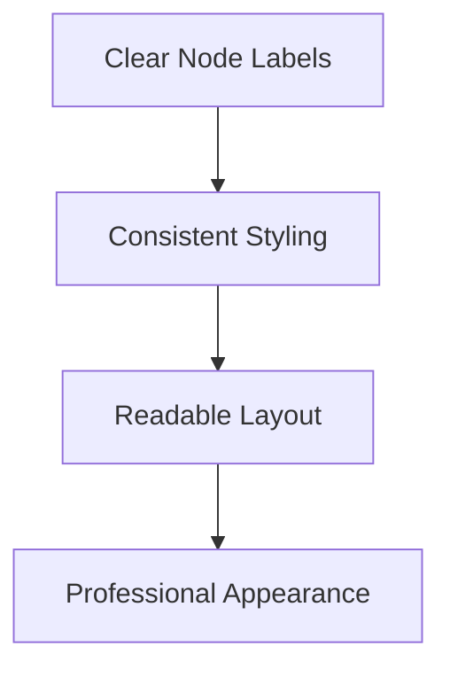

# Documentation Style Guide

## Overview

This style guide provides specific formatting, writing, and presentation standards for all project documentation to ensure consistency and professional quality across all deliverables.

## Markdown Formatting Standards

### Headers

Use consistent header hierarchy:

```markdown
# Document Title (H1 - Use only once per document)
## Major Section (H2)
### Subsection (H3)
#### Sub-subsection (H4)
##### Detail Section (H5)
###### Minor Detail (H6)
```

#### Header Capitalization
- Use title case for all headers
- Capitalize first and last words
- Capitalize all major words (nouns, verbs, adjectives, adverbs)
- Do not capitalize articles, prepositions, or conjunctions unless they are the first or last word

### Text Formatting

#### Emphasis
- Use **bold** for important terms and key concepts
- Use *italics* for emphasis and foreign terms
- Use `code formatting` for technical terms, file names, and code snippets
- Use ~~strikethrough~~ for deprecated or removed content

#### Lists

**Numbered Lists** (for sequential items):
```markdown
1. First item
2. Second item
3. Third item
   - Sub-item
   - Another sub-item
```

**Bullet Lists** (for non-sequential items):
```markdown
- First item
- Second item
- Third item
  - Sub-item
  - Another sub-item
```

#### Code Blocks

Use fenced code blocks with language specification:

```markdown
```javascript
function example() {
    return "Hello, World!";
}
```
```

#### Tables

Use proper table formatting:

```markdown
| Column 1 | Column 2 | Column 3 |
|----------|----------|----------|
| Data 1   | Data 2   | Data 3   |
| Data 4   | Data 5   | Data 6   |
```

### Links and References

#### Internal Links
```markdown
[Link Text](../path/to/document.md)
[Section Link](#section-name)
```

#### External Links
```markdown
[Link Text](https://example.com)
```

#### Image References
```markdown

```

## Writing Style Standards

### Voice and Tone

#### Professional Academic Tone
- Maintain formal, professional language
- Use objective, third-person perspective
- Avoid contractions (use "do not" instead of "don't")
- Use complete sentences and proper grammar

#### Technical Writing Guidelines
- Be precise and specific
- Use active voice when possible
- Keep sentences concise and clear
- Define technical terms before using them
- Use consistent terminology throughout

### Terminology Standards

#### System Names
- **Abqar_Store_System**: The complete digital sales management system
- **Documentation_System**: The academic documentation framework
- **Firebase_Backend**: Cloud-based backend service
- **Dashboard_Module**: Analytics and metrics display component

#### Technical Terms
- Use consistent capitalization for technical terms
- Define all acronyms on first use: "Application Programming Interface (API)"
- Maintain a glossary of terms for each document section

### Sentence Structure

#### Preferred Patterns
- Subject-verb-object construction
- Active voice: "The system processes the data"
- Parallel structure in lists and series
- Clear, direct statements

#### Avoid
- Passive voice when active is clearer
- Run-on sentences
- Ambiguous pronouns
- Unnecessary jargon or buzzwords

## Document Organization Standards

### Standard Document Structure

```markdown
# Document Title

## Overview
[Brief description of document purpose]

## Table of Contents
[Numbered list of sections]

## Introduction
[Background and context]

## [Main Content Sections]
[Organized logically with clear headers]

## Conclusion
[Summary and key takeaways]

## Requirements Addressed
[List of requirements this document addresses]

## Related Documents
[Links to related documentation]

## Appendices
[Supporting information]

---

**Document Information:**
[Standard footer information]
```

### Section Numbering

Use consistent numbering for major documents:
- 1.0 Introduction
- 2.0 Main Content
- 2.1 Subsection
- 2.2 Subsection
- 3.0 Next Section

### Cross-References

#### Internal References
- Use descriptive link text: [Project Requirements](../03-requirements/functional-requirements.md)
- Include section references: See [Section 2.1](#database-design) for details
- Maintain reference accuracy across document updates

#### Requirements Traceability
- Reference specific requirements: _Requirements: 1.1, 2.3, 4.2_
- Use consistent requirement numbering
- Maintain bidirectional traceability

## Visual Standards

### Diagram Formatting

#### Mermaid Diagram Standards


#### Diagram Guidelines
- Use consistent colors and styling
- Ensure readability at standard sizes
- Include clear labels and descriptions
- Provide diagram legends when necessary

### Image Standards

#### Screenshots
- Use consistent browser/application settings
- Crop to show relevant content only
- Ensure high resolution and clarity
- Include descriptive captions

#### Technical Diagrams
- Use professional diagramming tools
- Maintain consistent styling across diagrams
- Ensure accuracy with current implementation
- Include version information

## File Organization Standards

### Naming Conventions

#### File Names
- Use lowercase with hyphens: `project-proposal.md`
- Be descriptive and specific
- Include version numbers for major revisions
- Use consistent naming patterns

#### Directory Structure
- Use numbered prefixes for main sections
- Include README.md files in directories
- Maintain logical hierarchy
- Use descriptive directory names

### Version Control

#### File Versioning
- Use semantic versioning: v1.0, v1.1, v2.0
- Document changes in commit messages
- Maintain change logs for major documents
- Archive previous versions appropriately

#### Change Management
- Track document modifications
- Maintain author and reviewer information
- Document approval status
- Update modification dates

## Quality Standards

### Review Requirements

#### Content Review
- Technical accuracy verification
- Completeness against requirements
- Clarity and readability assessment
- Academic standards compliance

#### Format Review
- Consistent formatting application
- Proper markdown syntax usage
- Link and reference validation
- Visual presentation quality

### Validation Checklist

#### Before Submission
- [ ] Document follows template structure
- [ ] All sections are complete
- [ ] Writing meets academic standards
- [ ] Formatting is consistent
- [ ] Links and references are valid
- [ ] Diagrams are current and accurate
- [ ] Requirements traceability is maintained
- [ ] Document information is complete

#### Final Quality Check
- [ ] Professional presentation quality
- [ ] Academic compliance verified
- [ ] Technical accuracy confirmed
- [ ] Consistent style throughout
- [ ] Complete documentation package

## Common Mistakes to Avoid

### Writing Issues
- Inconsistent terminology usage
- Unclear or ambiguous statements
- Informal language or tone
- Missing or incomplete sections

### Formatting Issues
- Inconsistent header formatting
- Broken links or references
- Poor table formatting
- Inconsistent code block formatting

### Technical Issues
- Outdated diagrams or screenshots
- Incorrect technical information
- Missing requirements traceability
- Incomplete cross-references

---

**Document Information:**
- **Created:** [Current Date]
- **Last Updated:** [Current Date]
- **Version:** v1.0
- **Author:** Project Team
- **Purpose:** Documentation Style Guide
- **Status:** Active Standard