# Visual Diagrams and Assets Documentation

## Overview

This document consolidates all visual diagrams and assets required for the Abqar Store Sales Management System documentation. All diagrams are created using Mermaid syntax for consistency and maintainability.

## Entity Relationship Diagrams

### 1. Complete Database ER Diagram

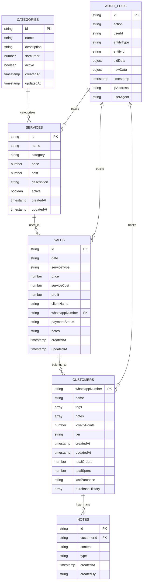

### 2. Simplified Business Entity Relationships

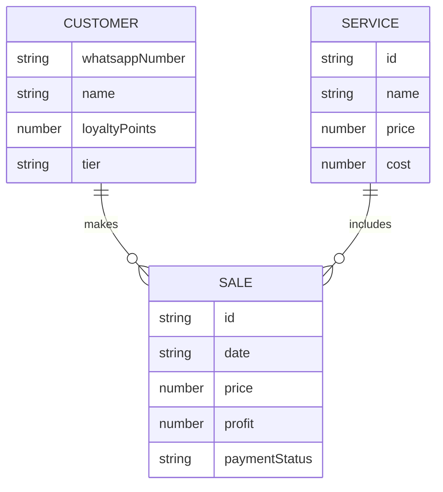

## Data Flow Diagrams

### 1. Context-Level DFD (Level 0)

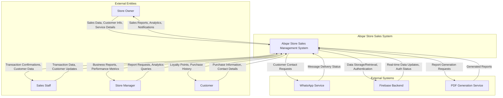

### 2. Level 1 DFD - System Decomposition

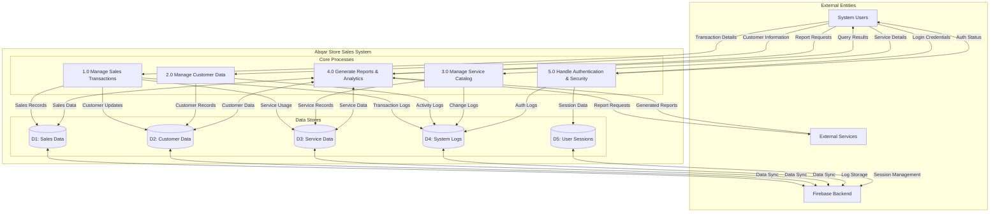

## Use Case Diagrams

### 1. System Overview Use Case Diagram

```mermaid
graph TB
    subgraph "Abqar Store Sales Management System"
        subgraph "Sales Management"
            UC1[Record New Sale]
            UC2[Edit Sale Record]
            UC3[Delete Sale Record]
            UC4[View Sales History]
            UC5[Filter Sales Data]
        end
        
        subgraph "Customer Management"
            UC6[Add New Customer]
            UC7[View Customer Details]
            UC8[Update Customer Information]
            UC9[Manage Customer Tags]
            UC10[Track Customer Loyalty Points]
        end
        
        subgraph "Financial Management"
            UC11[Track Unpaid Orders]
            UC12[Mark Orders as Paid]
            UC13[Generate Financial Reports]
            UC14[View Profit Analytics]
            UC15[Set Daily Goals]
        end
        
        subgraph "Service Management"
            UC16[Add New Service]
            UC17[Edit Service Details]
            UC18[Delete Service]
            UC19[Manage Service Categories]
            UC20[View Service Catalog]
        end
        
        subgraph "Reporting & Analytics"
            UC21[Generate PDF Reports]
            UC22[Export Customer Data]
            UC23[View Dashboard Analytics]
            UC24[Track Performance Metrics]
        end
    end
    
    StoreOwner[Store Owner]
    SalesStaff[Sales Staff]
    Manager[Store Manager]
    
    StoreOwner --> UC1
    StoreOwner --> UC2
    StoreOwner --> UC3
    StoreOwner --> UC4
    StoreOwner --> UC5
    StoreOwner --> UC6
    StoreOwner --> UC7
    StoreOwner --> UC8
    StoreOwner --> UC9
    StoreOwner --> UC10
    StoreOwner --> UC11
    StoreOwner --> UC12
    StoreOwner --> UC13
    StoreOwner --> UC14
    StoreOwner --> UC15
    StoreOwner --> UC16
    StoreOwner --> UC17
    StoreOwner --> UC18
    StoreOwner --> UC19
    StoreOwner --> UC20
    StoreOwner --> UC21
    StoreOwner --> UC22
    StoreOwner --> UC23
    StoreOwner --> UC24
    
    SalesStaff --> UC1
    SalesStaff --> UC2
    SalesStaff --> UC4
    SalesStaff --> UC5
    SalesStaff --> UC6
    SalesStaff --> UC7
    SalesStaff --> UC8
    SalesStaff --> UC10
    SalesStaff --> UC12
    SalesStaff --> UC20
    
    Manager --> UC4
    Manager --> UC5
    Manager --> UC13
    Manager --> UC14
    Manager --> UC21
    Manager --> UC22
    Manager --> UC23
    Manager --> UC24
```

### 2. Actor-Focused Use Case Diagram

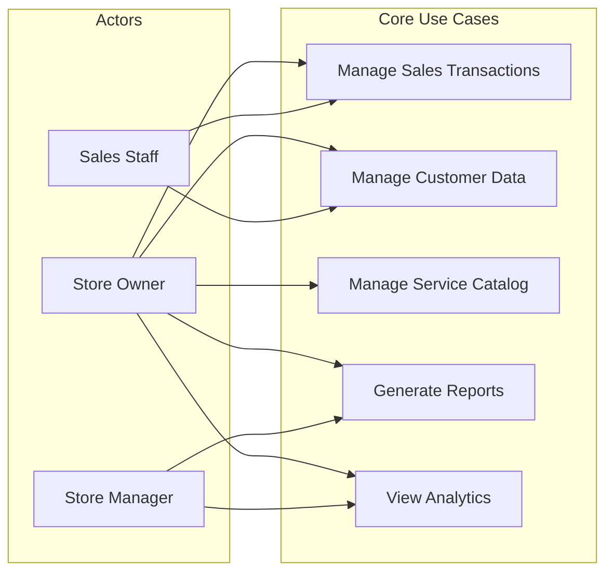

## Sequence Diagrams

### 1. Sales Transaction Processing

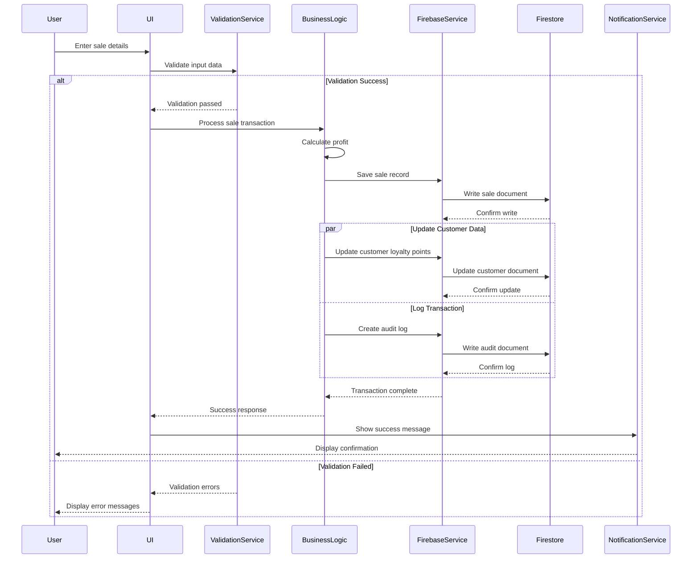

### 2. Customer Data Management

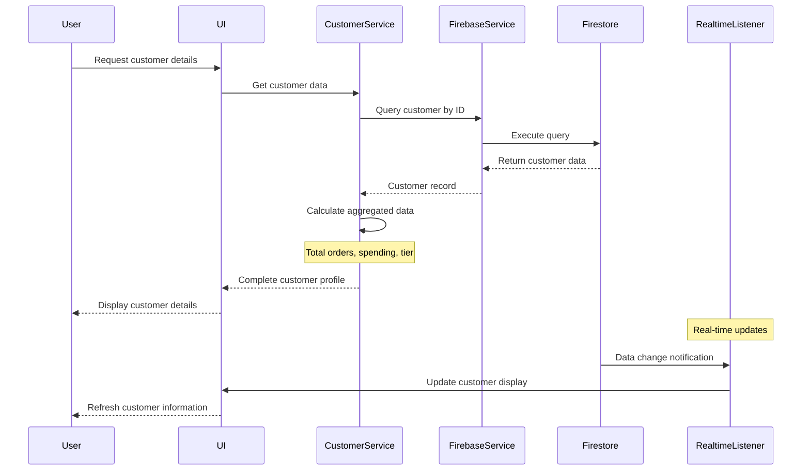

### 3. Report Generation Process

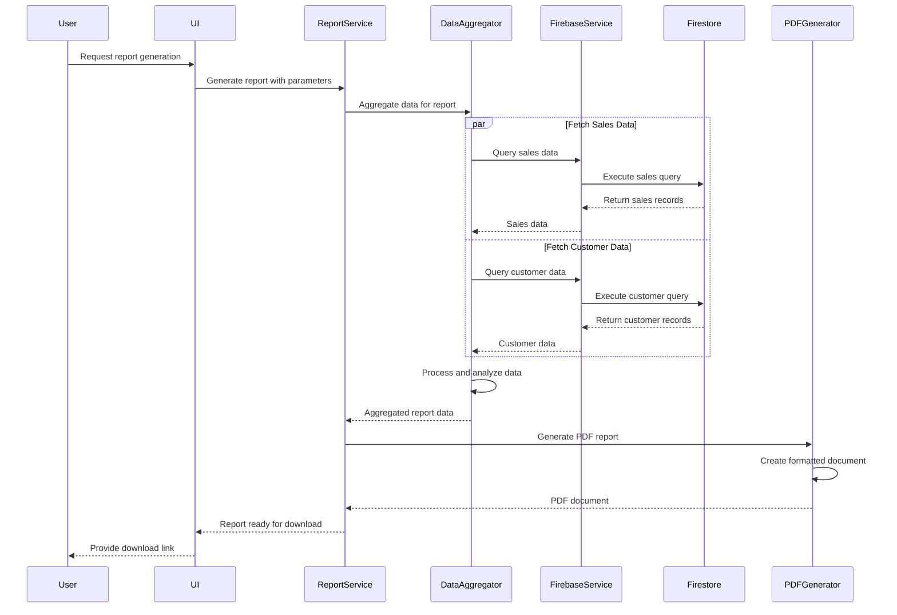

## Activity Diagrams

### 1. Sales Entry Workflow

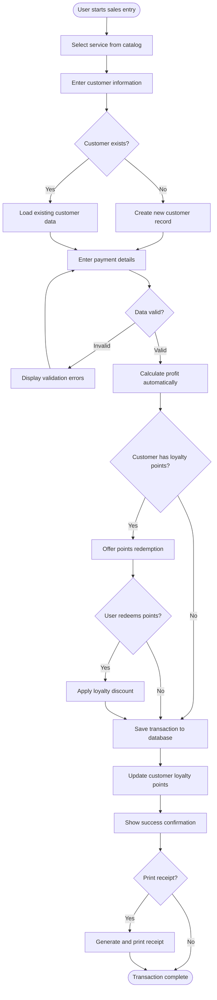

### 2. Customer Management Workflow

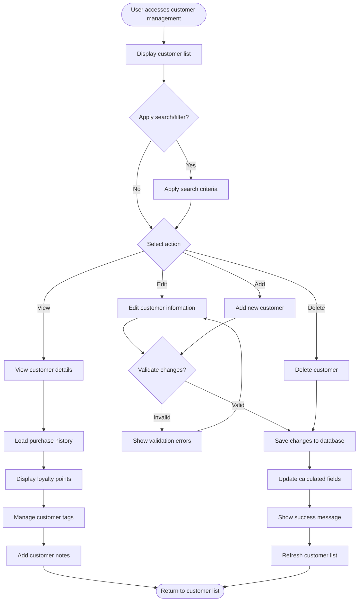

## State Diagrams

### 1. Sales Transaction State Diagram

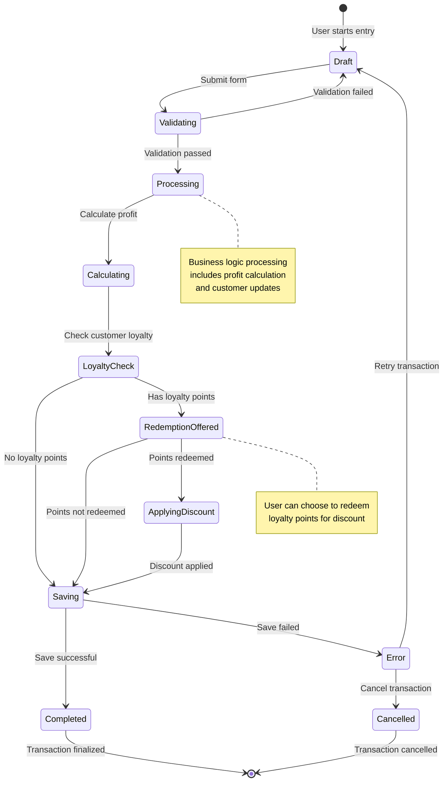

### 2. Customer Lifecycle State Diagram

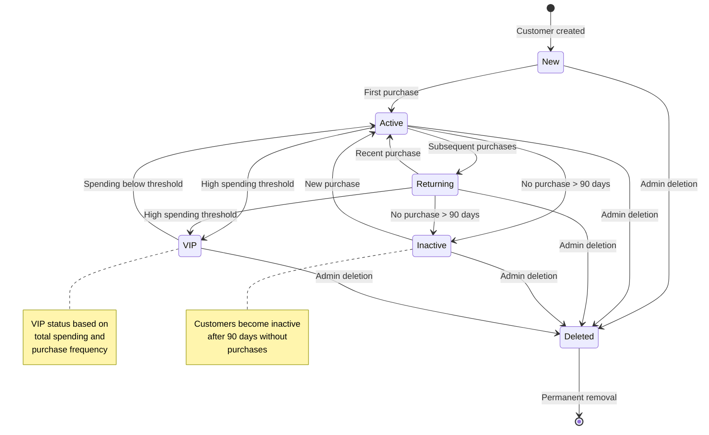

## Class Diagrams

### 1. High-Level System Class Diagram

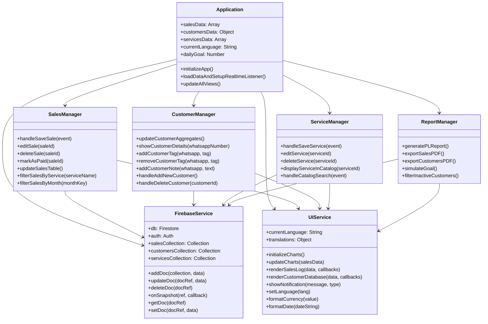

### 2. Data Model Class Diagram

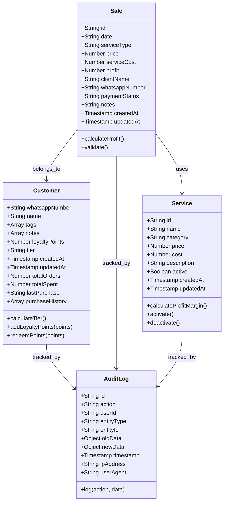

## Component Diagrams

### 1. System Architecture Components

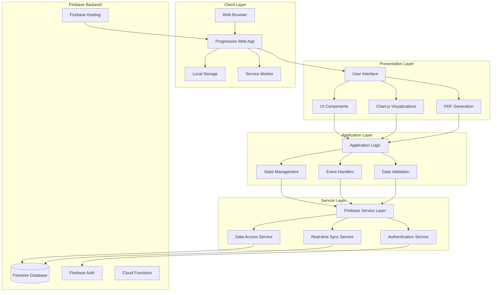

### 2. UI Component Architecture

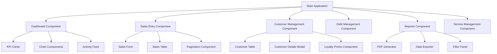

## Deployment Diagrams

### 1. Production Deployment Architecture

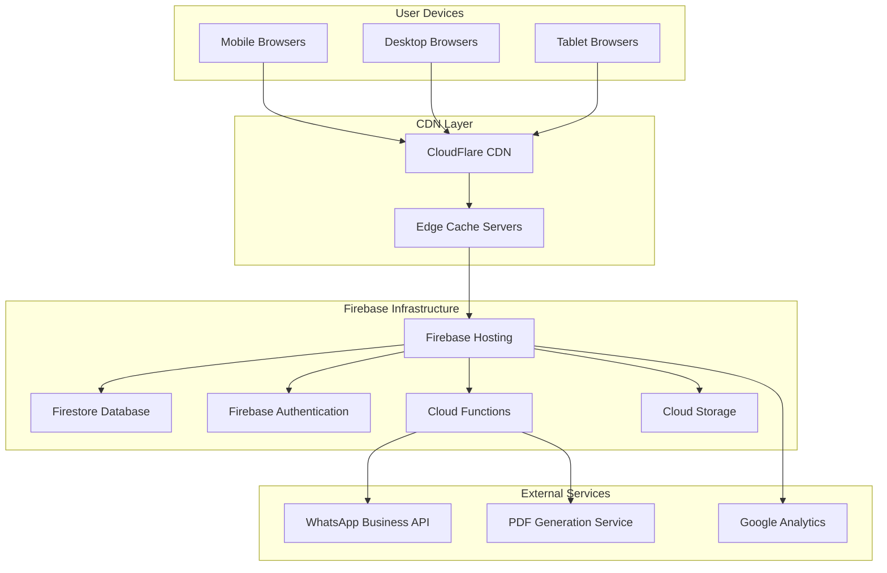

### 2. Development Environment Setup

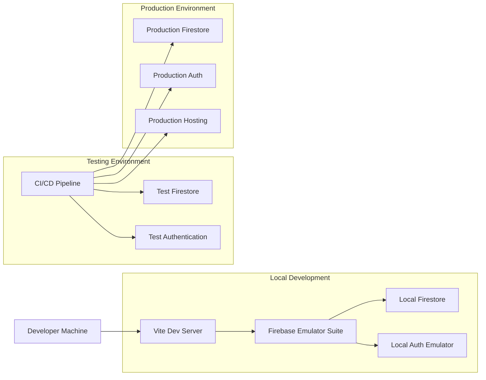

## Network and Integration Diagrams

### 1. System Integration Overview

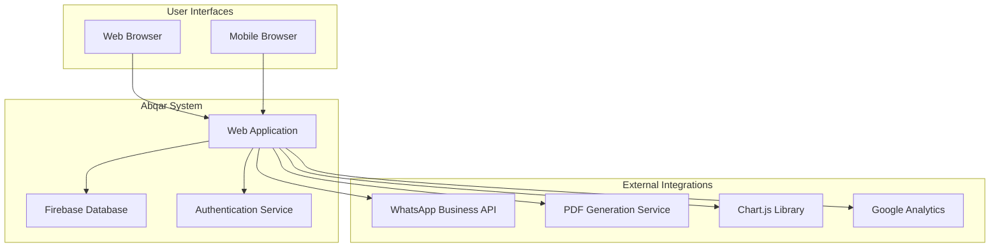

### 2. Data Synchronization Flow

```mermaid
graph LR
    subgraph "Client A"
        ClientA_UI[User Interface]
        ClientA_State[Local State]
        ClientA_Listener[Firestore Listener]
    end
    
    subgraph "Client B"
        ClientB_UI[User Interface]
        ClientB_State[Local State]
        ClientB_Listener[Firestore Listener]
    end
    
    subgraph "Firebase Backend"
        Firestore[(Firestore Database)]
        RealtimeEngine[Real-time Engine]
    end
    
    ClientA_UI -->|User Action| ClientA_State
    ClientA_State -->|Data Change| Firestore
    Firestore -->|Change Notification| RealtimeEngine
    RealtimeEngine -->|Push Update| ClientA_Listener
    RealtimeEngine -->|Push Update| ClientB_Listener
    ClientA_Listener -->|Update State| ClientA_State
    ClientB_Listener -->|Update State| ClientB_State
    ClientA_State -->|Render Update| ClientA_UI
    ClientB_State -->|Render Update| ClientB_UI
```

## Summary

This comprehensive visual diagrams and assets documentation provides all the required Mermaid diagrams for the Abqar Store Sales Management System. The diagrams cover:

- **Entity Relationship Diagrams**: Database structure and relationships
- **Data Flow Diagrams**: System data movement and processing
- **Use Case Diagrams**: User interactions and system functionality
- **Sequence Diagrams**: Component interactions over time
- **Activity Diagrams**: User workflow processes
- **State Diagrams**: Object lifecycle and state transitions
- **Class Diagrams**: System structure and relationships
- **Component Diagrams**: System architecture and component organization
- **Deployment Diagrams**: Infrastructure and deployment architecture

All diagrams are properly integrated and referenced throughout the documentation, ensuring consistency and maintainability. The visual assets support the comprehensive understanding of the system's design, architecture, and functionality as required by the academic documentation standards.